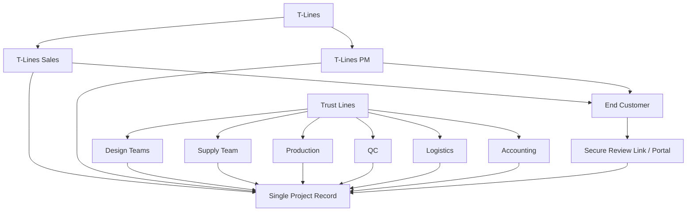
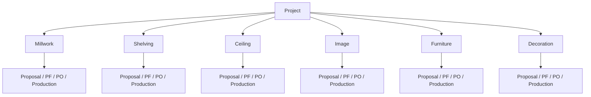

# TRUST-LINES PLATFORM — ANA ÜRÜN MİMARİSİ VE DEVAM REHBERİ

> **Bu dosya projenin bundan sonraki ana referansıdır.**
>
> Claude veya başka bir geliştirici projede çalışmaya başlamadan önce bu dosyanın tamamını okumalıdır. Yeni geliştirmeler, tablo isimleri, roller, ekranlar ve workflow kararları bu dosyaya göre yapılmalıdır.
>
> **Önemli:** Mevcut Trust Lines üretim, doküman, Dropbox, imza, PF/PO ve operational board altyapısının doğru çalışan kısımları korunacaktır. Ana değişiklik; `client/customer` kavramlarının düzeltilmesi, Sales → Design → PM → Supply → Production → Delivery zincirinin tek proje altında bağlanmasıdır.

---

# 1. PROJENİN DOĞRU İŞ TANIMI

Trust-Lines Platform, T-Lines satış ekibinin bulduğu son müşterilerin projelerini ilk görüşmeden başlayarak tasarım, closed deal, proje yönetimi, supply, üretim, lojistik, teslimat ve build aşamalarına kadar yöneten şirket içi platformdur.

## 1.1 Trust Lines

- Platformun ana operasyon, supply, production ve doküman tarafını yürütür.
- Türkiye ve Suriye ofisleri dahil olabilir.
- PF, vendor fiyatı, iç maliyet, kâr marjı, production ve lojistik bilgilerini yönetir.
- Trust Lines'ın sabit kurumsal müşterisi T-Lines'tır.

## 1.2 T-Lines

- Trust Lines'ın sabit kurumsal müşterisidir.
- Sales ve müşteri ilişkileri tarafını yönetir.
- Kendi bünyesinde çok sayıda son müşteriye iş satar.
- T-Lines'ın bölgeleri, sales ekibi ve PM ekibi vardır.

## 1.3 End Customer / Customer

T-Lines'ın gerçek müşterisidir.

Örnekler:

- Benzin istasyonu sahibi
- Kuyumcu
- Market zinciri
- Restoran
- Otel
- Ev sahibi
- Franchise sahibi
- Mağaza sahibi
- Ticari şirket

> Sistemde `customer`, T-Lines'ın iş yaptığı son müşteriyi ifade eder.

## 1.4 Customer Contact

Customer şirketindeki veya projedeki iletişim kişisidir.

Örnek roller:

- Owner
- General Manager
- Project Manager
- Architect
- Site Manager
- Purchasing
- Accounting
- Authorized Approver

Bir customer'ın birden fazla contact kişisi olabilir.

---

# 2. KRİTİK TERMİNOLOJİ DÜZELTMESİ

Mevcut sistemde `clients` kavramı kafa karıştırmaktadır.

Eski kullanımda `clients`, çoğu zaman gerçek müşteri değil; T-Lines bölgesi veya operasyonel business unit gibi davranmaktadır.

## 2.1 Yeni isimlendirme

Mevcut anlamına göre aşağıdaki yeniden adlandırma planı kullanılmalıdır:

```text
clients
→ tlines_regions
veya
→ business_units
```

```text
client_companies
→ service_lines
veya
→ tlines_entities
```

Yeni gerçek müşteri tabloları:

```text
customers
customer_contacts
customer_addresses
project_customer_contacts
```

## 2.2 Ayrım örneği

Aşağıdaki iki kayıt aynı tabloda tutulmamalıdır:

```text
T-Lines North East
```

ve

```text
ABC Jewelry
```

Birincisi T-Lines organizasyon bölgesidir.

İkincisi T-Lines'ın son müşterisidir.

---

# 3. SİSTEMİN ANA İŞ AKIŞI

Projenin ana omurgası aşağıdaki sekiz aşamadır:

```text
1. Lead
2. Sales Design
3. Closed Deal
4. PM Finalization
5. Supply Development
6. Proposal / PF / PO Approval
7. Production & Logistics
8. Delivery & Build
```

Her proje tek bir `Project ID` altında baştan sona ilerler.

Aynı iş için Sales, PM, Supply veya Production tarafında ayrı proje kayıtları oluşturulmaz.

---

# 4. ANA WORKFLOW — DETAYLI

## 4.1 Aşama 1 — Lead

T-Lines Sales ekibi yeni bir müşteri bulur.

Müşteri sistemde yoksa:

- Customer oluşturulur.
- Customer Contact oluşturulur.
- Lead oluşturulur.
- İlk görüşme planlanır.
- Müşteri ihtiyacı kaydedilir.
- Proje tipi kaydedilir.
- Yaklaşık lokasyon ve kapsam kaydedilir.
- Sales temsilcisi atanır.
- Follow-up tarihi belirlenir.

Bu aşamada projeyle ilgilenen ana ekip:

- T-Lines Sales Rep
- Sales Manager

T-Lines PM bu aşamada projeye dahil olmaz.

### Lead durumları

```text
NEW
CONTACTED
MEETING_SCHEDULED
DISCOVERY
WAITING_CUSTOMER_FILES
SALES_DESIGN
PROPOSAL_PRESENTED
NEGOTIATION
CLOSED_WON
CLOSED_LOST
ON_HOLD
```

## 4.2 Aşama 2 — Sales Design

Müşteri görüşmede olumlu yaklaşırsa Sales ekibi müşteriden şu bilgileri toplar:

- Layout
- Mevcut çizimler
- Ölçüler
- Fotoğraflar
- Marka bilgileri
- Konsept beklentisi
- Bütçe aralığı
- Lokasyon
- Mevcut site koşulları
- Referans görseller
- Proje deadline'ı

Sales ekibi bu bilgileri Designer ekibine gönderir.

Designer aşağıdaki ekiplerden biri olabilir:

- Trust Lines Türkiye Design Team
- Suriye Office Design Team
- Başka atanmış design ekibi

Bu aşamadaki tasarımın amacı:

> Müşteriye projeyi göstermek, projeyi satmak ve Closed Deal almaktır.

Bu aşamada detaylı supply çözümü, vendor fiyatlandırması veya üretim dokümanları hazırlanmaz.

### Sales Design döngüsü

```text
Customer Files
→ Sales Review
→ Designer Assignment
→ Design Draft
→ Sales Review
→ Customer Presentation
→ Customer Feedback
→ Revision
→ New Presentation
→ Closed Deal veya Closed Lost
```

Closed Deal olana kadar projenin ana sahibi T-Lines Sales ekibidir.

T-Lines PM henüz ana sorumlu değildir.

## 4.3 Aşama 3 — Closed Deal ve Handover

Müşteri projeyi kabul ettiğinde:

```text
Lead → CLOSED_WON
```

ve gerçek aktif proje başlatılır.

Bu aşamada sistem otomatik veya kontrollü şekilde şunları yapmalıdır:

- Lead'i Customer'a bağlar.
- Customer Contact kayıtlarını projeye bağlar.
- Sales dosyalarını projeye taşır veya ilişkilendirir.
- Sales Design versiyonlarını arşivler.
- Project kaydı oluşturur veya draft projeyi aktif hale getirir.
- Global proje numarası üretir.
- T-Lines PM atar.
- Trust Lines PM atar.
- Gerekirse PM Supervisor atar.
- Dropbox proje klasörü oluşturur.
- Handover checklist oluşturur.
- Handover meeting oluşturur.
- Sales temsilcisini proje geçmişinde korur.
- Closed deal tarihi kaydedilir.
- Bütçe ve kapsam bilgisi kaydedilir.

Bu aşamadan sonra:

- Sales ana proje sahibi olmaktan çıkar.
- T-Lines PM müşteri tarafındaki ana sorumlu olur.
- Trust Lines PM iç operasyon tarafındaki ana sorumlu olur.

## 4.4 Aşama 4 — PM Finalization

Closed Deal sonrası T-Lines PM müşteriyle görüşür.

Amaç:

> Satış için hazırlanmış tasarımı gerçek, ölçülebilir, üretilebilir ve uygulanabilir projeye dönüştürmek.

T-Lines PM müşteriyle şunları görüşür:

- Gerçek ihtiyaç
- Site durumu
- Gerçek ölçüler
- Malzeme kararları
- Bütçe sınırı
- Deadline
- Scope
- Elektrik durumu
- Duvar ve tavan durumu
- Flooring
- Installation ihtiyaçları
- Delivery seçeneği
- Build sorumluluğu
- Müşteri değişiklik talepleri

Bu aşamada tasarım değişebilir.

Ancak artık değişiklikler bütçeye, teknik uygulanabilirliğe, üretilebilirliğe, site koşullarına ve deadline'a bağlıdır.

### T-Lines PM iletişim sorumluluğu

T-Lines PM açık proje boyunca müşteriyle sürekli iletişimde kalır.

Sistem şunları takip etmelidir:

- Son müşteri görüşmesi
- Bir sonraki görüşme tarihi
- Beklenen müşteri kararı
- Beklenen dosya
- Açık change request
- Site readiness durumu
- Approval bekleyen doküman
- Müşteri risk durumu

T-Lines PM ortalama iki günde bir veya proje ihtiyacına göre müşteriyle iletişim kurabilir.

Bu nedenle projede `customer_communications`, `meetings`, `follow_ups` ve `change_requests` kayıtları bulunmalıdır.

## 4.5 Aşama 5 — Supply Development

Finalization yeterli seviyeye geldiğinde proje Trust Lines Supply ekibine devredilir.

Supply ekibi projeyi type bazlı yönetir.

Ana type'lar:

```text
MILLWORK
SHELVING
CEILING
IMAGE
FURNITURE
DECORATION
```

Her type için ayrı bilgiler olmalıdır:

- Assigned team
- Assigned responsible
- Status
- Priority
- Start date
- Target date
- Files
- Proposal
- Version
- Comments
- Approval
- Budget
- PF
- PO
- Vendor
- Production status
- QC status
- Shipment status

### Supply ekibinin görevleri

- Teknik detaylandırma
- Millwork detayları
- Shelving detayları
- Ceiling detayları
- Image ve branding detayları
- Furniture detayları
- Decoration detayları
- Malzeme seçimi
- Item Plan
- Item List
- Item Price List
- Book
- Construction / technical drawings
- Vendor araştırması
- PF hazırlığı
- Üretilebilirlik kontrolü
- Type bazlı proposal üretimi

> Projenin tek bir genel statüsü olacaktır, fakat her type kendi alt statüsüne sahip olmalıdır.

Örnek:

```text
Project: Supply Development

Millwork: In Production
Shelving: Revision Requested
Ceiling: Pricing
Image: Waiting Approval
Furniture: Not Started
Decoration: Approved
```

## 4.6 Aşama 6 — T-Lines Görünürlüğü, Proposal, PF ve PO

Trust Lines Supply tarafındaki tüm bilgiler T-Lines'a gösterilmez.

### T-Lines PM'in görebileceği bilgiler

- Proposal
- Item Plan
- Item List
- Book
- Technical Drawings
- T-Lines'a gönderilen PO
- Project progress
- Approval status
- Site readiness
- Delivery status
- Customer'a sunulacak versiyonlar
- Type bazlı status

### T-Lines PM'in göremeyeceği bilgiler

- Vendor alış fiyatı
- Trust Lines iç maliyet hesabı
- Kâr marjı
- Vendor özel fiyatı
- Trust Lines iç PF detayları
- İç production notları
- İç financial calculations

Mevcut `tlines_pm` güvenlik ayrımı korunmalıdır.

### Type bazlı Proposal

Her type için ayrı proposal hazırlanır:

```text
Millwork Proposal
Shelving Proposal
Ceiling Proposal
Image Proposal
Furniture Proposal
Decoration Proposal
```

Her proposal ayrı onaylanabilir.

Approval seçenekleri:

```text
APPROVE
REQUEST_REVISION
REJECT
COMMENT
```

Approval Route:

```text
T-LINES_PM_ONLY
END_CUSTOMER_DIRECT
T-LINES_PM_AND_CUSTOMER
```

- `T-LINES_PM_ONLY`: T-Lines PM müşteri adına onay verir.
- `END_CUSTOMER_DIRECT`: Son müşteri güvenli link üzerinden doğrudan onay verir.
- `T-LINES_PM_AND_CUSTOMER`: İki tarafın da onayı gerekir.

### PF ve PO ilişkisi

```text
Vendor / Production Cost
→ Trust Lines PF
→ Trust Lines Internal Pricing
→ T-Lines PO
```

- PF Trust Lines iç dokümanıdır.
- PO T-Lines'a gönderilen satış veya sipariş dokümanıdır.
- T-Lines PF içindeki gizli maliyet alanlarını görmez.
- PO onaylandığında ilgili type üretime açılabilir.

Her type farklı zamanda PO onayı alabilir ve üretime başlayabilir.

## 4.7 Aşama 7 — Production & Logistics

Type proposal ve PO onaylarından sonra Trust Lines iç operasyonu başlar.

Bu aşamada:

- Vendor atanır.
- Vendor order açılır.
- Payment plan oluşturulur.
- Production başlatılır.
- Production takip edilir.
- QC yapılır.
- Packing yapılır.
- Container'a atanır.
- Shipment oluşturulur.
- Warehouse veya job site teslimatı planlanır.

### Production ana statüleri

Mevcut doğru zincir korunabilir:

```text
NOT_ORDERED
ORDERED
WAITING_PAYMENT
READY_TO_RECEIVE
RECEIVED
READY
SENT_TO_TLINES
PARTIAL_SENT
SENT
```

Ek ara durumlar:

```text
HOLD_T
HOLD_PM
ASSEMBLY
```

### Customer iletişimi tamamen bitmez

T-Lines PM müşteriyle şu konuları takip etmeye devam eder:

- Site hazır mı?
- Elektrik işleri bitti mi?
- Duvarlar hazır mı?
- Flooring hazır mı?
- Ürünler job site'a gönderilebilir mi?
- Warehouse'a mı gönderilecek?
- Direkt job site'a mı gönderilecek?
- T-Lines Build ekibi mi kuracak?
- Başka ekip mi kuracak?
- Installation tarihi nedir?

## 4.8 Aşama 8 — Delivery & Build

Trust Lines üretimi bitirdiğinde T-Lines PM bilgilendirilir.

```text
Items are ready
```

T-Lines PM müşteriyle final delivery kararını verir:

```text
T-Lines Warehouse
Direct to Job Site
Partial Delivery
Hold
Installation Date
Build Schedule
```

Son aşamalar:

- Shipment
- Warehouse receiving
- Direct job site delivery
- Build / installation
- Missing & Extra
- Punch List
- Customer acceptance
- Project completion
- Project archive

---

# 5. KULLANICI GRUPLARI VE HESAPLAR

Sistemde ilk aşamada altı ana kullanıcı grubu bulunmalıdır.

## 5.1 T-Lines Sales

Yetkiler:

- Customer ve Customer Contact oluşturma
- Lead, Meeting ve Follow-up yönetme
- Dosya yükleme
- Designer atama
- Sales Design takip etme
- Müşteriye presentation gönderme
- Feedback ve revision yönetme
- Closed Deal yapma
- PM Handover başlatma

Göremez:

- Trust Lines PF
- Vendor fiyatları
- İç maliyet
- Kâr marjı
- Production iç detayları

## 5.2 Designers

Designer Türkiye veya Suriye ofisinde olabilir.

Yetkiler:

- Atanmış design job'larını görme
- Müşteri layout ve dosyalarını görme
- Design draft ve revision yükleme
- Sales yorumlarını görme
- Design status güncelleme

Göremez:

- Finans
- Vendor
- PF
- PO iç fiyatları
- Production board finans bilgileri

## 5.3 T-Lines PM

Yetkiler:

- Closed Deal projelerini görme
- Customer ve Contact bilgilerini görme
- Müşteri iletişim geçmişini görme
- PM Finalization ve Change Request yönetme
- Site Readiness takip etme
- T-Lines'a açık supply dosyalarını görme
- Proposal ve PO yönetme
- Customer Approval yönetme
- Delivery ve Build planlama

Göremez:

- Trust Lines iç PF detayları
- Vendor alış fiyatları
- İç maliyet
- Kâr marjı
- Vendor private notes

## 5.4 Trust Lines PM / Supply

Yetkiler:

- Proje teknik detaylarını yönetme
- Type oluşturma ve atama
- Supply task yönetme
- Teknik doküman, Proposal, PF ve PO oluşturma
- Vendor ve fiyat yönetme
- Production hazırlığı
- T-Lines PM'e görünür dosya yayınlama
- Type status yönetme

## 5.5 Production / QC / Logistics / Accounting

Bunlar ayrı roller olmalıdır fakat aynı Operations Workspace ailesini kullanabilir.

Alt roller:

```text
production_manager
production_user
qc_responsible
logistics
accounting
general_manager
project_manager
```

Sorumluluklar:

- Production
- Vendor
- Payment
- QC
- Packing
- Container
- Shipment
- Invoice
- Warehouse
- Missing & Extra

## 5.6 End Customer

### Model A — Güvenli link, hesapsız kullanım

- Doküman görüntüleme
- Comment
- Approve
- Request Revision
- Reject
- İsim ve e-posta doğrulama

İlk sürümde bu model yapılmalıdır.

### Model B — Customer Portal Account

- Açık projeleri görme
- Pending approvals
- Proje özeti
- Dosyalar
- Comments
- Site readiness
- Delivery status
- Approval geçmişi

Portal, güvenli link sistemi tamamlandıktan sonra geliştirilmelidir.

---

# 6. ANA WORKSPACE'LER

Tek sistem içinde beş ana workspace olacaktır.

## 6.1 Sales Workspace

```text
Customers
Contacts
Leads
Meetings
Sales Design
Follow-ups
Closed Deals
Handover
```

## 6.2 Project Management Workspace

```text
Active Projects
Customer Communication
Finalization
Change Requests
Approvals
Site Readiness
Delivery Planning
Build Planning
```

## 6.3 Supply Workspace

```text
Project Types
Tasks
Technical Documents
Proposal
Item Plan
Item List
Item Price List
Book
PF
PO
Vendor
Pricing
```

## 6.4 Operations Workspace

```text
Production Board
Vendors
Payments
QC
Packing
Containers
Shipments
Warehouse
Missing & Extra
Invoices
```

## 6.5 Customer Review / Portal

```text
Project Summary
Documents
Approvals
Comments
Revision Requests
Site Status
Delivery Status
```

---

# 7. SİSTEMİN ANA VERİ İLİŞKİSİ

Ana merkez `Project` kaydıdır.

```text
T-Lines
├── Regions
├── Sales Users
├── PM Users
│
└── Customers
    ├── Contacts
    ├── Leads
    └── Projects
        ├── Project Team
        ├── Meetings
        ├── Communications
        ├── Sales Design Versions
        ├── Change Requests
        ├── Project Types
        ├── Documents
        ├── Approvals
        ├── PF
        ├── PO
        ├── Production
        ├── Containers
        ├── Shipments
        └── Delivery / Build
```

## Tek Project ID ilkesi

Aynı iş için Sales Project, PM Project, Supply Project veya Production Project şeklinde ayrı kayıtlar açılmaz.

Tek `Project ID` vardır.

Farklı ekipler aynı projeyi kendi workspace'lerinden ve kendi izinlerine göre görür.

---

# 8. GÖRSEL MİMARİ

## 8.1 Ana süreç şeması

```mermaid
flowchart LR
    A[New Customer / Lead] --> B[Sales Meeting]
    B --> C[Customer Files]
    C --> D[Sales Design]
    D --> E[Customer Presentation]
    E --> F{Decision}
    F -->|Revision| D
    F -->|Closed Lost| Z[Archive]
    F -->|Closed Won| G[PM Handover]
    G --> H[PM Finalization]
    H --> I[Supply Development]
    I --> J[Type Proposals]
    J --> K{Approval}
    K -->|Revision| I
    K -->|Approved| L[PF and PO]
    L --> M[Production]
    M --> N[QC and Packing]
    N --> O[Container and Shipment]
    O --> P[Warehouse or Job Site]
    P --> Q[Build / Installation]
    Q --> R[Missing Extra / Punch List]
    R --> S[Project Completed]
```



## 8.2 Organizasyon ve görünürlük şeması



## 8.3 Proje type yapısı



---

# 9. EKLENMESİ GEREKEN ANA TABLOLAR

Mevcut tablo isimleri ve canlı schema kod incelenmeden doğrudan rename yapılmamalıdır. Önce migration planı hazırlanmalıdır.

Yeni veya netleştirilmesi gereken tablolar:

```text
customers
customer_contacts
customer_addresses
project_customer_contacts
customer_communications
customer_meetings
customer_follow_ups
change_requests
sales_design_jobs
sales_design_versions
sales_presentations
project_team_members
project_types
project_type_assignments
project_type_status_history
approval_links
approval_link_events
approval_comments
site_readiness
delivery_plans
build_plans
containers
container_items
container_documents
shipments
shipment_items
warehouse_receipts
```

## Existing tablolarla tekrar oluşturma yapma

Aşağıdaki mevcut tablolar varsa yeniden tablo açılmamalıdır; mevcut yapıya extension yapılmalıdır:

```text
projects
documents
document_versions
document_approvals
project_steps
production_items
suppliers
notifications
audit_log
lead_intake
lead_tasks
lead_activity
lead_watchers
profiles
role_definitions
```

---

# 10. DIŞ MÜŞTERİ ONAY LİNKİ

İlk customer-facing özellik güvenli review linkidir.

## Ana tablo

```text
approval_links
```

Önerilen alanlar:

```text
id
project_id
document_id
document_version_id
customer_contact_id
token_hash
status
expires_at
max_views
view_count
require_email_verification
created_by
created_at
first_opened_at
completed_at
revoked_at
```

## Public route

```text
/review/[token]
```

## Public API

```text
GET  /api/public/reviews/[token]
POST /api/public/reviews/[token]/verify
POST /api/public/reviews/[token]/comment
POST /api/public/reviews/[token]/approve
POST /api/public/reviews/[token]/request-revision
POST /api/public/reviews/[token]/reject
```

## Güvenlik

- Token DB'de düz metin saklanmamalıdır.
- Token hash saklanmalıdır.
- Expire tarihi olmalıdır.
- Link revoke edilebilmelidir.
- Eski versiyon linki kapatılabilmelidir.
- IP ve user-agent audit kaydı tutulmalıdır.
- PF, vendor price, margin ve internal fields public route'a çıkmamalıdır.
- Approval işleminde contact doğrulanmalıdır.
- Aynı işlem iki kez çalışırsa duplicate approval oluşmamalıdır.
- Public route middleware tarafından izinli olmalı fakat token doğrulaması zorunlu olmalıdır.

---

# 11. KONTEYNER VE LOJİSTİK MODELİ

Yeni sistemde container merkezi bir kayıt olmalıdır.

## Containers

```text
id
container_no
booking_no
carrier
vessel_name
voyage_no
origin_port
destination_port
departure_date
estimated_arrival_date
actual_arrival_date
customs_clearance_date
warehouse_arrival_date
status
seal_no
tracking_url
notes
created_by
created_at
updated_at
```

## Container Items

```text
id
container_id
production_item_id
quantity
package_count
pallet_count
gross_weight
volume_cbm
loaded_at
unloaded_at
notes
```

## Container durumları

```text
PLANNING
BOOKED
WAITING_LOADING
LOADING
DEPARTED
IN_TRANSIT
ARRIVED_PORT
CUSTOMS
RELEASED
WAREHOUSE
COMPLETED
CANCELLED
```

Bir production item container'a eklendiğinde ilgili shipment alanları otomatik senkronize edilmelidir.

Container `DEPARTED` olduğunda bağlı production item'lar iş kuralına göre güncellenmelidir.

Container `WAREHOUSE` olduğunda warehouse receiving flow başlatılmalıdır.

---

# 12. MEVCUT TRUST LINES ALTYAPISINDA KORUNACAKLAR

Aşağıdaki mevcut yapılar doğru çalışıyorsa korunmalı ve gereksiz yeniden yazılmamalıdır:

- Next.js platform altyapısı
- Supabase Auth
- RLS
- Role definitions
- Permission catalog
- Dropbox dosya sistemi
- Documents metadata modeli
- Document versions
- Document approvals
- PDF signature
- PF üretimi
- PO üretimi
- Production board
- Vendor modeli
- Audit log
- Notifications
- AI read-only assistant
- Lead CRM'in çalışan özellikleri
- Global project number
- Region ve service line sistemi
- T-Lines PM için PF/margin/vendor price güvenlik kısıtları

---

# 13. CLAUDE İÇİN UYGULAMA TALİMATLARI

## Her yeni oturumda

Claude önce şu dosyaları okumalıdır:

```text
PROJECT-MASTER-PLAN.md
PROJE_OZETI_DETAYLI.md
SYSTEM_ARCHITECTURE.md
AGENTS.md
```

Bu dosya proje root'unda tutulmalıdır:

```text
PROJECT-MASTER-PLAN.md
```

## Kullanıcı yalnızca “devam et” dediğinde

Claude şunları yapmalıdır:

1. Bu dosyadaki `CURRENT STATUS` bölümünü oku.
2. `NEXT TASKS` listesindeki ilk tamamlanmamış işi seç.
3. İlgili mevcut kodu incele.
4. Mevcut çalışan yapıyı bozmadan geliştirmeyi yap.
5. Gerekli migration dosyasını oluştur.
6. `types/database.ts` veya ilgili tipleri güncelle.
7. API authorization ve RLS kontrollerini ekle.
8. Frontend sayfa ve component'lerini ekle.
9. Audit log ekle.
10. Build ve mümkünse test çalıştır.
11. Bu dosyadaki `CHANGE LOG`, `CURRENT STATUS` ve `NEXT TASKS` bölümlerini güncelle.
12. Kullanıcıya yapılan işi, değişen dosyaları ve sıradaki işi Türkçe olarak özetle.

## Soru sorma kuralı

Açık bir güvenlik riski veya geri döndürülemez veri kaybı yoksa kullanıcıya gereksiz soru sorulmaz.

Eksik küçük detaylarda mevcut mimariye ve bu dosyaya uygun en güvenli karar uygulanır.

## Yasaklar

- Var olan Dropbox dosyalarını silme.
- Dropbox upload'da overwrite kullanma.
- Existing proje klasörünü yeniden oluşturma.
- T-Lines PM'e PF, vendor price veya margin gösterme.
- Service role kullanılan route'u authorization kontrolsüz bırakma.
- Aynı iş için ikinci Project kaydı oluşturma.
- Customer ile T-Lines region kayıtlarını aynı tabloda tutma.
- Büyük migration'ı rollback planı olmadan uygulama.
- Mevcut doğru working flow'u komple yeniden yazma.
- `documents` listelerinde ağır base64 alanları `select('*')` ile çekme.

---

# 14. GELİŞTİRME SIRASI

## Phase 0 — Audit ve isim haritası — ✅ TAMAMLANDI (2026-07-10, bkz. `AUDIT_PHASE0_CLIENTS.md`)

- [x] Mevcut `clients` kullanımının tüm kod tabanındaki yerlerini bul. → 112 eşleşme / 38 dosya envanteri.
- [x] `clients` tablosunun gerçekten region/business unit olarak kullanıldığını doğrula. → Doğrulandı (pm_client_id, sales_region_id, UI "Region").
- [x] `client_companies` kullanımını doğrula. → "Service / service_line", `margin_pct` taşır (hassas).
- [x] Rename gerektiren ve sadece UI label değişimi yeterli olan alanları ayır. → Audit §3; label düzeltmesi büyük ölçüde zaten yapılmış.
- [x] Migration ve backward compatibility planı hazırla. → Audit §4 (fiziksel rename YOK; VIEW alias + yeni customers tabloları).
- [x] Existing lead → project dönüşümünü incele. → `leads/[id]/deliver` (tek Project ID korunuyor; customer eksik).
- [x] Existing document approval flow'u incele. → doc-approvals + stageConfig + versions (genişletilecek, yeniden yazılmayacak).
- [x] Existing production type modelini incele. → `production_items` + board.ts (Phase 4 bağlanacak).

## Phase 1 — Customer Management V1

- [x] `customers` migration (045_customers.sql — NOT yet applied to live DB)
- [x] `customer_contacts` migration (045_customers.sql)
- [x] `customer_addresses` migration (049 — RLS + indexes + types + Customer 360 addresses UI + API)
- [x] `project_customer_contacts` migration (049 — junction, RLS + indexes + types + API; UI lands with the project customer panel)
- [x] RLS (045/049: read = sales+tlines_pm+trustlines_pm+ops_manager/general_manager; write = sales+ops_manager/general_manager; text-role model, no enum)
- [x] Types (types/database.ts: Customer, CustomerContact, CustomerStatus + Database map; tsc EXIT=0)
- [x] Customer list (`/customers` — search, status pill, loading/empty/error, permission-aware)
- [x] Customer create/edit (list create form + 360 edit form; API PATCH)
- [x] Customer detail 360 page (`/customers/[id]` — details + contacts + project-history placeholder)
- [x] Contact management (add/edit/delete, single-primary enforcement, authorized-approver flag)
- [x] Customer project history (Customer 360 lists linked projects via projects.customer_id — migration 048, role-safe cols)
- [x] Lead ile customer eşleştirme (lead_intake.customer_id; link/create/unlink API + CustomerLinkCard; deliver propagates to project)
- [x] Duplicate customer kontrolü (case-insensitive name guard in API create + edit + link-from-lead, 409)

## Phase 2 — Lead ve Sales Design

- [x] Lead customer bağlantısı (migration 048 + /api/leads/[id]/link-customer + CustomerLinkCard)
- [x] Meeting sistemi (migration 053 `customer_meetings` + API + Customer 360 "Meetings" bölümü)
- [x] Follow-up sistemi (migration 053 `customer_follow_ups` + API + Customer 360 "Follow-ups" kuyruğu, overdue işaretli)
- [x] Sales design job (migration 051 `sales_design_jobs`) — **created ONLY by the status trigger**: when the lead's
      `opportunity_status` becomes `working_on_it_trust` ("Working on it Trust"). Never created from the New Lead form.
      Idempotent (one live job per lead, partial unique index + `ensureDesignJobForLead`). Starts `awaiting_assignment`.
- [x] Designer assignment (job.assigned_designer_id → a PERSON in `profiles`; office lives on `profiles.office`, shown
      only as secondary label metadata "Sara Khaled — Syria Office". No office/team dropdown. Notifies the designer.)
- [x] Sales design versions (migration 051 `sales_design_versions`, auto version_no, preview_link + notes)
- [x] Customer presentation status (version status `presented` stamps presented_at; job → in_review)
- [x] Revision cycle (version `revision_requested` + customer_feedback → add next version; job status mirrors)
- [x] Closed won handover checklist (migration 050 project_handovers + /projects/[id]/handover)
- [x] Lead → Active Project dönüşümü (existing /api/leads/[id]/deliver; now also carries customer_id)

## Phase 3 — PM Finalization

- [x] Project communication timeline (finalization page: merged read-only feed of meetings + follow-ups + change requests + stage moves; no new table)
- [x] Customer meetings (migration 053 customer_meetings — Customer 360 "Meetings")
- [x] Change requests (migration 055 change_requests + /projects/[id]/finalization: status, budget/timeline impact, requester)
- [~] Budget guard (change_requests capture budget_impact Δ + currency; a hard project-total guard is still TODO)
- [x] Site readiness (migration 055 site_readiness: checklist + derived not_ready/partial/ready + target date, on the finalization page)
- [x] PM follow-up reminder (migration 062 customer_follow_ups.reminded_on + lib/pm/followupReminders.ts; the finalization page notifies the PM of their overdue open follow-ups, deduped per due date — mirrors the Sales lead reminder)
- [x] Handover summary (migration 050 project_handovers + /projects/[id]/handover: checklist + summary + customer/contacts panel)
- [x] Sales files → project files bağlantısı (/projects/[id]/types "Sales design files" card — resolves project → lead_intake → sales_design_jobs → sales_design_version_files, surfaced to Supply/PM)

## Phase 4 — Project Types ve Supply

> The per-project×type `production_items` row (source='project') IS the "project type" entity (§4.5). Migration 062
> adds the management fields; the **/projects/[id]/types** dashboard surfaces each type with its own owner, schedule
> and sub-status. Gated on page.production → tlines_pm never sees PF budget here.

- [x] Project type entity doğrulama (production_items source='project'; seeded from the project's categories)
- [x] Type-level owner (migration 062 production_items.assigned_to → internal PM/Supply person, editable on the Types dashboard)
- [x] Type-level status (production_items.status STATUS_CHAIN — the per-type sub-status; editable on the dashboard)
- [x] Type-level workflow (status chain + date automation in lib/production/board.ts, per type)
- [x] Type-level documents (per-category documents already keyed by cat_group in the doc-approvals system)
- [x] Type-level proposal (per-category proposal doc_type in the existing production doc chain)
- [x] Type-level approvals (per-category doc-approvals / PF-PO signature chain — already type-scoped)
- [x] Type dashboard (/projects/[id]/types — owner, priority, start/target date, sub-status, vendor, PF, budget per type; "Types" header link)
- [x] Existing production_items bağlantısı (the dashboard reads/writes production_items directly via /api/production/items PATCH)

## Phase 5 — External Review Link

- [x] Approval links migration (056: approval_links + approval_link_events, RLS + indexes)
- [x] Token security (random 32-byte token; only sha256(token) stored; plaintext shown once; expiry + max_views + revoke)
- [x] Public review page (`/review/[token]` — outside (platform), no auth/AppShell, gated entirely by the token)
- [x] PDF viewer (short-lived Dropbox link for the document; never a PF)
- [x] Comment (POST action `comment`)
- [x] Approve (POST action `approve` → decision recorded, link completed)
- [x] Request revision (POST action `request_revision`)
- [x] Reject (POST action `reject`)
- [x] Link expiration (expires_at → 410; auto-marks status expired)
- [x] Link revoke (POST `.../approval-links/[linkId]` {action:revoke})
- [x] Audit events (approval_link_events: opened/approved/… + IP + user-agent)
- [x] Email notification (in-app + SMTP email to Sales/PM on every customer decision — best-effort via lib/email/send)
- [x] Version rejection integration (customer decision on a Sales Design version flows back: approve → version approved +
      job approved_by_sales + project auto-delivered to Supply; reject/revision → version status + customer_feedback +
      job revision_requested. Documents: approve → approved, reject → rejected.)

## Phase 6 — PF / PO flow alignment  (ALREADY COVERED by the existing production system — see §12)

- [x] Type-level PF (production_items are per project×type; PF codes per type — migration 014 + lib/production/pfCode.ts)
- [x] Type-level PO (per-type PO in the doc-approvals chain)
- [x] T-Lines visibility (RLS `tlines_no_pf` + AI restrictions + field-level; tlines_pm never sees PF/margin/vendor price)
- [x] PF internal fields security (pf_usd/pf_tl restricted; PFs can't even be shared on a review link)
- [x] PO approval (stageConfig PO chain: Client PM → General Manager → Accountant(opt) → PM Supervisor(anytime))
- [x] Production start trigger (production_items STATUS_CHAIN; board dates auto-fill — lib/production/board.ts)
- [x] Bundle document checks (doc-approvals SHARED_GUARD + PF prerequisite gates)
> Not re-implemented — the existing doc-approvals / stageConfig / production board already satisfy Phase 6. Per the
> master plan rule, working flows are not rewritten.

## Phase 7 — Containers & Logistics

- [x] Containers migration (058: containers + container_items, RLS + indexes, 12-status lifecycle)
- [x] Container items (junction to production_items; unique — one container per item; packing figures)
- [x] Container documents (migration 062 container_documents — attach BL/packing list/customs/invoice by name + Dropbox path/URL; on the container detail page)
- [x] Shipment entity (folded into `containers` by design — booking/vessel/voyage/ports/dates; a container IS the shipment. No separate table needed for the modelled flow.)
- [x] Shipment items (= container_items; a shipment's items are the loaded production items — no separate entity)
- [x] Container screen (`/logistics` list + create, `/logistics/[id]` detail — shipment fields + load/unload items + documents)
- [x] ETA (estimated/actual arrival dates; status change auto-stamps departure/arrival/warehouse dates)
- [x] Warehouse receiving (status WAREHOUSE + warehouse_arrival_date auto-stamped; delivery_destination=warehouse)
- [x] Direct job site (migration 062 containers.delivery_destination='direct_job_site' + job_site_address, on the container detail page)
- [x] Production status sync (loading stamps production_items.container_no; container IN_TRANSIT → items status SENT)

## Phase 8 — Delivery & Build

- [x] Delivery plan (migration 059 delivery_plans — method warehouse/direct_job_site/partial/hold, on /projects/[id]/delivery)
- [x] Build plan (build_by trust_build/customer/other + build_schedule)
- [x] Installation date (delivery_plans.installation_date)
- [x] Site confirmation (delivery_plans.site_confirmed)
- [x] Missing & Extra (delivered in Phase 9 — production_items source='missing_extra' full workflow on the Production tab)
- [x] Punch list (migration 059 punch_list_items — add / done / reopen / remove; open-count gates completion)
- [x] Customer final acceptance (delivery_plans.customer_accepted + accepted_by/at)
- [x] Project completion ("Mark delivered & complete" → status completed + project advances to the `delivered` stage;
      gated on 0 open punch items + customer acceptance)

## Phase 9 — Eski operational modüller

- [x] Direct Orders (production_items source='direct_order' — add/vendor/status/delete on the Production › Direct Orders tab; PDO PF prefix; board + Excel wired)
- [x] Missing & Extra full workflow (production_items source='missing_extra' — same management panel on the Missing Extra tab; board + Excel wired)
- [x] Trust Expenses (migration 061 trust_expenses — category/currency/amount/date, optional project+supplier tag, paid flag; /expenses ledger with per-currency totals)
- [x] Supplier profiles (migration 060 — suppliers enriched with email/phone/address/tax/terms; /suppliers + /suppliers/[id])
- [x] Supplier invoice receipts (`supplier_invoices` — number/date/currency/amount/description/receipt path; unpaid→partial→paid)
- [x] Multi-payment tracking (`supplier_payments` — many per invoice or on-account; method/date/reference; auto re-syncs invoice status)
- [x] Supplier totals (per-currency invoiced/paid/balance on the list + the 360; never sums USD/TL/EUR together)
- [x] Project totals (/projects/[id]/finance — per-project roll-up: production PF/invoice/expense + supplier invoices/payments/balance + trust expenses, per currency; finance-gated, tlines_pm-safe)
- [x] Backup / restore strategy (BACKUP_RESTORE.md — Supabase PITR/pg_dump + Dropbox immutability; Settings → on-demand JSON snapshot via /api/admin/backup, GM-only)

> SECURITY: supplier finance is vendor purchase cost — RLS + `page.suppliers` exclude `tlines_pm` entirely.
> Read = ops/gm/accountant/accounting/trustlines_pm · Write = ops/gm/accountant/accounting.

---

# 15. CURRENT STATUS

> Bu bölüm her geliştirme sonunda güncellenmelidir.

```text
Project architecture:
- Main Next.js / Supabase platform exists.
- Auth and permissions exist.
- Dropbox document system exists.
- Document versions and approval engine exist.
- PF / PO generation exists.
- Production board exists.
- Lead CRM exists.
- Phase 0 audit is COMPLETE (see AUDIT_PHASE0_CLIENTS.md).
  - `clients` = T-Lines Region/business-unit (NOT end customer). UI already labels it "Region".
  - `client_companies` = Service / service_line (carries sensitive margin_pct).
  - DECISION: no physical rename of clients/client_companies; solve terminology via new `customers` tables + optional read-only VIEW aliases.
  - Schema gap noted: CREATE TABLE for client_companies/client_franchises is missing from repo migrations (needs a baseline dump).
- Customer terminology: root cause identified; correction path decided (additive, non-breaking).
- Real End Customer module BUILT (Phase 1 core): migration 045 (`customers` + `customer_contacts`, RLS + indexes + types)
  + full Customer API (list/create/edit/soft-delete + contacts, requireRole + logAudit + duplicate check)
  + Customer list (`/customers`) + Customer 360 detail (`/customers/[id]`) + contact management + nav + permissions.
  + Lead↔customer link (migration 048: lead_intake.customer_id + projects.customer_id): link/create/unlink API
    (`/api/leads/[id]/link-customer`) + CustomerLinkCard on the lead page; deliver propagates customer to the project;
    Customer 360 shows real linked-project history (role-safe columns).
  + customer_addresses + project_customer_contacts (migration 049): RLS + types + API; addresses managed on Customer 360;
    project↔contact junction API ready for the project customer panel (Phase 3 UI).
  - Phase 1 checklist is COMPLETE in the repo (data + API + core UI).
- Closed Won → Project Handover BUILT: migration 050 (project_handovers) + checklist API + /projects/[id]/handover page
  (checklist, handover summary, customer & contacts panel — which is also the project_customer_contacts UI) + header link.
- ✅ Migrations 045–050 are APPLIED to the live DB (confirmed by the user, 2026-07-10).
- Sales Design (Phase 2) BUILT, status-triggered: migration 051 (sales_design_jobs + sales_design_versions +
  `profiles.office` + `designer` role) + design-job/version API + SalesDesignCard (passive summary/list) on the lead page.
  - BUSINESS RULE: the design job is created ONLY when the lead reaches `working_on_it_trust`. The New Lead form shows a
    passive summary and cannot create/assign a job. Assignment is to a PERSON (`assigned_designer_id`), never an office.
  - ⚠️ Migration 051: an early draft was already applied; the corrected 051 is RE-RUNNABLE and heals that schema in
    place (rename → assigned_designer_id, drop assigned_team, add customer_id, remap statuses). Re-run the current 051.
    Until then the Sales Design card renders the passive summary and the trigger no-ops safely.
- Designer workspace BUILT: `/design` (page.design, migration 052). A designer sees ONLY their assigned jobs;
  Sales/ops/gm see the whole queue. No production/finance/PF/vendor/margin surface.
- Phase 2 remaining: Meeting sistemi, Follow-up sistemi.
- Designer onboarding: a Sales Manager (or ops_manager / general_manager) can **invite a designer directly from the
  Sales Design card** ("Invite designer" → name / email / office). It reuses the existing /api/team/invite pipeline,
  grants the `designer` role, stores `profiles.office`, and assigns the new designer to that job immediately.
  Existing designers can also be onboarded via Team → Roles.
- Phases 0–9 are BUILT end-to-end (see CURRENT_SYSTEM_STATE.md + the Phase 3–9 CHANGE LOG entries below).
- PHASE 10 (Integration, Automation & Project Cockpit) IS IN PROGRESS — single source: PHASE10-INTEGRATION-AND-AUTOMATION.md.
  - [x] 10.1a Project Lifecycle Engine: lib/lifecycle/projectLifecycle.ts (`deriveLifecycle`, pure, no DB) + unit tests.
        Derives the 8-phase master-plan §3 chain from existing data; `projects.current_stage` is NOT touched.
  - [x] 10.1b Per-type sub-status (`deriveTypeState` → TypeSubPhase) + per-type blockers + project roll-up,
        and the ROLE-SAFE GATE `redactLifecycleForRole()` / `canSeeInternalSupply()` (fail-closed).
        61 lifecycle tests. Every Phase 10 surface (cockpit, next actions, My Day, event payload, e-mail) MUST
        pass its lifecycle result through `redactLifecycleForRole(result, role)` before it reaches a user.
  - [x] 10.2a Event & Automation layer skeleton: migration **063_system_events.sql** (RLS on, read for internal+PM
        roles, NO write policy → service-role only; dedupe_key UNIQUE; 5 indexes) + `types/database.ts` SystemEventRow
        + `lib/events/types.ts` (A1–A10 event names) + `lib/events/bus.ts` (emitEvent / handleEvent / registerHandler /
        sanitizeEventPayload). 17 tests. No handlers registered yet — those land in 10.2b–d.
        Idempotency is enforced BY THE DB (unique dedupe_key + upsert ignoreDuplicates): a repeated emit inserts
        nothing, returns null and runs NO handler.
  - [x] 10.2b Automations **A1** (lead won → open handover + notify both PMs + schedule the first finalization
        follow-up), **A2** (handover fully green → "move to Finalization" NUDGE; the stage is never forced), and
        **A5** ("Items are ready" → notify + e-mail the T-Lines PM the moment the last item goes SENT — master plan
        §4.8). `lib/events/handlers.ts` + `lib/events/notify.ts` + `lib/handover/readiness.ts` + `allItemsSent()`.
        Emit points: lib/sales/deliver.ts, PATCH /api/projects/[id]/handover, PATCH /api/production/items/[id].
        15 tests. Routes import `emitEvent` from `@/lib/events` (NOT `./bus`) — that import registers the handlers.
  - ✅ Migration **063 IS APPLIED** to the live DB (verified 2026-07-14 against the real table: a repeat emit returns
        null and re-runs no handler; payload sanitising strips pf_/vendor_id/margin; anon read blocked; anon INSERT
        blocked with 42501 → the "no write policy" design works).
  - [x] 10.2c Automations **A3** (site ready → Trust PM + logistics + "site ready" badge on Delivery),
        **A4** (PO chain complete → "assign a vendor" to production_manager when the signed type has none),
        **A6** (container ARRIVED_PORT / WAREHOUSE → fans out to EVERY project on the container + status badges),
        **A7** (CR approved → Trust PM + Supply, and the approved-CR budget delta now shows on the project Finance
        page, read straight from `change_requests` — no new table). 13 tests.
        🐛 FOUND & FIXED while wiring this: **A5 would almost never have fired.** Items reach SENT in real operations
        via the CONTAINER route's bulk update, not the per-item PATCH where A5 was wired. Extracted
        `maybeEmitItemsReady()` (lib/events/triggers.ts) and called it from BOTH paths.
  - [x] 10.2d Automations **A8** (customer review decision → project timeline event; the team notification already
        exists, so no second message), **A9** (approval pending 3+ days → daily reminder to the assigned signer,
        deduped once-per-signer-per-day via the event key), **A10** (design version submitted / revision requested →
        timeline + My Day events, existing notifications unchanged), and the **notify matrix** (§10.5,
        `lib/notify/matrix.ts`) that all A1–A10 handlers now resolve their audience through. 19 tests (incl. the
        mandatory A9 dedupe test). A8/A10 deliberately have NO handler — the event is recorded, not re-notified.
  - **Phase 10.2 (Event & Automation layer) is COMPLETE: A1–A10 all wired, 63 automation tests.**
  - [x] 10.3a Cockpit data layer: `lib/lifecycle/nextActions.ts` (blocker → owned, linked action; pure) +
        `lib/lifecycle/cockpitData.ts` (`assembleCockpit` pure core + `loadCockpit` single-query-set IO shell + rail
        builder + pending-strip counts). Redaction happens ONCE in assembleCockpit, so rail/grid/actions/counts are all
        computed from the already-safe result. 12 tests; loadCockpit's 8-query set verified schema-valid against the
        live DB. Next actions carry a ROLE owner (resolved to a person by the UI later), not a hardcoded person.
  - [x] 10.3b Cockpit UI: `components/platform/projects/ProjectCockpit.tsx` — lifecycle rail (8 stages, active
        highlighted, blockers underneath), pending strip (3 clickable counts), next-action panel (owner + link), type
        grid (sub-phase per type; vendor/PO/PF chips ONLY when `canSeeInternal`). Rendered ABOVE the existing project
        detail from `loadCockpit` (additive — sub-pages and their header links untouched). Purely presentational: it
        makes no visibility decision, it renders the already-redacted data.
  - [x] 10.4 My Day: `GET /api/my-day` (requireUser + role-filtered) → `lib/dashboard/myDay.ts` (`buildMyDay`
        assembles only the sections a role allows, each a bounded/indexed query, in parallel, never-throws) +
        `components/platform/dashboard/MyDay.tsx` (loading / empty / error, rendered ABOVE the existing dashboard).
        PRICE-SAFETY IS STRUCTURAL: `PRICEY_SECTIONS` (vendor_needed, items_on_hold, unpaid_invoices, waiting_payment)
        are declared only on internal roles AND `sectionsForRole` strips any pricey section for a role failing
        `canSeeInternalSupply` — so a tlines_pm My Day cannot hold a price row (pinned by a full-payload leak test). 10
        tests. Roles wired: everyone (signatures + notifications), tlines_pm, trustlines_pm, production_manager,
        pm_millwork/ceiling, logistics, designer, sales, accounting/accountant, ops/gm.
  - [x] 10.6 (a) Deliver SOFT-GATE: `deliverLeadToTrust` returns `customerMissing` when a lead is delivered with no
        structured customer (never blocks); the lead page's CustomerLinkCard shows a warning + the existing one-click
        "Create from lead" when `delivered && !linked`. (b) sales_design DOC POINTER: on design approval,
        `linkDesignFilesToProject` adds the approved files to the project `documents` as `doc_type='sales_design'`
        POINTERS (Dropbox unmoved), idempotent by dropbox_path. Migration **064** adds the enum value (idempotent) —
        though the live enum ALREADY accepts 'sales_design' (probed: an insert failed only on FK, not the enum), so the
        pointer works in production now. 8 tests. (c) meetings/follow-ups project surface = already covered by My Day +
        the cockpit pending strip.
  - [x] Smoke test: `tests/phase10Smoke.test.ts` drives one throwaway project through the WHOLE chain against the
        LIVE DB (LEAD → A1 → CLOSED_DEAL → handover complete → PM_FINALIZATION → types → SUPPLY_DEVELOPMENT → A3 site →
        A7 CR → all SENT → A5 "Items are ready" → DELIVERY_BUILD → COMPLETED), asserting the phase, the emitted
        system_event and the notifications at each step, A1 + A5 idempotency (double-emit = no-op), and that a
        tlines_pm cockpit + My Day leak NO pf/vendor/margin. 10/10 passed; every created row cleaned up (0 leftover).
        SKIPPED in the normal suite; run with `SMOKE=1 npx vitest run tests/phase10Smoke.test.ts`.
  - **✅ PHASE 10 COMPLETE (10.1–10.6 + smoke). The nervous-system layer is built, tested, and live-verified.**
  - ✅ Migration **059 is now APPLIED** (delivery_plans + punch_list_items are live, re-probed 2026-07-14).
  - ✅ **Migration 062 is FULLY APPLIED** (re-probed 2026-07-16, Phase 11.0 audit). The earlier
        "`customer_follow_ups.reminded_on` is MISSING / PM follow-up reminders are broken" warning is
        **RESOLVED — the column EXISTS live.** Every part of 062 verified present: production_items
        assigned_to/priority/start_date/target_date, containers.delivery_destination + job_site_address,
        container_documents, customer_follow_ups.reminded_on.
        📌 Naming trap: `062_supply_types_and_logistics.sql` does NOT create `supply_types` or `shipments`
        (no such tables exist, by design — type lives on `production_items.type`). Their absence is NOT
        evidence that 062 is unapplied.
  - ⚠️ **NO user migration action is outstanding.** The live DB matches the repo through 064.

- PHASE 11 (Role, Assignment & Workspace Completion) IS IN PROGRESS — single source:
  PHASE-11-ROLE-WORKSPACE-COMPLETION.md. Goal: the web platform end-to-end for ~40 real users. No mobile.
  - [x] **11.0 Audit COMPLETE (2026-07-16) → `AUDIT_PHASE11_ROLES.md`.** Repo scan + live read-only probe.
        Nothing was created or renamed (audit-only, no migration).
        • `executive` is ALREADY ZERO live (0 profiles, 0 role_definitions — 046 is applied). ✅
        • `general_manager` = `{"all":true}` live. ✅
        • 🔴 **`tlines_pm` LIVE HOLDS `view.pf` + `view.prices` + `view.po`** — violates the CLAUDE.md
          immutable rule and Phase 11 §7. Not a data leak today (RLS `tlines_no_pf` + code still block the
          documents, so the PF sub-tab renders EMPTY via CategoryTab.tsx:51), but the permission layer sits
          on the wrong side and one defence layer is effectively off. Root cause is in BOTH the live seed AND
          `catalog.ts` `VIEW_ALL_TABS` (which includes view.pf/view.po) → fix needs code + migration 065.
        • 🔴 `effectivePermissions()` (catalog.ts:197) returns the stored map WHOLE — it does NOT merge
          per-key onto DEFAULT_PERMISSIONS. Adding a key to the code default grants NOTHING to a role that
          has a stored map. Every new permission REQUIRES a forward seed migration.
        • Profile metadata: 5 of 6 Phase 11 §3 targets MISSING (company_side, department, skills[],
          manager_id, service_line_ids[]); `office` EXISTS but is NULL on 10/10 profiles → safe to normalise,
          nothing to backfill; region scope exists only as SINGLE pm_client_id / sales_region_id.
        • Assignment is real-person-based but EMPTY in practice: sales_design_jobs.assigned_designer_id is
          NULL on 6/6 rows; production_items.assigned_to filled on 1/20. No `project_team`/`project_types`/
          `supply_types` tables exist (probed PGRST205) → 11.3 needs a junction; `production_items` is the
          natural anchor for "type owner", not a new type table.
        • No duplicate ASSIGNMENT structures; 4 parallel task SOURCES (lead_tasks, document_approvals,
          notifications, customer_follow_ups). Phase 10's myDay.ts already derives from them — 11.5 must keep
          deriving, NOT create a `tasks` table.
        • Anomalies for 11.1: `pm__image` orphan role_definition (0 users, not in UserRole) → delete;
          `accounting` has NO role_definitions row (code fallback works, but Roles UI can't see it) → seed.
        • Open decisions for 11.1 (audit did NOT decide unilaterally): designer = 7 roles vs 1 role +
          `skills[]`; `pm_supervisor` role vs existing `is_pm_supervisor` flag (removing the flag BREAKS the
          PO signature chain → additive only); `luxury_pm` scope undefined; `pm_millwork`/`pm_ceiling`/
          `project_manager` are absent from Phase 11 §2's list but live and in the PF/PO signature chain.
  - [x] **11.1 Role Catalog COMPLETE (2026-07-16)** — migration **065_phase11_role_catalog.sql** (idempotent).
        User-approved model decisions (recorded in PHASE-11-...md §11.1): designer = ONE role + skills[]
        (the 7 per-discipline roles in §2 are SKILLS, not roles → 11.2); `design_lead` + `shop_drawer` ARE
        roles (different authority); `pm_supervisor` stays the `is_pm_supervisor` FLAG (additive — the PO
        supervisor box reads it); `luxury_pm` DEFERRED (scope undefined); `pm_millwork`/`pm_ceiling`/
        `project_manager` KEPT (§2's list is incomplete — they are live and in the PF/PO signature chain).
        • 🔴 **§7 BOUNDARY FIXED:** `view.pf` + `view.po` removed from the shared `VIEW_ALL_TABS` spread in
          catalog.ts (the root cause — every PM default spread it, so tlines_pm silently inherited PF) and
          moved to an explicit `VIEW_INTERNAL_DOCS` granted role-by-role. tlines_pm loses view.pf +
          view.prices + view.production_board in BOTH the code default AND the live seed (065).
        • ✅ **`view.po` deliberately KEPT for tlines_pm** — master plan §4.6 lists "the PO sent to T-Lines"
          as visible, and they sign the PO's Client PM box; CategoryTab gates the PO tab on view.po, so
          removing it would have BROKEN PO approval. Pinned by a test.
        • 7 new roles seeded: design_lead, shop_drawer, supply_manager, supply_user, production_user,
          warehouse_manager, warehouse_user. `pm__image` orphan deleted; `accounting` seeded (both guarded).
        • 🐛 FOUND BY THE NEW TESTS: `sales_rep` + `sales_marketing_manager` had NO DEFAULT_PERMISSIONS entry
          at all — they worked only because the live rows carry a stored map; a fresh DB would fall back to
          `{}` and lock Sales out. Added, mirroring the live seed exactly (no production behaviour change).
        • Verified: tsc EXIT=0 · lint 0 errors · **205/205 tests pass** (tests/roleCatalog.test.ts = 23 new)
          · `npm run build` EXIT=0.
        • ⚠️ **Migration 065 must be APPLIED.** Until it runs, tlines_pm STILL holds view.pf/view.prices live
          — the stored map overrides the code default, so the code fix alone changes nothing in production.
  - [x] **11.2 Profile Metadata COMPLETE (2026-07-16)** — migration **066_profile_metadata.sql**, APPLIED and
        LIVE-VERIFIED. Additive only: company_side, department, skills[], manager_id, region_ids[],
        service_line_ids[] added; `office` (free text since 051) normalised to `turkey|syria|usa|other`.
        • The existing scope columns (pm_client_id / sales_region_id / is_pm_supervisor / category_scope) were
          NOT touched — the PO signature chain and the tlines_pm/AI scope read them. region_ids[]/
          service_line_ids[] are ADDITIONAL multi-scope, not replacements.
        • CHECK constraints on every set + `manager_id <> id` + skills element check; GIN indexes on the three
          array columns, partial b-tree on department/company_side/office/manager_id (AGENTS.md §5).
        • Backfill: company_side + department derived from role — **10/10 profiles filled, none blank**.
          tlines_pm/sales_rep/sales_marketing_manager → `t_lines`; everyone else → `trust_lines` (the SAME
          wall §7 draws for PF/price/margin). Mirrors lib/profile/metadata.ts — keep the two in sync.
        • 🔴 BREAKAGE AVOIDED: the designer invite form wrote `office` as FREE TEXT ("e.g. Syria Office").
          066's CHECK rejects that, so the invite flow would have started failing with a raw 23514. Fixed in
          the same pass: /api/team/invite + PATCH /api/team/[id] now validate against the fixed set and
          return a useful 400; the Team edit UI is a select, not a text box.
        • API: PATCH /api/team/[id] now also writes an audit log (it never did — AGENTS.md §7) and maps a
          23514 to 400. Invite seeds company_side/department for new members so nobody starts blank.
        • UI: Team → Edit "Organisation" section. Gated on `metadataReady` — if 066 were unapplied the
          section hides and the page degrades to its pre-11.2 behaviour instead of blanking.
        • LIVE-VERIFIED by controlled test (row restored, no leftovers): office="Syria Office",
          department="not_a_dept", company_side="nope", skills=["nope"], self-manager → ALL rejected 23514;
          valid values (office=syria, skills=[millwork,ceiling]) accepted.
        • Verified: tsc 0 · lint 0 errors · **223/223 tests** (tests/profileMetadata.test.ts = 18 new) · build OK.
  - [x] **11.3 Assignment Model COMPLETE (2026-07-16) — migration 067 APPLIED + LIVE-VERIFIED.**
        `067_project_assignments.sql` + lib/assignments/{slots,team}.ts + GET|PUT /api/projects/[id]/assignments
        + components/platform/projects/AssignmentPanel.tsx + tests/assignments.test.ts (23 tests).
        • **ONE-HOME RULE (the core design decision):** project_assignments models ONLY the slots that had no
          home — type_owner, type_designer, shop_drawer, supply_responsible, per-type qc_responsible,
          warehouse_responsible. It deliberately does NOT re-model `production_items.assigned_to` (production
          responsible), `projects.*_id` (the PM columns the PO signature chain reads), `projects.qc_inspector_id`
          or `sales_design_jobs.assigned_designer_id`. The 11.0 audit's "no duplicate assignment structures"
          finding depends on this, and a test pins it.
        • **Project team is DERIVED, never stored** (lib/assignments/team.ts). `assembleTeam` is pure and folds
          every source into one de-duplicated list — one human = one row carrying several hats. A
          `project_team` table would have been a second home for facts that already exist, and two homes drift.
        • **Duplicate protection:** TWO partial unique indexes. Postgres treats NULLs as DISTINCT, so a plain
          UNIQUE(project_id, type, slot) would NOT have stopped duplicate PROJECT-level rows (type IS NULL) —
          that hole is closed by a separate `WHERE type IS NULL` index. The API is also idempotent (re-sending
          the same assignment returns `unchanged: true` and writes no audit noise) and maps 23505 → 409.
        • Assignee validation: must be a real, ACTIVE person whose ROLE may hold the slot (Phase 11 §9 — never
          an office). Skill match is ADVISORY only: it shows a ⚠ hint, never blocks — and an EMPTY skills list
          counts as a match, otherwise every assignment would warn on day one (skills are new in 11.2).
        • 🐛 FOUND WHILE BUILDING: `sales_design_jobs` has **no project_id** (verified live) — a job hangs off a
          LEAD. loadTeam therefore hops project → lead_intake.project_id → sales_design_jobs. Querying the
          non-existent column would have silently returned nobody and the design member would have vanished
          from every team panel (the graceful-degradation wrapper would have hidden it).
        • Also verified live: `projects.categories` holds FULL TYPE NAMES ("Millwork", "Shelving") — not the
          M1–I3 codes the docs describe. `categoryToType()` survives both because it switches on charAt(0).
        • UI: AssignmentPanel renders ABOVE the existing detail (additive, same defensive shape as the
          cockpit — an unapplied 067 or a load failure renders no panel instead of breaking the page).
          Presentational only: the server decides `canAssign` and the API re-checks it.
        • Verified: tsc 0 · lint 0 errors · **246/246 tests** · build OK.
        • ✅ **LIVE-VERIFIED (067 applied, test rows cleaned up — 0 left):** a repeat (project, type, slot)
          insert is rejected 23505; a different type with the same slot IS allowed (per-type owners work);
          the **NULL-type duplicate is rejected** (the partial-index hole is genuinely closed — this is the
          one a plain UNIQUE would have missed); invalid slot and invalid type both rejected 23514; anon
          SELECT returns nothing and anon INSERT is blocked with 42501 (RLS holds).

- ✅ **CORRECTED 2026-08-27 (direct read-only probe against the live DB, not assumed):** this section had
  been stale since roughly migration 064 — it still said "Highest migration in repo: 064" and still called
  078/086 "NOT applied" while the repo had quietly grown to migration **104** (the whole ClickUp import +
  unified Deals board chain, migrations 087–104, was entirely undocumented here). Probed 20 marker
  columns/tables spanning 078 through 104 (`opportunities.project_id`, `marketing_campaigns`,
  `survey_submissions`, `campaign_interactions`, `prospect_contact_checklist_items`, `prospect_files`,
  `prospects.tags`, `lead_tasks.potential_id`, `opportunities.external_project_code`, etc.) — **every single
  one is present live.** The live DB is NOT behind the repo; it is current through migration 104. Nothing
  above this line needs a migration applied. → **Highest migration in repo: 104 → next new migration: 105.**
- ⚠️ Practical effect of the above: **Sales Handoff (078)** and **Marketing Campaigns (086)** are not
  "pending deploys" — their tables/columns are live right now. What is still actually missing for them is
  USE, not deployment: no one has run the Accept flow against a real deal yet (it reserves a real project
  number and creates a real Dropbox folder — do NOT trigger it without asking first, see CLAUDE.md/AGENTS.md
  §4 Dropbox immutability), and Campaigns has no real campaign created yet. Treat "is it live" and "has it
  been used for real" as two separate questions from now on — this file conflated them and that's exactly
  how the staleness happened.
- Historical note (superseded by the probe above, kept for context): migration 059 (`delivery_plans` +
  `punch_list_items`) and the 062 tail (`customer_follow_ups.reminded_on`) were reported missing on
  2026-07-14. Both are confirmed present now (whether fixed then or since, the live DB shows them today).
- Live data is still thin: 13 projects (10 drafts), 1 handover (in_progress), 0 site_readiness, 0 change requests,
  all 20 production items NOT_ORDERED / no vendor / PO+PF NOT_SIGNED, no pending approvals, no delivery plans.
  → Only the LEAD → PM_FINALIZATION phases can be validated against real rows today; the later phases are covered by
  synthetic fixtures until real projects reach them.
```

---

# 16. NEXT TASKS

> Claude `devam et` komutunda ilk tamamlanmamış görevden başlamalıdır.

```text
[x] 1. Audit all current uses of clients and client_companies.  (DONE — AUDIT_PHASE0_CLIENTS.md)
[x] 2. Produce a safe rename / compatibility map.               (DONE — AUDIT_PHASE0_CLIENTS.md §3–4)
--- Phase 1 — Customer Management V1 ---
[x] 3. Create Customer Management V1 database design (customers, customer_contacts done; addresses + project link pending).
[x] 4. Implement customers and customer_contacts migrations (045_customers.sql) with RLS + indexes + types/database.ts. (tsc EXIT=0)
[x] 5. Build Customer API (list/create/edit/soft-delete + contacts) with requireRole + logAudit + duplicate check.
[x] 6. Add Customer list and Customer 360 detail page (loading/empty/error, permission-aware, role-safe) + nav + permissions (047).
[x] 7. Connect lead_intake to customer (customer_id link; reuse duplicate check) + real Customer project history. (048)
[x] 8. Add customer_addresses + project_customer_contacts (migration 049 + RLS + types + API + addresses UI). ← Phase 1 tables done
[x] 9. Add Closed Won → Project Handover flow (migration 050 project_handovers + checklist API + /projects/[id]/handover
       page with checklist + customer/contacts panel + summary + header link). project_customer_contacts UI shipped here.
[x] 10. Apply migrations 045→050 to the live DB. (DONE by the user, 2026-07-10)
[x] 11. Add Sales Design assignment and version flow (migration 051 + API + SalesDesignCard).
[x] 12. Reposition Sales Design in the workflow: status-triggered job creation, person-based designer assignment.
[x] 13. Migration 051 applied; `designer` role live; Design workspace (`/design`) built.
[x] 14. Phase 2 remainder: Meeting sistemi + Follow-up sistemi (migration 053). ← Phase 2 COMPLETE
--- start here next ---
15. Apply migrations 052 (page.design) + 053 (meetings/follow-ups) to the live DB, then smoke-test:
    designer sees only their job in /design; Customer 360 follow-up/meeting create → done → overdue.
[x] 16. Phase 3 (part 1): change_requests + site_readiness (migration 055 + /projects/[id]/finalization page).
17. Apply migrations 052/053/054/055 to the live DB, then smoke-test the finalization page + Customer 360 sections.
18. Phase 3 (part 2): project communication timeline + PM follow-up reminder (a due-follow-up nudge, reusing
    lib/sales/notify + the customer_follow_ups queue) + Sales files → project files link.

--- PHASE 10 — Integration, Automation & Project Cockpit (task list: PHASE10-INTEGRATION-AND-AUTOMATION.md) ---
[x] 10.1a lib/lifecycle/projectLifecycle.ts (deriveLifecycle: pure fn → {phase, perType, blockers}) + unit tests,
      pinned against the 13 real live projects.
[x] 10.1b Per-type sub-phase + per-type blockers + project roll-up + role-safe redaction gate
      (redactLifecycleForRole / canSeeInternalSupply). 61 lifecycle tests; build + lint + 84/84 green.
[x] 10.2a Migration 063_system_events.sql (RLS + indexes) + types + lib/events/{types,bus}.ts + 17 tests. APPLIED ✅
[x] 10.2b A1 (handover opens itself) + A2 (finalization nudge) + A5 ("Items are ready") + 15 tests.
[x] 10.2c A3 (site ready) + A4 (vendor needed) + A6 (container arrived) + A7 (CR approved → Finance delta) + 13 tests.
[x] 10.2d A8 (review→timeline) + A9 (approval reminder, daily dedupe) + A10 (design→My Day) + notify matrix + 19 tests.
    → Phase 10.2 COMPLETE (A1–A10).
[x] 10.3a nextActions.ts + cockpitData.ts (assembleCockpit pure + loadCockpit IO + rail + pending) + 12 tests.
[x] 10.3b Cockpit UI (ProjectCockpit.tsx: rail + pending strip + next actions + type grid) on /projects/[id].
[x] 10.4  /api/my-day + MyDay.tsx (role sections; tlines_pm price-safe) + 10 tests.
[x] 10.6  Deliver soft-gate (customerMissing + CustomerLinkCard warning) + sales_design doc pointer (migration 064) + 8 tests.
[x] Smoke test: full chain on the LIVE DB (tests/phase10Smoke.test.ts, SMOKE=1) — 10/10, idempotent, no tlines_pm
    leak, self-cleaning. ✅ PHASE 10 COMPLETE.
--- PHASE 11 — Role, Assignment & Workspace Completion (task list: PHASE-11-ROLE-WORKSPACE-COMPLETION.md) ---
[x] 11.0 Audit → AUDIT_PHASE11_ROLES.md (repo scan + live read-only probe; no migration, nothing renamed).
      executive already 0 ✅ · general_manager {all:true} ✅ · tlines_pm wrongly holds view.pf/prices/po 🔴 ·
      permissions do NOT merge (seed migration mandatory) 🔴 · 5/6 profile metadata fields missing ·
      assignment fields exist but are empty in practice · no duplicate assignment structures.

[x] 11.1 Role Catalog → migration 065. §7 boundary fixed at the root (view.pf/view.po out of VIEW_ALL_TABS →
      explicit VIEW_INTERNAL_DOCS); tlines_pm stripped of view.pf/view.prices/view.production_board in code
      AND live seed, but KEEPS view.po (they sign the PO — removing it breaks approval). 7 new roles seeded;
      pm__image deleted; accounting + the two sales roles given defaults. 23 new tests; 205/205 green.

[x] APPLY MIGRATION 065 — DONE by the user + LIVE-VERIFIED 2026-07-16: tlines_pm no longer holds
      view.pf/view.prices/view.production_board (27→24 keys) but KEEPS view.po + sign.client_pm; the internal
      roles (trustlines_pm/supply_manager/accountant/…) did NOT lose PF; 7 new roles seeded; pm__image gone;
      accounting present. 22 role_definitions live.
[x] 11.2 Profile Metadata → migration 066, APPLIED + LIVE-VERIFIED (CHECKs reject bad values, backfill
      10/10, valid values accepted, test row restored).

[x] 11.3 Assignment Model → migration 067, APPLIED + LIVE-VERIFIED (duplicate protection incl. the NULL-type
      trap, slot/type CHECKs, RLS anon read+write blocked; test rows cleaned up). One-home rule holds:
      production_items/projects/sales_design_jobs were NOT re-modelled; project team is derived.

[~] 11.4 Workspace Completion — IN PROGRESS.
    Route audit (by DRIVING the real app, not by reading the sidebar): all nav targets resolve 200 EXCEPT
    🔴 /qc, which was a 404 while sitting IN the sidebar behind page.qc. /pm, /warehouse, /management do not
    exist (and are not in the nav). Design ✅ /design · Production ✅ /production · Logistics ✅ /logistics ·
    Supply = "Supply" nav is an alias for /projects.
    [x] QC workspace → migration 068, APPLIED + LIVE-VERIFIED. The 404 is closed.
    [x] PM + Management workspaces (/pm, /management) — NO migration. Both reuse Phase 10's lifecycle engine
        at portfolio scope (lib/workspace/portfolio.ts, ~10 queries regardless of project count — NOT 10 per
        project). LIVE-VERIFIED with 3 real sessions; tlines_pm sees only her own project, no internal
        blockers, and /management redirects her away. 18 tests.

--- start here next ---
[ ] 11.4 remainder: Warehouse workspace — deliberately deferred: there are **0 warehouse users live**, so it
    would serve nobody today; pair it with 11.7 (test accounts). Then review Logistics + Design against
    Phase 11 §4's section lists. Build them as per-role VIEWS over project_assignments + the existing
    sources — `loadTeam`/`assembleTeam` already fold them, "assigned to me" is indexed
    (idx_project_assignments_user), and lib/qc/queue.ts is the pattern to copy: derive, never store a status.
    ⚠️ A nav item must never point at a page that does not exist — that is how /qc 404'd for months.
[x] 11.1 follow-up: verify with a REAL tlines_pm session that PF is unreachable end-to-end. DONE
    2026-08-27 — see the CHANGE LOG entry above. A real password-authenticated tlines_pm session
    (anon-key client, real JWT, no service role) could not read pf_usd/pf_tl/expenses_usd via
    production_items (migration 080) nor a pf document (migration 002's tlines_no_pf) on a project
    it owned, while still reading its own project row fine. Self-cleaning test, no files changed.
[x] 11.5 My Day Completion → NO migration. Wired the 9 roles that had no My Day (11.1's new roles +
      qc_responsible + project_manager) and added two derived sections: `assigned_to_me` (11.3
      project_assignments) and `qc_queue` (reuses buildQcQueue). Both role-safe (not pricey). LIVE-VERIFIED:
      a trustlines_pm with Millwork assignments sees them in My Day with project code + deep link. 15 tests.
[ ] 11.6 End-to-End Handoffs [ ] 11.7 Test Accounts (~40)

✅ NO USER MIGRATION ACTION IS OUTSTANDING (re-probed 2026-07-16): 059, 062 (in full) and 063 are all live;
   064's enum value is live. The live DB matches the repo through 064 → next new migration is **065**.

--- PHASE 00 — Marketing, Lead Cloud & Opportunity Origination (task list: PHASE-00-MARKETING-LEAD-OPPORTUNITY-ORIGINATION.md) ---
[x] 00.0 Audit COMPLETE (2026-07-22) → `AUDIT_PHASE00_MARKETING.md`. Read-only, nothing created/renamed/migrated.
      🔴 KEY FINDING: there is no `leads` table — `lead_intake` is already Opportunity-shaped and is anchored
      1:1 to a REAL `projects` row created the moment Block 1 (region/service/customer_name/city/state) is
      filled — before any Opportunity concept exists today. That autosave PATCH also burns a slot of the
      single global project-number sequence and creates live, immutable Dropbox folders. The new Marketing
      Prospect/Potential layer must NOT trigger this side effect, or every trade-show contact that never
      converts leaves a permanent empty project + Dropbox folder behind.
      🔴 No Closed Lost concept exists (only generic `is_archived`); `source` is free text (no
      campaign/event attribution table); no `marketing_pr`/`marketing_manager` role, page, or RLS policy
      exists anywhere. Phase 1 Customer linking + PM Handover + Sales Design (§8's "Closed Won conversion")
      are ALREADY BUILT and reusable as-is — only the pre-Opportunity front half (Prospect/Potential/
      attribution/marketing roles) is genuinely new.
      Compatibility map produced (audit §8). Four open decisions raised for user sign-off — RESOLVED
      2026-07-22 (audit §7, updated): (1) project/Dropbox/global-number creation moves from today's
      Block-1-complete trigger to **Opportunity `sales_accepted`**; (2) build a **new, separate
      `opportunities` table** per PHASE-00 §3's literal schema (NOT an extension of `lead_intake` — the
      user chose the schema-faithful path over the audit's lower-risk "extend lead_intake" option).
      `lead_intake` is NOT deleted (§12 forbids it) and needs a controlled backfill into `opportunities`
      (mapping table in audit §7.3); Sales Design's trigger and the deliver/Closed-Won flow will each need
      a NEW code path keyed off `opportunities.stage` once §00.5 builds it — flagged, not built yet.
[x] **00.1 Compatibility Map COMPLETE (2026-07-22)** — AUDIT_PHASE00_MARKETING.md §8, decisions locked in §7.
[x] **00.2 Marketing Roles COMPLETE (2026-07-22)** — migrations 070 (role seed) + 071 (department CHECK
      widened for the new 'marketing' department). `marketing_pr` (own records) and `marketing_manager`
      (all records — same "manager sees everything" shape as `design_lead`/`DESIGN_MANAGE_ROLES`, via the
      new `lib/marketing/roles.ts` `MARKETING_MANAGE_ROLES`) added to `UserRole`, `DEFAULT_PERMISSIONS`
      (`page.marketing` + `edit.marketing` only — no `page.projects`, no PF/prices/PO/production/suppliers/
      expenses), `PAGE_ROUTES`/`PERMISSION_GROUPS`, Sidebar `ROLE_LABELS` + nav item. FOUNDATION ONLY, per
      instruction: no Prospect/Potential/Opportunity table yet. New `/marketing` page
      (`requirePage('page.marketing')` → `MarketingWorkspaceClient`) explicitly marks every future widget
      "Coming in Phase 00.x" — no fake data (AGENTS.md §8). My Day gets 4 new sections for both roles
      (`prospects_assigned`/`potentials_due`/`nurture_overdue`/`handoffs_waiting`), each returning one honest
      pending item via `pendingSection()` rather than mock rows; none are pricey (module has no PF/vendor/
      margin surface at all). Boundaries verified by test, not just by omission: neither role is in
      `SALES_INTAKE_ROLES`/`SALES_DELIVER_ROLES` (cannot reach `/api/leads/[id]/intake` or `/deliver` →
      cannot create a project, reserve a project number, or touch Dropbox — the exact boundary
      AUDIT_PHASE00_MARKETING.md §7.1 flagged); `sales_rep`/`sales_marketing_manager` do NOT get
      `page.marketing` by default; `general_manager`/`ops_manager` keep full authority via `all:true`
      (implicitly includes `page.marketing`); `executive` is not referenced anywhere in the new code.
      Live-verified (`designsy@trust-lines.com`, general_manager session): `/marketing` renders, nav item
      shows, no console/server errors. Verified: tsc 0 · lint 0 new warnings · **317/317 tests** (26 new:
      `tests/marketingRoles.test.ts` + 4 in `tests/myDay.test.ts`) · `npm run build` EXIT 0.
      ✅ Migrations 070 + 071 APPLIED to the live DB (confirmed 2026-07-22: `prospects` reachable,
      `marketing_pr` role_definitions row present before 072 even landed).
[x] **00.3 Prospect Core COMPLETE (2026-07-22)** — migration **072_phase00_prospect_core.sql**, APPLIED +
      LIVE-VERIFIED. First real Marketing data layer: `prospects` + `prospect_contacts` + `prospect_locations`.
      `lead_intake` untouched (§9's explicit requirement) — nothing in 072 references `projects`,
      `project_number_counter`, or Dropbox in any way, so the "Marketing never creates a project" boundary
      (AUDIT_PHASE00_MARKETING.md §7.1) holds by absence, same pattern as 070.
      • RLS: marketing_pr own-record only (created_by/assigned_marketing_user_id/owner_id — 3 separate
        policies: read-all for managers, read-own + insert-own + update-own for marketing_pr);
        marketing_manager/general_manager full read+write; **ops_manager READ-ONLY** (no write policy at
        all, per the explicit "do not automatically give Marketing edit authority" instruction) — a real
        change from 00.2's original `MARKETING_MANAGE_ROLES` (which wrongly included ops_manager); split
        into `MARKETING_MANAGE_ROLES` (write, no ops_manager) vs `MARKETING_SEE_ALL_ROLES` (read-all,
        includes ops_manager) in `lib/marketing/roles.ts`. Sales/tlines_pm/trustlines_pm/designers/supply/
        production/qc/warehouse/logistics/accounting: no policy = deny.
      • 🔴 Pages do NOT gate writes on `permCan('edit.marketing')` — ops_manager holds `{all:true}` which
        would bypass that check and grant write UI it was explicitly told not to have. Both the list and
        detail pages compute `canEdit = MARKETING_WRITE_ROLES.includes(role)` instead (same defensive
        pattern `page.management` already uses in catalog.ts).
      • Duplicate suggestion (`lib/marketing/duplicates.ts`): normalized org name / website domain / email
        / phone, ADVISORY ONLY — returned alongside the created row, never blocks, never merges. Live-
        verified: creating a near-duplicate ("ZZTEST  acme retail group" vs "ZZTEST Acme Retail Group")
        surfaced the suggestion banner AND both rows existed afterward (not blocked).
      • Object-level API authorization: `lib/marketing/prospectAccess.ts` `canAccessProspect`/
        `assertProspectAccess` (mirrors `lib/sales/leadAccess.ts` — API routes use the service-role admin
        client, which bypasses RLS, so this is the real per-record gate there).
      • API: `/api/marketing/prospects` (GET scoped list, POST create+duplicates), `/duplicates` (live
        check), `/[id]` (GET detail+contacts+locations, PATCH edit/archive), `/[id]/contacts[/[contactId]]`,
        `/[id]/locations[/[locationId]]`. Every write calls `logAudit()`.
      • UI: `/marketing/prospects` list (search, create form, duplicate banner) + `/marketing/prospects/[id]`
        360 (Overview/Contacts/Locations tabs, status dropdown, archive toggle). Both read through the
        RLS-scoped client (not admin) — the real defense-in-depth layer is actually exercised at page load,
        same pattern as `/customers`. Loading/empty/error states included (migration-not-applied degrades
        to a message, not a crash).
      • `/marketing` landing page's Prospects card now links to the real list with a live RLS-scoped count
        (never a `head:true` count query — that can lie on a missing table, a documented probing trap;
        uses a real bounded row fetch instead). Potentials/Opportunity/Sources cards stay pending (00.4-6).
      • My Day: `prospects_assigned` is now REAL (created/owned/assigned-to-me, bounded+indexed, degrades
        to the old pending note if the table errors rather than crashing). The other 3 Marketing sections
        stay pending.
      • Profile metadata note: no new department needed here — 'marketing' was already added in 00.2.
      • LIVE-VERIFIED end-to-end via a real general_manager session (create → duplicate banner → detail
        page → add contact → add location, all succeeded; self-cleaning, 0 ZZTEST rows left afterward).
      • Verified: tsc 0 · lint 0 new warnings · **338/338 tests** (21 new: `tests/prospectCore.test.ts` +
        `tests/marketingRoles.test.ts` MARKETING_MANAGE_ROLES/SEE_ALL split updated) · `npm run build` EXIT 0.
      ✅ Migration **072 APPLIED** to the live DB (confirmed by direct probe before this task even started
      writing code — user had already run it).

[x] **Lead Capture UI redesign COMPLETE (2026-07-22)** — migration **073_phase00_lead_capture_fields.sql**,
      APPLIED + LIVE-VERIFIED. The generic one-page Prospect form was replaced with the real Marketing & PR
      product: a 6-step guided **Lead Capture wizard** (Source → Company/Brand → Contact → Project Need →
      Timing → Classification Preview), and the technical table stayed `prospects` while every user-facing
      surface now says **Lead Cloud / Lead / Potential / Opportunity** — no bare "Prospect" in UI copy.
      • 073 additively extends `prospects` (source_label, project_types[]/scope_types[] with CHECK
        constraints, has_active_project, project_count, deadline, expected_start_date, layout_available,
        site_ready, budget_range, notes, timing + target_contact_date with a CHECK that "contact_later"
        requires a date, classification_reasons[], next_action/next_action_date, classification_overridden +
        classification_override_reason with a CHECK that an override requires a reason) and
        `prospect_contacts` (preferred_contact_method). No new table, no rename — `lead_intake` and the
        072 core schema are untouched.
      • `lib/marketing/classification.ts` — the Classification Engine (PHASE-00 §5), pure and explainable:
        `classifyLead()` returns {classification, reasons[], recommendedNextAction, recommendedFollowUpDate}.
        Opportunity Candidate ⟵ any of active project / deadline / near-term start (named constant
        `NEAR_TERM_START_HORIZON_DAYS`, not a magic number) / project type known / layout available.
        Potential ⟵ (absent the above) location count > 0 / future expansion / "contact later" / 6-12+
        month timing. Lead ⟵ neither. **Never auto-suggests Disqualified** — that classification is
        human-override-only, pinned by test. The 4 classifications map 1:1 onto the EXISTING
        `ProspectStatus` enum from 072 (no enum change) via `CLASSIFICATION_TO_STATUS`/`STATUS_TO_CLASSIFICATION`.
      • `components/platform/marketing/LeadCaptureWizard.tsx` — 6-step stepper, chip multi-select for
        Source/Project Type/Scope/Timing, Yes/No toggles, a live classification preview (recalculated via
        `useMemo` as the user types) with an override path that requires a reason before "Save to Lead
        Cloud" enables. Every input uses a real `useId()`-generated `htmlFor`/`id` pair (AGENTS.md §8
        accessible labels — the first draft used unlinked `<label>` text and `getByLabel` couldn't find any
        field; fixed with `TextField`/`SelectField`/`TextAreaField`/`CheckboxField` wrapper components).
        Submits once to `POST /api/marketing/prospects` with the full payload plus an optional nested
        primary contact + first location, then routes to the new Lead's detail page.
      • Lead Cloud list (`/marketing/prospects`) now has all 12 required columns (Company/Brand, Primary
        Contact, Source, Locations, Classification, Potentials, Opportunities, Project Types, Scope,
        Next Follow-up, Owner, Last Activity), bulk-enriched server-side in ONE extra query each for primary
        contact / location count / owner name (AGENTS.md §5 — no N+1). Potentials/Opportunities columns
        show "—" (not a fake 0) since those tables don't exist until 00.4/00.5.
      • 🐛 FOUND BY LIVE VERIFICATION: the detail page's OWN inline `select()` (separate from the API
        route's) still listed only the old 072 columns — opening a Lead with real 073 data crashed with
        "Cannot read properties of undefined (reading 'length')" because `project_types`/`scope_types`/
        `classification_reasons` were `undefined`, not `[]`. Fixed by updating that select list too.
      • Autosave/draft recovery deliberately NOT built — the `intake_forms`/`intake_submissions` model
        (PHASE-00 §4) doesn't exist yet; that's Phase 00.7 Event Intake, documented here rather than faked.
      • LIVE-VERIFIED end-to-end (general_manager session): full 6-step wizard → Opportunity Candidate
        suggested correctly with real reasons → saved → row + nested contact + nested location all
        persisted correctly → Lead Cloud list renders all 12 columns → detail page renders (after the fix
        above) with Source/Project Type/Scope/Classification sections. Self-cleaning, 0 test rows left.
      • Verified: tsc 0 · lint 0 new warnings · **360/360 tests** (22 new: `tests/leadClassification.test.ts`)
        · `npm run build` EXIT 0.
      ✅ Migration **073 APPLIED** to the live DB (confirmed by direct probe — user had already run it).

[x] **Person / Organization Lead types COMPLETE (2026-07-22)** — migration **074_phase00_lead_entity_type.sql**,
      APPLIED + LIVE-VERIFIED. The Lead Capture wizard previously assumed every Lead was a company; it now
      supports an individual **Person** Lead too (never labeled "Individual" in UI copy — product language
      is exactly "Person").
      • 074 additively extends `prospects`: `organization_name` made nullable, new `entity_type` TEXT NOT
        NULL DEFAULT 'organization' (CHECK organization|person), new nullable `person_name`, new GENERATED
        ALWAYS AS STORED `display_name` (= person_name for person rows, organization_name otherwise — never
        written to directly, computed by Postgres so it can't drift), a CHECK that exactly one of
        organization_name/person_name is set per entity_type (never both, never neither), and indexes on
        lower(display_name)/lower(person_name)/entity_type.
      • `lib/marketing/classification.ts` — `ENTITY_TYPE_LABEL`/`ENTITY_TYPES` ("Business / Organization" /
        "Person").
      • `lib/marketing/duplicates.ts` — duplicate suggestion now matches organization leads on
        org-name/domain/email/phone and person leads on person-name/email/phone; a person name never
        cross-matches another row's organization_name and vice versa (only the entity-agnostic email/phone
        signals cross entity types). `DuplicateSuggestion.organization_name` renamed to `.display_name`.
      • API (`/api/marketing/prospects` POST, `/[id]` PATCH, `/duplicates`) — entity_type-aware validation
        (organization requires organization_name, person requires person_name, checked against the
        EFFECTIVE post-patch state on edit, DB CHECK is the final backstop either way); POST accepts an
        optional `additionalContact` alongside the primary `contact` for the person-lead "one more contact"
        case.
      • `components/platform/marketing/LeadCaptureWizard.tsx` — Step 0 gained a "Lead type" chip selector.
        Step "Company" now branches: Organization keeps the existing Company/Brand form; Person shows Full
        name (required)/Occupation/Email/Phone/Country/City + an optional connected Company/Organization
        field. The Contact step branches too: for a person Lead it auto-derives the primary contact from
        the Person fields (never asks the same name twice) and relabels to "Additional contact (optional)"
        for a genuinely separate second contact only.
      • Lead Cloud list (`ProspectsPageClient.tsx`) — name column renamed "Lead Name", search/display now use
        `display_name`, each row shows a small Organization/Person type badge. Detail page header
        (`ProspectDetailClient.tsx`) shows `display_name` with the same badge, plus the connected
        organization line for person Leads that have one.
      • Tests: `tests/prospectCore.test.ts` gained a person-name-matching duplicate-detection block (matches
        on normalized person name, cross-entity name isolation, entity-agnostic email match).
      • LIVE-VERIFIED end-to-end (general_manager session, self-cleaning ZZTEST rows, 0 left afterward): Lead
        type chips show correct labels, Person branch of Company/Contact steps behaves exactly as specified,
        Organization branch unchanged, Lead Cloud list and detail page both render display_name + correct
        badge for both entity types.
      • Verified: tsc 0 · lint 0 new warnings · **363/363 tests** (3 new) · `npm run build` EXIT 0.
      ✅ Migration **074 APPLIED** to the live DB (confirmed by direct probe before this task's live
      verification — user had already run it).

[x] **Opportunity Core + automatic classification COMPLETE (2026-07-22)** — migration
      **075_phase00_opportunities_core.sql**, APPLIED + LIVE-VERIFIED. User decision that drove this task,
      ahead of the originally planned order:
      "the primary actionable business list must be Opportunities, not Leads" + "classification must be
      automatic — no manual Lead/Potential/Opportunity selector" + "an emergency correction mechanism may
      exist only for general_manager... must not be part of the normal Marketing workflow." Phase 00.4
      Potentials was explicitly deferred in favor of this.
      • 075 creates `opportunities` (title, opportunity_type, project_types[], stage — the full 12-value
        PHASE-00 §3 enum including sales_accepted/discovery/.../closed_won/closed_lost/on_hold —
        marketing_owner_id/sales_owner_id, deadline/expected_close_date, auto_managed, classification_reasons[],
        classification_rule_version, admin_corrected + admin_correction_reason with a CHECK requiring a
        reason) and `opportunity_locations` (multi-location rollout bridge). RLS mirrors 072 exactly:
        marketing_pr scoped to Opportunities under their own Prospects, marketing_manager/general_manager
        full, ops_manager READ-ONLY, no policy at all for Sales (deferred — sales_owner_id assignment and
        the handoff/accept action don't exist yet, documented gap). A partial unique index enforces AT MOST
        ONE open (non-closed) `auto_managed = TRUE` Opportunity per Prospect — the idempotency guarantee the
        engine depends on to never spawn duplicates.
      • `lib/marketing/opportunityEngine.ts` — `runClassificationAndSync()` is now the ONLY place a
        Prospect's `status`/`classification_reasons`/`next_action(_date)` or an Opportunity row gets
        written. Recomputes `classifyLead()` from the Prospect's current answers, writes the result back
        onto the Prospect, and upserts the single auto-managed Opportunity: creates one the first time a
        Prospect becomes an Opportunity Candidate, updates it on every subsequent qualifying recalculation
        (never a duplicate), and moves it to `on_hold` — never deletes it — the moment it stops qualifying
        (preserves history per the decision). An `on_hold` Opportunity that re-qualifies moves back to
        `marketing_qualification`, not left stranded.
      • Removed the manual "Override this classification" control from `LeadCaptureWizard.tsx` entirely —
        Step 6 is now a read-only preview with copy explaining the system computes and recalculates this
        automatically. `classifyLead()` in the wizard is client-side preview only; the server independently
        recomputes via the engine right after save, and that recomputation is what's actually stored.
      • `app/api/marketing/prospects` (POST) / `[id]` (PATCH) no longer accept `status`,
        `classification_reasons`, `next_action(_date)`, `classification_overridden`, or
        `classification_override_reason` from the client at all — those fields are silently dropped from
        the editable set. PATCH triggers `runClassificationAndSync()` automatically whenever a
        classification-input field changes (`project_types`, `has_active_project`, `deadline`,
        `expected_start_date`, `location_count`, `timing`, `layout_available`) — "continuously recalculate
        ... when the underlying answers change."
      • New `/api/marketing/opportunities` (GET list, RLS-scoped) and `/api/marketing/opportunities/[id]`
        (GET detail, PATCH — administrative metadata only: owner assignment, deal economics; stage/
        classification are never client-writable). No POST — Opportunities are exclusively system-created.
      • New `/marketing/opportunities` page + `OpportunitiesPageClient.tsx` — the new PRIMARY Marketing/
        Sales-facing list (stage pill, project type chips, parent Lead name, owner, next action). Marketing
        landing page (`MarketingWorkspaceClient.tsx`) reordered: Opportunities card now appears FIRST with a
        real RLS-scoped count, Lead Cloud second and re-labeled "the Marketing & PR data reservoir."
      • Disqualification note (honest gap, not fabricated): the decision's "invalid/duplicate/spam/outside
        scope → Disqualified" rule needs signals (spam flag, duplicate-confirmed flag) the intake doesn't
        capture yet — `classifyLead()` still never auto-returns `disqualified`. The `admin_corrected` /
        `admin_correction_reason` columns on `opportunities` exist for a future general_manager-only
        emergency-repair endpoint, but that endpoint is NOT built in this task (documented, not implemented).
      • Tests: new `tests/opportunityEngine.test.ts` (6 tests) pins the three rules the engine hinges on —
        exactly one Opportunity created per qualifying Prospect, re-running never spawns a duplicate (updates
        the existing row instead), and a no-longer-qualifying Opportunity is put on_hold, never deleted.
      • Verified: tsc 0 · lint 0 new warnings · **369/369 tests** (6 new) · `npm run build` EXIT 0
        (`/marketing/opportunities` compiles).
      • LIVE-VERIFIED end-to-end (general_manager session, self-cleaning ZZTEST rows, 0 left afterward):
        wizard Step 6 confirmed read-only (no override control anywhere in the DOM); a Lead created with
        "has an active project" = Yes produced exactly ONE Opportunity ("New" stage) visible in
        `/marketing/opportunities`, with the Opportunities card appearing first on the Marketing landing
        page; PATCHing `has_active_project` to `false` moved the SAME Opportunity id to `on_hold` (not
        deleted); PATCHing it back to `true` moved it from `on_hold` to `marketing_qualification`, same id;
        a repeat no-op PATCH left exactly one Opportunity row — no duplicate ever created.
      ✅ Migration **075 APPLIED** to the live DB (confirmed by direct probe, then re-confirmed by the live
      verification pass above).

[x] **Need-level model correction COMPLETE (2026-07-22, same day)** — migration **076_phase00_prospect_needs.sql**,
      APPLIED + LIVE-VERIFIED. User correction to 075's model: "A Prospect may have multiple open Potentials.
      A Prospect may have multiple open Opportunities... Classification must run per prospect_need, not per
      Prospect." Removed the wrong "at most one open Opportunity per Prospect" rule entirely.
      • New `prospect_needs` table — one row per distinct project need under a Lead (title, project_types[],
        has_active_project, deadline, timing, budget_min/max, classification ∈
        unclassified/potential/opportunity/disqualified, classification_reasons JSONB, rule version). New
        `prospect_potentials` table (Phase 00.4's table, built here instead — need_id-linked, status enum,
        converted_opportunity_id). `opportunities.need_id` added and made NOT NULL after a non-destructive
        backfill (every existing Opportunity's Prospect got exactly one synthesized Need from its legacy
        072/073 columns — those legacy columns on `prospects` are UNTOUCHED, just no longer written by new
        code). 🔴 The real uniqueness rule going forward: **at most one open auto_managed Opportunity/
        Potential PER NEED**, not per Prospect (`idx_opportunities_one_auto_open_per_need` /
        `idx_potentials_one_auto_open_per_need` replace 075's `idx_opportunities_one_auto_open_per_prospect`,
        which is DROP'd).
      • `lib/marketing/opportunityEngine.ts` rewritten: `runClassificationForNeed(admin, needId, actorId)`
        replaces the old per-Prospect `runClassificationAndSync()`. Classifies ONE Need from its own answers,
        writes the result onto that Need, and keeps that Need's own Opportunity/Potential in sync — a Need
        graduating from Potential to Opportunity marks the existing Potential `converted` +
        `converted_opportunity_id`. Also recomputes a Prospect-level `status` ROLLUP (most-advanced
        classification across all its Needs) purely for Lead Cloud list continuity — not a source of truth.
      • `app/api/marketing/prospects` POST no longer writes project-need answers onto the Prospect row at
        all — the wizard's Project Need + Timing steps now create the Prospect's first `prospect_need` via
        an optional nested `need` object, classified immediately after. New
        `/api/marketing/prospects/[id]/needs` (list/create) and `/needs/[needId]` (get/patch) routes — PATCH
        auto-recalculates via `runClassificationForNeed()` when a classification-input field changes, same
        pattern as before but scoped per-Need.
      • `LeadCaptureWizard.tsx` submit() sends `need: {...}` instead of top-level project-need fields;
        removed the now-redundant "Number of projects/locations" field (a second need is just a second Need
        going forward); Budget range free-text folds into the Need's `description`.
      • `ProspectDetailClient.tsx` — Prospect 360 gained **Needs / Potentials / Opportunities** tabs (Overview
        now just links to the Needs tab instead of rendering project-need fields directly). "+ Add project
        need" form on the Needs tab; Potentials/Opportunities tabs are read-only lists.
      • 🐛 FOUND BY LIVE VERIFICATION: `runClassificationForNeed()` wrote
        `classification_reasons: JSON.stringify(classification.reasons)` onto `prospect_needs` — a JSONB
        column — double-encoding the array into a scalar JSON string, which crashed the Needs tab with
        `TypeError: n.classification_reasons.map is not a function` the moment it was opened. Fixed by
        removing the stray `JSON.stringify` (the `opportunities`/`prospect_potentials` writes a few lines
        below were never affected — those are `TEXT[]` columns). Pinned by a new regression test.
      • Tests: `tests/opportunityEngine.test.ts` fully rewritten for the per-Need engine — created/idempotent-
        update/on_hold/converted-potential/potential-only-created behaviors, PLUS an integration-style
        **multi-need scenario test** (one Prospect, 3 Needs → 2 Opportunities + 1 Potential, re-running
        never duplicates) using a generic in-memory fake Supabase table store, plus the
        classification_reasons-is-a-real-array regression test.
      • LIVE-VERIFIED end-to-end (general_manager session, self-cleaning ZZTEST rows, 0 left afterward): one
        Lead with 3 Needs (active project → Opportunity, deadline set → Opportunity, 6-12mo timing →
        Potential) produced exactly 2 separate Opportunities + 1 Potential, all visible correctly in the
        Needs/Potentials/Opportunities tabs AND as 2 distinct rows on `/marketing/opportunities` (the old
        one-per-Prospect cap confirmed gone) — then, after the JSON.stringify fix, re-verified the Needs tab
        itself renders without crashing and shows reasons as real bullet text.
      • Verified: tsc 0 · lint 0 new warnings · **370/370 tests** (7 in the rewritten opportunityEngine suite)
        · `npm run build` EXIT 0 (`/marketing/prospects/[id]/needs[/[needId]]` routes compile).
      • Known scope gaps (honestly deferred, not fabricated): no dedicated `/marketing/potentials` top-level
        list page yet (Potentials only surface inside Prospect 360 for now); no Need-editing UI yet (only
        create, per live verification — PATCH endpoint exists and is tested, just no edit form); Needs-tab
        location_id/budget_min/budget_max fields have no UI control yet (API/schema support them).
      ✅ Migration **076 APPLIED** to the live DB (confirmed by direct probe — backfill correctly gave the one
      pre-existing Opportunity a `need_id`; user had already run it ahead of this task's verification).

[x] **Phase 00.3c — Multi-Need compatibility correction COMPLETE (2026-07-22, same day)** — migration
      **077_phase00_need_target_contact_date.sql**, APPLIED + LIVE-VERIFIED. Closed the gap between 076's
      schema and the full Phase 00.3c field/UI spec.
      • `prospect_needs.target_contact_date` added (was missing from 076 despite the wizard already sending
        it) + a CHECK mirroring 073/076's rule: `timing = 'contact_later'` requires this date. Backfilled
        from a Prospect's legacy `target_contact_date` for any 076-backfilled Need with `contact_later`
        timing and no date of its own.
      • `lib/marketing/opportunityEngine.ts`: an explicit `need.target_contact_date` now wins over the rule
        engine's computed `recommendedFollowUpDate` when creating/updating the resulting Potential — "contact
        me on this exact date" is respected, not silently replaced.
      • Needs API (`POST .../needs`, `PATCH .../needs/[needId]`, and the wizard's nested `need` object)
        thread `target_contact_date` through end-to-end; PATCH validates the effective (patch-merged-with-
        current) state the same way the Prospect entity_type PATCH already does.
      • `ProspectDetailClient.tsx`: Needs tab gained an **Edit** action (inline pre-filled `NeedForm`, PATCH
        triggers re-classification) — previously create-only. Each Need card now shows a clickable
        "→ Opportunity: <stage>" / "→ Potential: <status>" badge linking to the matching tab. Added
        **Activities** and **Files** tabs as honest "not built yet" placeholders (AGENTS.md §8 — no fake
        data) to complete the Prospect 360 tab set from the spec (Overview/Contacts/Locations/Needs/
        Potentials/Opportunities/Activities/Files).
      • Tests: `tests/opportunityEngine.test.ts` gained 2 new cases (explicit target_contact_date threading
        + fallback to the computed date when none given) — 9/9 in that file, 372/372 overall.
      • LIVE-VERIFIED end-to-end (general_manager session, self-cleaning ZZTEST rows, 0 left afterward): a
        Need with Timing=Contact later + an explicit future date → Potential's "Contact by" date matched
        exactly; Needs-tab Edit form opened pre-filled, renamed the Need, saved without crashing, DB
        confirmed the update; Activities/Files tabs render their placeholder messages, no crash.
      • Verified: tsc 0 · lint 0 new warnings · **372/372 tests** · `npm run build` EXIT 0.
      ✅ Migration **077 APPLIED** to the live DB (confirmed by direct probe before live verification).

[x] **Phase 00.4 — Potentials & Nurture COMPLETE (2026-07-23)** — no new migration (reused `prospect_potentials`,
      built ahead of schedule in 076). No table gap remained; the actual gap was a top-level list page and real
      My Day wiring, both now built.
      • New `/api/marketing/potentials` (GET, RLS-scoped — marketing_pr sees only Potentials under their own
        Prospects via prospect ids, marketing_manager/general_manager/ops_manager see everything, mirrors the
        Opportunities list route exactly). New `/marketing/potentials` page + `PotentialsPageClient.tsx` —
        table with Potential/Lead/Status/Target Contact Date (overdue dates shown in red)/Owner/Updated.
      • `lib/dashboard/myDay.ts`: `buildPotentialsDue`/`buildNurtureOverdue` are no longer `pendingSection()`
        stubs — real, bounded, indexed-by-`assigned_to` queries against `prospect_potentials`, excluding
        converted/lost/cancelled. Due = today through `POTENTIALS_DUE_WINDOW_DAYS` (7, named constant) days
        ahead; Overdue = target date in the past, still open. Only `handoffs_waiting` (Phase 00.5, no table)
        still returns the "Coming in Phase 00.x" placeholder.
      • `MarketingWorkspaceClient.tsx`: added a "Potentials" nav card (real RLS-scoped count) between
        Opportunities and Lead Cloud; removed the now-stale "Potentials & Nurture detail view" pending card;
        updated the My Day summary copy to say Potentials/nurture are real, only handoffs remain pending.
      • Tests: `tests/myDay.test.ts` — replaced the "still pending" assertion for potentials_due/nurture_overdue
        with real behavioral tests (due-window inclusion/exclusion, mine-only, open-only, overdue detection,
        `tone: 'danger'` on overdue items). STILL_PENDING_KEYS now only covers `handoffs_waiting`.
      • LIVE-VERIFIED end-to-end (general_manager + a temporary marketing_pr test account, self-cleaning,
        0 rows left afterward): a Lead with Timing=Contact later auto-created exactly one Potential (not an
        Opportunity, correctly); it appeared on `/marketing/potentials` with the right Lead name and date; the
        Marketing landing page's Potentials card showed the correct count; assigning that Potential to the
        marketing_pr test user made it appear in that user's My Day "Potentials due for contact" section.
      • Verified (and NOT a bug, confirmed by design): My Day hides a section with zero items for a user with
        nothing assigned — this is `MyDay.tsx`'s existing, intentional behavior for every REAL section in the
        whole widget (matches how `vendor_needed`/`open_containers`/etc. already behave); only *pending*
        (not-yet-built) sections always render one explanatory row so they don't look broken. No code change
        needed — potentials_due/nurture_overdue now behave exactly like every other real My Day section.
      • Verified: tsc 0 · lint 0 new warnings · **374/374 tests** (+2 real My Day tests) · `npm run build`
        EXIT 0 (`/marketing/potentials` compiles).

[x] **Needs form: location + budget fields wired into the UI (2026-07-27)** — no migration (API/schema from
      076 already supported `location_id`/`budget_min`/`budget_max`/`currency`; only the UI was missing).
      • `components/platform/marketing/ProspectDetailClient.tsx`'s `NeedForm` (used by both "+ Add project
        need" and per-Need "Edit") gained a Location dropdown (populated from the Lead's own
        `prospect_locations`, hidden entirely when the Lead has none) and Budget min / Budget max / Currency
        inputs, pre-filled correctly in edit mode. The server page's own inline `prospect_needs` select
        (separate from the API route's) was missing `budget_min/budget_max/currency` — fixed to avoid the
        same "detail page lags the API's column set" bug class caught earlier this session.
      • LIVE-VERIFIED (general_manager session, self-cleaning ZZTEST rows, 0 left afterward): Location
        dropdown listed a real Lead location; a Need saved with Location + Budget min=50000/max=100000/
        Currency=USD persisted correctly (direct DB check) and the Edit form re-opened with all four values
        correctly pre-filled, not silently dropped.
      • Verified: tsc 0 · lint 0 new warnings · **374/374 tests** · `npm run build` EXIT 0.

[x] **Sales Handoff & full pipeline — CODE COMPLETE, migration NOT yet applied (2026-07-27)** — migration
      **078_phase00_sales_handoff.sql**, written but NOT confirmed live (direct probe: "column
      opportunities.project_id does not exist" — needs to be run before this can be used or live-verified).
      Closes the last documented gap from 075/076 ("Sales-side visibility... deferred, next task").
      • 078 adds `opportunities.project_id` (UNIQUE, mirrors `lead_intake.project_id`), `.scope_types`
        (carried onto the Opportunity from its Need, same as `.project_types`), `.return_reason`; a
        `opportunities_read_sales` RLS policy (sales_rep/sales_marketing_manager see a stage past internal
        Marketing qualification, or their own accepted rows). No new `projects`/Dropbox/number logic in the
        migration itself — only application code touches those (see below).
      • `lib/marketing/salesHandoff.ts` — the whole state machine, reusing the EXACT SAME primitives
        `app/api/leads/[id]/intake/route.ts` already uses for `lead_intake` (deliberately, so there is only
        ONE project-creation code path, not two that could drift): `reserve_global_number()` RPC,
        `composeProjectCode()`, `createProjectFolders()`, `scopeToCategories()` — including replicating
        `scopeToCategories()`'s known category-vocabulary mismatch (English labels into the `project_category`
        enum column) rather than fixing it here and diverging from `lead_intake`'s existing behavior (explicit
        user decision — a real bug, flagged, deliberately NOT touched in this task).
        - `initiateHandoff()` — Marketing's one-step "qualify + hand off" action (`new`/`marketing_qualification`
          → `sales_handoff`, stamps `sales_handoff_at`, optional `sales_owner_id`).
        - `acceptOpportunity()` — Sales action. **Idempotent**: if `project_id` is already set, returns the
          existing Project instead of creating a second one (mirrors `lead_intake`'s `!row.project_id` guard
          exactly). Otherwise reserves a number, builds the Dropbox path, inserts the `projects` row
          (`is_draft: false` — a deliberate accept action, not an autosave draft), best-effort creates Dropbox
          folders (never fails the request), sets `project_id`/`stage: 'sales_accepted'`/`sales_accepted_at`/
          `sales_owner_id`.
        - `returnOpportunity()` — Sales sends a handoff back to Marketing with a required reason; only valid
          before acceptance (once a Project exists, use Close Lost — never undo a created Project/folder).
        - `closeWon()` — requires an already-accepted Opportunity (a Project must exist — Closed Won never
          creates one; only `sales_accepted` does, per the 2026-07-22 architecture decision). Idempotently
          links/creates the Customer from the parent Prospect (PHASE-00 §8), advisory name-dedupe only.
        - `closeLost()` — requires a reason; Opportunity and any created Project/Dropbox folder are preserved,
          never deleted.
      • API: `POST /api/marketing/opportunities/[id]/handoff` (Marketing, object-level via `canAccessProspect`);
        `GET /api/sales/opportunities` (the handoff pool) + `POST .../[id]/accept|return|close-won|close-lost`
        (`SALES_HANDOFF_ROLES`, new in `lib/sales/roles.ts` — same shape as `SALES_INTAKE_ROLES`).
      • UI: `OpportunitiesPageClient.tsx` gained a "Hand off to Sales" row action (marketing write roles,
        stage `new`/`marketing_qualification` only). New `/sales-projects` page (the empty reserved slot found
        during audit, sibling to `/sales-tasks`/`/sales-team`) + `SalesOpportunitiesClient.tsx` — the handoff
        pool with inline Accept (region/service line/city/state/customer name form), Return (reason), Close
        Won, Close Lost (reason) actions. Sidebar gained a "Handoffs" link under the Sales section.
      • My Day: `handoffs_waiting` is no longer a `pendingSection()` stub — real query for Opportunities Sales
        has returned to Marketing (`stage = 'marketing_qualification'` with a `return_reason`), scoped to the
        Marketing user's own `marketing_owner_id`.
      • Tests: new `tests/salesHandoff.test.ts` (13 tests, Dropbox/audit fully mocked, no real side effects) —
        pins the state machine (only valid transitions succeed) and the two safety-critical idempotency
        guarantees: accept never reserves a second number or creates a second Project when called twice; Close
        Won never creates a second Customer when called on an already-closed Opportunity. `tests/myDay.test.ts`
        updated for the real `handoffs_waiting` section (own-only, reason-required).
      • Verified: tsc 0 · lint 0 new warnings · **387/387 tests** (13 new) · `npm run build` EXIT 0
        (`/sales-projects` compiles).
      • Deliberately NOT done this task (user decision, 2026-07-27): no live Playwright test that actually
        reserves a real global project number or creates a real, permanent Dropbox folder — those side effects
        are irreversible (numbers never reset, folders are never deleted per AGENTS.md), so this was verified
        by unit test only (fully mocked Dropbox/RPC). **Recommend a careful manual live test** (or an
        explicitly-approved live pass) before relying on the Accept flow with real Sales users.
      🔴 Migration **078 NOT YET APPLIED** — direct probe against the live DB failed with "column
      opportunities.project_id does not exist". Nothing in this feature can be used until the user runs
      `078_phase00_sales_handoff.sql`.
      • Known scope gaps (honest, not fabricated): no UI for reassigning `sales_owner_id` before accept; no
        multi-location `opportunity_locations` handling in the accept form (single site address only); the
        Sales Opportunity Workspace's later stages (`discovery`/`sales_design`/`proposal`/`negotiation`) have
        no dedicated UI yet — only Close Won/Lost are reachable from `sales_accepted`.
[x] Apply migration 078 + live-verify the Accept flow — DONE 2026-08-27/28. Live probe confirmed 078 (and
    everything through 104) is applied. Accept flow live-verified twice with real test-account identities
    (see Roadmap Month 1 tasks 2 and 5) — idempotent, no duplicate project/number on repeat calls.
[x] Sales Opportunity Workspace stages beyond sales_accepted — turned out to already be built
    (`SalesOpportunitiesClient.tsx`: Start Design / Move to Negotiation / Close Won / Close Lost, all wired
    to real API routes) — this line was stale, not an actual gap. No dedicated per-stage detail screen exists
    (just an "Open Design Job →" link at discovery/sales_design/proposal), which is a smaller, real polish
    item (see ROADMAP-5AY.md Month 2, task 18).
[x] Phase 00.6 Sources/Campaigns/Events attribution — BUILT 2026-08-11 (migration 086), APPLIED (confirmed
    live 2026-08-27). Events sub-scope closed 2026-08-28 WITHOUT a new table: `marketing_campaigns.campaign_type`
    already supported 'event' end-to-end (schema/list/detail) — the only real gap was the create/edit form
    hardcoding 'trade_fair' with no selector, fixed (see ROADMAP-5AY.md Month 1, task 9).
--- start here next ---
[ ] See ROADMAP-5AY.md for the current active task list (5-month plan, checkbox-tracked, Month 1 in progress).
```

---

# 17. CHANGE LOG

> Her geliştirme sonunda tarih, yapılan iş ve değişen dosyalar yazılmalıdır.

```text
2026-08-28 (Catch-up documentation — migrations 087–104, ClickUp import + Deals Unified Board) — NO new migration
- This file's CHANGE LOG had a real gap: the entire 087–104 batch (18 migrations, built via direct terminal
  work outside the normal "devam et" flow — see SALES_AUDIT.md's own flagging of this) was never recorded
  here, even though CURRENT STATUS was corrected to "highest migration: 104" on 2026-08-27. All 18 confirmed
  APPLIED live by direct probe (2026-08-27). Summary, grouped by what each actually did:
- **087_marketing_campaigns_state** — Create Campaign form simplified to US State dropdown + city
  autocomplete (mirrors NewProjectForm's LocationSearch), after the user's first live create attempt showed
  free-text city/country was wrong for "our fairs are always in the USA." Adds `marketing_campaigns.state`.
- **088_clickup_import_fields** — first ClickUp Contacts import fields on `prospects`: `external_source`,
  `external_ref` (dedupe key), `business_types`, `region`, `source_detail`. Additive only, nothing renamed.
- **089_campaign_interactions_import_type** — widens `campaign_interactions.interaction_type` CHECK beyond
  the original `survey_submission` to also allow real historical trade-fair attendance records imported
  from ClickUp.
- **090_clickup_opportunities_import** — imports the real "Opportunities NE" ClickUp board (176 tasks) into
  `opportunities` + `prospect_needs`, with `external_source`/`external_ref`/`external_stage_label` for
  traceability back to the original ClickUp "Status OP" value.
- **091_potentials_clickup_import** — same traceability columns on `prospect_potentials` for the 23
  Potential/In Target List rows, so the unified `/leads` board can split Opportunity vs Potential correctly.
- **092_prospect_contact_checklist_notes** — `prospect_contact_checklist_items` (the 10-item "Client
  Information progress" checklist) + `prospect_contact_notes` (comment/activity thread), matching a live
  ClickUp contact task screenshot the user compared directly against our own screen.
- **093_checklist_order_index_numeric** — `order_index` widened INT→NUMERIC after a real backfill hit
  ClickUp's fractional drag-reorder values (e.g. "1.5") and failed with 22P02.
- **094_clickup_field_parity** — closes a field-by-field gap found by comparing Prospect 360 directly
  against a live ClickUp Person task: adds `company2_phone`, `source_raw_label`, `external_project_code`,
  `project_info`, `x_note` and others that the original 088 import never captured.
- **095_prospect_files_and_writable_notes** — `prospect_files` (Dropbox-backed attachments) + makes the
  Activity panel genuinely writable (was read-only, ClickUp-imported comments only).
- **096_prospect_tags** — `prospects.tags` JSONB, mirroring ClickUp's native colored task tags on the Lead
  Cloud list (e.g. "jewelry store", "architect").
- **097_external_created_at** — `prospects.external_created_at`, so "Date created" shows ClickUp's real task
  creation date instead of the moment we imported the row.
- **098_prospect_contacts_external_ref** — fixes two real import bugs the user caught comparing screenshots
  side by side (entity-type misclassification when a Person's "Company" field held their employer's name;
  a subtask/parent-company dedupe collision) + adds `prospect_contacts.external_source`/`external_ref`.
- **099_opportunity_field_parity_and_notes** — Opportunity detail field-completeness against ClickUp's real
  Deal task: `state`/`formatted_address`/`brand`/`industry_raw`/`project_type_raw`/`request_raw`/
  `to_do_raw`/`direct_contact_raw`/`tags` + a real comment thread including Matterport bookmark comments.
- **100_deals_unified_board_parity** — the "Opportunities/Potentials → one Deals board" migration:
  `deposit`, `payment_raw`, `targeted`, `due_date` on both `opportunities` and `prospect_potentials`, exact
  column parity with the real ClickUp list side by side.
- **101_lead_tasks_potential_anchor** — `lead_tasks.potential_id`, the third anchor (alongside
  lead_intake/opportunity) so the ClickUp-style hover-subtask UI works on Potential rows too.
- **102_campaign_survey_template** — `marketing_campaigns.survey_template`, lets Marketing pick which
  public `/survey/{slug}` UI a campaign uses from the New Campaign form itself.
- **103_opportunity_working_on_it_trust_stage** — adds the `working_on_it_trust` value to
  `opportunities.stage`'s CHECK constraint; ClickUp's real "WORKING ON IT TRUST" Status OP had no matching
  stage and was silently falling back to 'potential' on import, dropping real rows.
- **104_opportunity_potential_external_project_code** — `external_project_code` on both `opportunities` and
  `prospect_potentials`, so an imported ClickUp row's real "PROJECT #" (e.g. "417-NE") shows in the CRM
  board's PROJECT # column instead of "—", without waiting for our own Sales handoff to assign one.
- No files changed by this entry (documentation only). `docs/CLICKUP_IMPORT.md` still says "Scaffolding
  only — no import has run yet"; that file is also stale and should be corrected in a follow-up pass.

2026-08-27 (tlines_pm data privacy — LIVE-VERIFIED with a real RLS-enforced session) — NO migration
- Closes PROJECT-MASTER-PLAN.md's long-unchecked "11.1 follow-up: verify with a REAL tlines_pm
  session that PF is unreachable end-to-end" item, and independently re-confirms migration 080
  (already in the repo, dated 2026-08-06, "production_items_rls_hardening") is genuinely live.
- Method: created a real Supabase Auth user + `tlines_pm` profile, created a ZZTEST project OWNED
  by that user (`tlines_pm_id`), put a real `pf` document and a `production_items` row with
  `pf_usd: 12345, pf_tl: 54321` on it, then signed in AS that user (password auth, real JWT, the
  anon-key browser client — NOT the service-role admin client) and queried both tables directly,
  with no application code in between.
- Result: PASSED. `production_items` returned 0 rows (migration 080's policy holds — a tlines_pm
  session cannot read `pf_usd`/`pf_tl`/`expenses_usd` at the database level, full stop, not just
  because the app hides the column). The `pf` document returned 0 rows (migration 002's
  `tlines_no_pf` policy holds). Control check: the SAME session COULD read its own project row —
  so this isn't RLS over-blocking everything, it is specifically blocking PF/pricing.
- Self-cleaning: test project/document/production_item/auth user all deleted after the run.
- No files changed (verification-only). This was the one item in Phase 11.1 that had rested on
  "RLS should block it" without a live measurement — it now rests on a measurement.

2026-08-27 (Sales Handoff Accept flow — LIVE-VERIFIED on the dev DB) — NO migration
- Ran the real `initiateHandoff` → `acceptOpportunity` chain (lib/marketing/salesHandoff.ts) against real
  rows on the DEVELOPMENT database (not production — confirmed with the user first), self-cleaning
  (ZZTEST prospect/need/opportunity/project all deleted after). This is the live verification
  078's original task explicitly deferred ("no live test... recommend a careful manual live test").
- Result: PASSED. A qualifying Need → real Opportunity → handed off to Sales → Accepted → real project
  created (code `STW 3`, `current_stage: closed_deal`, `is_draft: false`, correct Dropbox path computed)
  → calling Accept a SECOND time on the same Opportunity correctly returned `alreadyAccepted: true` with
  the SAME project id — no duplicate project, no duplicate global project number. The one safety property
  this flow depends on (idempotency) holds on real data, not just in the mocked unit tests.
  Dropbox folder creation itself failed gracefully (400 — `DROPBOX_APP_KEY` is empty in this environment)
  and did not block project creation, matching the intended best-effort design.
- 🔴 **Found while building the test, not previously documented anywhere:** the classification engine
  (`lib/marketing/classification.ts`, wired via migration 085 `prospect_need_documents` /
  `hasDocumentEvidence`) no longer matches what PROJECT-MASTER-PLAN.md's Phase 00.3c entry describes.
  Today, **only a real attached document/link/photo/matterport (`prospect_need_documents`) can classify a
  Need as an Opportunity Candidate.** `has_active_project`, `deadline`, `expected_start_date`, and
  `project_types` alone — which 00.3c's write-up lists as independently sufficient — now only ever reach
  "potential" at best (confirmed by reading the current `classifyLead()` body, then reproducing it live: a
  Need with `has_active_project: true` and no document classified as "potential", reason "No document/link
  attached yet"; attaching a `prospect_need_documents` row flipped it to "opportunity_candidate"). This
  migration (085) is one more of the 087–104 batch this file never recorded — see the Migration Status
  Audit entry above. Worth a deliberate product decision (is this the intended rule now, or a regression?)
  rather than silently living with the drift.
- No files changed (verification-only task, temporary script deleted after the run).
- Next: with the Handoff mechanics now confirmed sound, the actual UI-facing gap remains — intermediate
  Opportunity stages (discovery/sales_design/proposal/negotiation) still have no dedicated screen, and
  `ensureProjectForOpportunity` (the "Working on it Trust" stage bridge, lib/marketing/salesHandoff.ts) is
  written but not called from any API route yet — confirmed by grep, zero call sites in app/api.

2026-08-27 (Sales Dashboard fix — was reading only lead_intake) — NO migration
- BUG: /sales-dashboard read ONLY the legacy `lead_intake` table. Since Phase 00, the real pipeline
  also lives in `opportunities` + `prospect_potentials` (the same three sources the CRM board at
  `/leads` already merges via `loadOpportunityLeadRows`/`loadPotentialLeadRows`). Every
  Marketing-sourced deal was invisible on the dashboard — pipeline value, status breakdown,
  by-assignee and by-region numbers were all undercounted, sometimes badly.
- FIX: `app/(platform)/sales-dashboard/page.tsx` now merges all three sources into one `Lead[]`
  array (same shape/merge pattern as `app/(platform)/leads/page.tsx`) before computing every KPI —
  the CRM board and the dashboard can no longer disagree about pipeline size.
- "Delivered" KPI: for `lead_intake` rows this stays the existing `is_delivered` flag; for
  `opportunities` the equivalent signal is `project_id IS NOT NULL` (set only by Sales's Accept
  action — an Opportunity only gets a real Trust project the same way a lead_intake row does).
  `prospect_potentials` never counts as delivered (they are pre-Opportunity by definition).
- Changed files: `app/(platform)/sales-dashboard/page.tsx`.
- Verified: `npx tsc --noEmit` clean · `npx eslint` 0 errors on the changed file (pre-existing `any`
  warnings only, matching the file's existing convention) · `npm test` 460 passed / 2 pre-existing
  failures in `tests/opportunityRows.test.ts` (confirmed present before this change, unrelated file)
  / 9 skipped · `npm run build` EXIT 0, `/sales-dashboard` compiles.
- ⚠️ **Documentation debt found while doing this task, not fixed here (separate task):** this
  CURRENT STATUS/CHANGE LOG section is stale — it still says "Highest migration in repo: 064" but
  the repo actually goes through migration **104** (the whole ClickUp import + unified Deals board
  chain, migrations 087–104, is undocumented here). Needs a dedicated catch-up pass.
- Next task: confirm which of migrations 078/086–104 are actually applied to the live DB (direct
  probe, not assumption), then continue down the September Sales/CRM + Marketing list.

2026-08-20 (Bug fix — "ghost lead" rows from Quick Deal) — NO new migration
- BUG: /leads/new inserted a blank `lead_intake` row on every page load, before the rep typed
  anything. Opening the form and leaving (or just clicking it by accident) left a permanent
  "Untitled lead" in the CRM Board and inflated the pipeline count. 5 such rows found live
  (SELECT confirmed; DELETE proposed but NOT run — left for a human decision, see SALES_AUDIT.md
  follow-up conversation).
- FIX — lazy creation: /leads/new no longer inserts anything; it mints a `crypto.randomUUID()` id
  client-side and redirects straight to /leads/[id] with that id (+ `region` on the URL for the
  single-assigned-region prefill, since there's no row yet to write it onto). The real
  `lead_intake` row is created by the FIRST PATCH /api/leads/[id]/intake that carries real content
  (`hasMeaningfulContent()` — customer_name/city/etc.; region/service_line/priority excluded since
  those can be prefilled/defaulted without the rep touching the form). A PATCH with nothing
  meaningful yet is a true no-op — zero DB trace.
- `lib/sales/leadAccess.ts`'s `canAccessLead()` used to deny (404) any SALES_INTAKE_ROLES member on
  an id with no row — safe before, but now hit on every single Quick Deal open. Changed: a missing
  row is now ALLOWED (mirrors the pre-existing rule that anyone in that role set could always start
  a brand-new lead) — updated `tests/leadAccess.test.ts` accordingly.
- `app/(platform)/leads/[id]/page.tsx`: when the row doesn't exist yet, renders ONLY the IntakeForm
  (no WatchButton/CustomerLinkCard/SalesDesignCard/LeadActivity/LeadTracking — none of those can
  reference a row that isn't there). IntakeForm calls `router.refresh()` the moment its first save
  actually persists, which re-runs this page and reveals the full layout once the row is real.
- IntakeForm: added an honest "Not saved yet" status (was always "Autosaves as you type" even
  before any row existed) that switches to "Autosaves as you type" only once `persisted` is true,
  and to "Saved {time}" after each real write. "Save Draft" now toasts an error instead of a false
  "Draft saved." if nothing meaningful was ever entered.
- Cleanup SQL for the 5 pre-existing ghost rows written but NOT executed — DELETE decision left to
  a human (see conversation).
- Changed files: app/(platform)/leads/new/page.tsx; app/(platform)/leads/[id]/page.tsx;
  app/api/leads/[id]/intake/route.ts; components/platform/leads/IntakeForm.tsx;
  lib/sales/leadAccess.ts; tests/leadAccess.test.ts.
- Verified: tsc 0 · lint 0 new errors (pre-existing `_probe078b.mjs` errors untouched) ·
  456/467 tests passing, 0 new failures (2 pre-existing opportunityRows.test.ts failures confirmed
  present on master before this change) · build EXIT=0.

2026-07-20 (Phase 11.4b — Manual assignment REPLACED by an auto-derived Team + a project-creation RLS bug)
— migration 069 (drop project_assignments + fix projects INSERT RLS), APPLIED + LIVE-VERIFIED.
- USER DECISION: the manual per-type assignment grid (11.3, migration 067) was "a very bad idea" — assignment
  must be AUTOMATIC, not picked from dropdowns, and shown in the fixed right-rail Team panel.
- REMOVED entirely (migration 069 DROP TABLE project_assignments CASCADE): the table, its API
  (app/api/projects/[id]/assignments), lib/assignments/{slots,team}.ts, the AssignmentPanel grid, and
  tests/assignments.test.ts. types/database.ts's ProjectAssignment/AssignmentSlot gone.
- NEW model — the team is DERIVED, never stored (lib/team/derive.ts, pure + tested):
  who is on a project = the fixed PM columns (projects.*_id) + anyone whose skills[] (11.2) matches a project
  type. Skill match is primary; when a person has NO skills set, a DEPARTMENT fallback applies (design /
  production / supply cover the production types) so the panel still populates today — skills are empty on
  every live profile, and it sharpens automatically as skills are entered. A person who HAS skills but not the
  matching one is correctly excluded (precision once data exists). Each team member shows WHY they're there
  (fixed-role label + matched type names) as pills in the right-rail Team card (ProjectRail). The redundant
  main-column PeopleCard was removed — the team lives only in the fixed right rail, as the user asked.
- My Day's `assigned_to_me` was repurposed from reading project_assignments to a skills derivation: "projects
  whose types match one of my skills". Empty when I have no skills. Still role-safe (not pricey).
- 🔴 SEPARATE BUG the user hit: general_manager could NOT create a project — "new row violates row-level
  security policy for table projects". 002's `ops_create` INSERT policy was `auth_role() = 'ops_manager'`;
  046 rewrote the SELECT/UPDATE project policies for general_manager but LEFT the INSERT one behind, so the GM
  (full system-wide authority) was blocked. 069 rewrites it to allow ops_manager + general_manager via a TEXT
  subquery (no enum dependency). Also fixed the two UI gates that excluded the GM: the /projects "+ New
  project" button (only the Dashboard's was correct) and /projects/new's page redirect.
- LIVE-VERIFIED (RLS enforced with the real users' JWTs): BEFORE, a GM insert would 42501 on the RLS policy;
  AFTER, the GM insert gets past RLS and fails only on missing NOT-NULL form columns (23502) — identical to
  ops_manager, i.e. RLS no longer discriminates. project_assignments confirmed dropped (PGRST205).
  Screenshotted project 193 as the GM: the manual grid is GONE, the right-rail Team panel shows `manager`
  with derived reasons ("Production PM · Millwork & Shelving" + "Millwork / Shelving / Image"). 0 console errors.
- Changed/new: supabase/migrations/069_...sql (new); lib/team/derive.ts (new); tests/teamDerive.test.ts (new);
  DELETED lib/assignments/*, app/api/projects/[id]/assignments/*, components/.../AssignmentPanel.tsx,
  tests/assignments.test.ts; components/.../ProjectRail.tsx + ProjectDetailClient.tsx (derived Team, grid
  removed); app/(platform)/projects/[id]/page.tsx (derive team, drop grid wiring);
  app/(platform)/projects/page.tsx + projects/new/page.tsx (GM create); lib/dashboard/myDay.ts (skill-based);
  types/database.ts (assignment types removed); docs.
- Verified: tsc 0 · lint 0 errors · 281/281 tests (teamDerive = new) · build EXIT=0.
- NOTE: 11.3 in the phase doc is now marked REVERTED/REPLACED. The "one home, derive don't store" principle
  actually got STRONGER — the team is now fully derived, no table at all.

2026-07-17 (Phase 11.5 — My Day Completion) — NO migration
- Phase 10.4's buildMyDay was sound, but NINE roles had no My Day at all: 11.1's new roles (design_lead,
  shop_drawer, supply_manager, supply_user, production_user, warehouse_manager, warehouse_user) + qc_responsible
  + project_manager were absent from SECTIONS_FOR_ROLE, so they fell back to just signatures + notifications —
  a designer/shop-drawer/supply/warehouse person logged in to an almost-empty dashboard despite having real
  assigned work from 11.3.
- Added two DERIVED sections (no new table):
  • `assigned_to_me` — the caller's per-type slots from project_assignments (11.3): type owner / designer /
    shop drawer / supply / QC / warehouse. Works for EVERY role that can hold a slot — this is the "real task
    source" the new roles were missing. One query for the assignments + one for the project codes, grouped in
    memory (no N+1). Carries slot + type + code only — directory data, NOT pricey.
  • `qc_queue` — for qc_responsible: items ready to inspect + my open inspections + rework count. Reuses the
    SAME buildQcQueue derivation as the /qc workspace, so My Day and the workspace can never disagree.
- Wired all 9 missing roles into SECTIONS_FOR_ROLE. Price-safety preserved: both new sections are declared
  NOT-pricey (they carry no PF/vendor price/margin), and the existing structural filter is untouched — a
  tlines_pm still cannot receive a pricey section.
- The My Day UI is fully generic (sections.map, empty sections hidden), so it rendered the new sections with
  zero component changes.
- LIVE-VERIFIED: signed in as the real trustlines_pm (hamza) who holds Millwork type_owner + supply_responsible
  — his dashboard's My Day shows an "Assigned to me" card with both, each with the project code (193) and a
  deep link to /projects/193. 0 console errors, no price/vendor leak.
- Changed files: lib/dashboard/myDay.ts; tests/myDay.test.ts (5 new). No migration, no new API, no UI change.
- Verified: tsc 0 · lint 0 errors · 290/290 tests (15 in myDay) · build OK.
- Next: 11.6 End-to-End Handoffs (the Phase 10 automations A1–A10 already fire the handoff events; 11.6 is
  about verifying the full chain produces a task/notification for the next person at each hop).

2026-07-17 (Phase 11.4 — PM + Management workspaces) — NO migration
- THE REALISATION: every Phase 11 §4 PM section (Handover, Finalization, Change Requests, Site Readiness,
  Approvals, Delivery Planning) ALREADY existed — but only as a PER-PROJECT sub-page. The thing that was
  actually missing is the CROSS-project view: a PM with 20 projects had to open each one to discover where
  they were needed. So nothing new was modelled; the existing engine was given a portfolio scope.
- PM and Management are the SAME derivation at two scopes (my projects / all projects). Both reuse Phase 10's
  deriveLifecycle + nextActions + redactLifecycleForRole. No new table, no new status, no second source of
  "what is stuck" — management and the PM must never be able to see two different stories about one project.
- 🔴 N+1 WAS THE WHOLE DIFFICULTY. loadCockpit issues ~10 queries for ONE project; looping it over a
  portfolio would be 200 queries for 20 projects (AGENTS.md §5.7 forbids exactly this). lib/workspace/
  portfolio.ts loads each table ONCE with `.in('project_id', ids)` and groups in memory → ~10 queries whether
  the portfolio holds 3 projects or 300. Every cross-project query is bounded (§5.8).
- `isMyAction`: ActionOwner is a discriminated union, not a role string. A { kind:'project_pm', slot } action
  is mine ONLY when that slot on THAT project names me — matching by role alone would have shown every
  T-Lines PM every other T-Lines PM's work.
- blockerRollup counts PROJECTS per blocker, not rows (two vendorless types on one project = one blocked
  project). workload counts a person ONCE per project — someone can hold PM *and* supervisor on the same
  project, and double-counting would overstate their load and make the view useless. Both pinned by tests.
- `page.management` added to the catalog. It is granted ONLY by `all: true`, so ops_manager/general_manager
  get it and nobody else does — no seed migration needed to keep it closed.
  🔴 But it is NOT the gate: loadPortfolio reads through the service-role client, which BYPASSES RLS. If an
  admin granted page.management to a tlines_pm in the Roles UI they would see every project in the company
  and RLS would not save us. So the page ALSO checks the role explicitly, fail-closed (AGENTS.md §3).
- 🐛 FOUND ONLY BY DRIVING THE APP: `toRows` was exported from a 'use client' module and called from a server
  component. Next.js refuses that ("Attempted to call toRows() from the server but toRows is on the client")
  and BOTH pages rendered "This page couldn't load" — while tsc, lint, build and 285 tests were all green.
  Moved to lib/workspace/rows.ts. A green build is not a working page.
- LIVE-VERIFIED by logging in as three REAL users (magic link + session cookie, headless Chromium):
  • general_manager (Taissier): /pm + /management render with real data — 2 active projects, 2 blocked, the
    company-blocker rollup ("No handover record yet" ×2 projects, "3 types without a vendor" ×1) and per-PM
    workload.
  • tlines_pm (Luna): /pm shows ONLY her own project (343) — NOT 193, which the GM sees — with NO
    vendor/PF/margin blocker anywhere, and her sidebar has no Management/QC/Production/Suppliers.
    /management REDIRECTS her to /dashboard. The §7 wall verified end to end, not asserted.
  • trustlines_pm: /pm renders. 0 console errors throughout.
- Changed/new files: lib/workspace/portfolio.ts; lib/workspace/rows.ts; app/(platform)/pm/page.tsx;
  app/(platform)/management/page.tsx; components/platform/workspace/PortfolioClient.tsx;
  tests/portfolio.test.ts; lib/permissions/catalog.ts (page.management);
  components/platform/shell/Sidebar.tsx (PM + Management nav); docs.
- Verified: tsc 0 · lint 0 errors · 285/285 tests (18 new) · build OK. No migration.
- ⚠️ Warehouse workspace deliberately NOT built: there are 0 warehouse users live, so it would serve nobody
  today. Pair it with 11.7 (test accounts), when real warehouse people exist.

2026-07-16 (Phase 11.4 — QC Workspace) — migration 068 APPLIED + LIVE-VERIFIED
- 🔴 CLOSED A LIVE 404: `/qc` was in the sidebar behind page.qc, but app/(platform)/qc/ DID NOT EXIST.
  Every role holding page.qc — including `qc_responsible`, whose whole job it is — hit a 404. Found by
  driving the real app through every nav target rather than reading the nav list and assuming.
- Migration 068_qc_workspace.sql: EXTENDS `qc_checklists` (created in 001, typed in types/database.ts, but
  with NO API, NO UI and 0 rows — the QC home in name only). Additive: + production_item_id (the per-TYPE
  link it never had — QC is per type in Phase 11), + rework_of_id (the fail→rework chain as a self-ref),
  + photos JSONB ("checklist + photo evidence"), + notes, + deleted_at. One home per fact, as in 11.3 —
  no second QC table.
- 🔴 NO STATUS COLUMN, DELIBERATELY. Ready for QC / My inspections / Failed / Rework / Completed are ALL
  derived (lib/qc/queue.ts) from overall_result + production_items.status + rework_of_id. A stored QC status
  would be a second home for what those already answer and would go stale the instant someone moved an item
  on the production board. Same rule as 11.3's assignments and Phase 10's My Day.
- 📌 NUANCE WORTH KEEPING: `qc_result` IS a REAL enum in the live DB — probed, invalid value → 22P02
  ('pass','fail','pending'). This is UNLIKE `user_role`, which 001 declares but the live DB does not have.
  So CLAUDE.md's "the live schema has no enum" rule is SPECIFIC TO user_role, not a general truth. The enum
  already covers pass/fail/pending, so 068 does not touch it.
- Duplicate protection: uq_qc_open_per_item (partial, WHERE overall_result='pending') — two QC users opening
  the queue at once cannot both start an inspection on the same item. Plus a rework-not-self CHECK.
- Queue rule worth noting: a FAILED item is deliberately NOT listed under "Ready for QC". It is physically
  present with no open inspection, so the naive rule would show it in BOTH queues and double-count the work —
  it belongs to Rework, which has a different owner action. Pinned by a test.
- RLS: is_internal_role() (as rewritten by 046) does NOT include 11.1's new roles, so `production_manager` —
  which CAN hold the per-type qc_responsible slot (11.3) — could not read a single checklist. It was NOT
  widened: it gates other tables with FOR ALL, so adding roles there would have silently granted WRITE on
  stage_transitions/project_notes. 068 adds a QC-scoped policy instead.
- API: POST /api/qc/inspections (open / open-as-rework) + PATCH (decide pass|fail), requireRole + logAudit,
  23505 → 409. A decided inspection cannot be re-decided (409, "open a rework instead") — an inspection is a
  record of a judgement someone made; re-deciding it would rewrite history, whereas a rework keeps both.
- UI: /qc + QcWorkspaceClient (5 counted section tabs, pass/fail/re-inspect actions, loading/empty/error,
  `migrationReady` banner). Design-system only (.card/.btn/.pill/Avatar), no ad-hoc colours.
- LIVE-VERIFIED (test rows deleted, item status restored — nothing left behind): second OPEN inspection →
  23505 rejected · fail → rework → pass works and the newest verdict wins · rework_of_id = self → 23514 ·
  anon SELECT empty · anon INSERT → 42501. Screenshotted /qc AS the real qc_responsible user (Cansu Akalın):
  renders, 0 console errors.
- Changed/new files: supabase/migrations/068_qc_workspace.sql; lib/qc/queue.ts; app/api/qc/inspections/route.ts;
  app/(platform)/qc/page.tsx; components/platform/qc/QcWorkspaceClient.tsx; tests/qcQueue.test.ts; docs.
- Verified: tsc 0 · lint 0 errors · 267/267 tests (21 new) · build OK.
- Next: PM / Warehouse / Management workspaces (none exist). Copy lib/qc/queue.ts's shape: derive, don't store.

2026-07-16 (Phase 11.3b — Project page layout + two real UI bugs found by looking at it)
- Drove the REAL app (headless Chromium + a Supabase magic-link session) and screenshotted
  /projects/[id] instead of trusting that it compiled. Three problems were visible immediately:
- 🐛 **The project title was BELOW three panels.** The cockpit (10.3b) and the assignment panel rendered
  ABOVE the breadcrumb, so you scrolled past a lifecycle rail, next-actions, types and a 15-cell assignment
  grid before the page told you WHICH project you were on. Fixed by adding a `topSlot` prop to
  ProjectDetailClient: the panels now render after the header and before the tabs. Additive prop, no rewrite.
- 🐛 **Nested `main-inner` → the whole cockpit block was mis-indented.** AppShell ALREADY wraps every page in
  `.main-inner` (24px 32px padding), and the cockpit added a second one inside it — so the top block sat ~32px
  further right than the title/tabs below it. That misalignment is what read as "ugly". Removed the nested
  wrapper; everything now shares one left edge.
- 🐛 **The ACTIVE lifecycle stage was invisible.** ProjectCockpit styled it `var(--accent, #2563eb)` with
  white text, on the assumption that `--accent` was undefined and would fall back to blue. `--accent` IS
  defined — by the shadcn token layer, as `oklch(0.97 0 0)`, i.e. near-WHITE. So the active pill rendered
  white-on-near-white and looked *more* disabled than the completed stages: the one thing answering "where is
  this project?" was the quietest thing on the rail. Now `var(--brand-navy)` + a soft shadow. Swept the other
  `var(--x, #hex)` fallbacks in components/ — the rest (--brand-teal, --status-*) all resolve to real tokens,
  so only --accent was a trap.
- Two duplicate progress bars: the legacy 4-phase `PhaseRail` is a strict SUBSET of the cockpit's 8-stage rail
  (Finalization/Production/Delivery all appear there). Showing both meant two progress models for one project
  → `hidePhaseRail` when a cockpit is present. PhaseRail is purely presentational (no links/clicks), so
  nothing is lost; it still renders whenever the cockpit is absent.
- AssignmentPanel redesigned: 30 identical live dropdowns became a wall of grey boxes where nothing read as
  important. A filled slot now shows the PERSON (Avatar + name), an empty one is a quiet dashed "+ Assign"
  chip, and the select only appears on the cell being edited — so the eye lands on who is MISSING, which is
  the question the panel answers. Uses the existing design system (.card/.card-head/.chip/.chip-dashed/
  Avatar), not ad-hoc colours.
- Verified by screenshot, not by assumption: title first, one aligned left edge, the active stage navy and
  loudest, full names ("hamza ghannomm") no longer ellipsed, 0 console errors.
- Changed files: components/platform/projects/{AssignmentPanel,ProjectCockpit,ProjectDetailClient}.tsx;
  app/(platform)/projects/[id]/page.tsx.
- Verified: tsc 0 · lint 0 errors · 246/246 tests · build OK. No migration.

2026-07-16 (Phase 11.3 — Assignment Model) — migration 067 APPLIED + LIVE-VERIFIED
- Migration 067_project_assignments.sql (NEW, idempotent): `project_assignments`
  (project_id, type NULL|PROD_TYPE, slot, user_id, assigned_by, assigned_at, note) + RLS + indexes.
- THE DESIGN DECISION — one home per fact. project_assignments models ONLY the slots that had NO home:
  type_owner, type_designer, shop_drawer, supply_responsible, per-type qc_responsible, warehouse_responsible.
  It deliberately does NOT re-model production_items.assigned_to (production responsible), projects.*_id (the
  PM columns — the PO signature chain and RLS read them), projects.qc_inspector_id, or
  sales_design_jobs.assigned_designer_id. Adding 4 columns × 6 types to `projects` would have been 24 columns
  and still not extensible; re-modelling the existing four would have created exactly the duplicate structures
  the 11.0 audit says do not exist. A test pins that those slot names never appear.
- Project team is DERIVED, not stored (lib/assignments/team.ts). `assembleTeam` is pure: it folds the fixed
  project columns + project_assignments + production_items + the design job into ONE de-duplicated list, so a
  person wearing several hats is one row with several roles. A `project_team` table would be a second home.
- DUPLICATE PROTECTION (Phase 11.3's explicit ask): two PARTIAL unique indexes, not one plain UNIQUE.
  Postgres treats NULLs as DISTINCT, so UNIQUE(project_id, type, slot) would NOT stop two project-level rows
  (type IS NULL) for the same slot — closed with a separate `WHERE type IS NULL` index. The API is idempotent
  on top: re-sending an identical assignment returns `unchanged: true` and writes no audit entry; a race maps
  23505 → 409. Handoff audit: logAudit 'assignment.set' / 'assignment.cleared' with old→new.
- Assignee rules: must be a real, ACTIVE person whose ROLE may hold the slot (400 otherwise) — Phase 11 §9,
  never an office. `validateScope` rejects a per-type slot with no type (which would collapse all six types
  into one row) and a type on a project-level slot. Skill match is ADVISORY (⚠ hint, never blocks) and an
  EMPTY skills list counts as a match — skills only arrived in 11.2 and are empty on every live profile, so
  treating empty as a mismatch would have warned on literally every assignment.
- 🐛 FOUND WHILE BUILDING (probe, not assumption): `sales_design_jobs` has NO project_id — a job hangs off a
  LEAD. loadTeam hops project → lead_intake.project_id → sales_design_jobs. Had I trusted the assumed column,
  the graceful-degradation wrapper would have swallowed the error and the design member would have silently
  vanished from every team panel.
- Also verified live: `projects.categories` holds FULL TYPE NAMES ("Millwork", "Shelving", "Image") — not the
  M1–I3 codes the docs describe. categoryToType() handles both only because it switches on charAt(0).
  production_items.type uses the same PROD_TYPES strings (live: Millwork/Shelving/Image/Ceiling).
- UI: components/platform/projects/AssignmentPanel.tsx — per-type grid (row = type, column = slot) + the
  project-level slots, rendered ABOVE the existing detail. Additive and defensive like the cockpit: an
  unapplied 067 or a load failure renders NO panel rather than breaking the project page. Optimistic writes
  roll back on failure so the UI never claims an assignment that did not save. Labelled selects; read-only
  users see the assignments and a note that they cannot change them (hiding is not authorization — the API
  enforces it).
- Changed/new files: supabase/migrations/067_project_assignments.sql; lib/assignments/slots.ts;
  lib/assignments/team.ts; app/api/projects/[id]/assignments/route.ts;
  components/platform/projects/AssignmentPanel.tsx; tests/assignments.test.ts; types/database.ts;
  app/(platform)/projects/[id]/page.tsx; PHASE-11-...md; PROJECT-MASTER-PLAN.md.
- Verified: tsc --noEmit EXIT=0 · npm run lint 0 errors · npm test 246/246 pass (15 files) · build EXIT=0.
- ✅ LIVE-VERIFIED (067 applied by the user; every test row deleted afterwards — 0 left behind):
  repeat (project,type,slot) → 23505 rejected · different type same slot → allowed (per-type owners work) ·
  **NULL-type duplicate → rejected** (the partial-index hole a plain UNIQUE would have left is really closed) ·
  invalid slot → 23514 · invalid type → 23514 · anon SELECT → nothing · anon INSERT → 42501 (RLS holds).
- Next: 11.4 Workspace Completion — the per-role workspaces are VIEWS over project_assignments + the existing
  sources; assembleTeam already folds them and "assigned to me" is indexed (idx_project_assignments_user).

2026-07-16 (Phase 11.2 — Profile Metadata)
- Migration 066_profile_metadata.sql (NEW, idempotent, ADDITIVE) — APPLIED by the user + LIVE-VERIFIED.
  Adds company_side, department, skills[], manager_id, region_ids[], service_line_ids[] to profiles and
  normalises `office` (free TEXT since 051) to turkey|syria|usa|other.
- NOTHING renamed or dropped. pm_client_id / sales_region_id / is_pm_supervisor / category_scope are LEFT
  ALONE — the PO signature chain, the tlines_pm/AI scope and the board read them. region_ids[] /
  service_line_ids[] are ADDITIONAL multi-scope columns, not replacements (CLAUDE.md: additive over rename).
- CHECK constraints on all four value sets + skills element check + `manager_id <> id` (an easy admin-UI slip
  that would break any org-chart walk). Constraints are added AFTER the office normalisation runs, so they
  cannot fail on live data. GIN indexes on skills/region_ids/service_line_ids; partial b-trees on
  department/company_side/office/manager_id (AGENTS.md §5: every new frequent filter gets an index).
- Backfill from role: company_side + department. 10/10 live profiles filled, NONE blank.
  tlines_pm/sales_rep/sales_marketing_manager → t_lines; everyone else → trust_lines — deliberately the SAME
  wall Phase 11 §7 draws for PF/vendor price/margin. Only fills NULLs → re-runnable, never overwrites an
  admin's correction. Mirrors lib/profile/metadata.ts (defaultCompanySideForRole/defaultDepartmentForRole).
- 🔴 BREAKAGE CAUGHT BEFORE IT SHIPPED: the designer invite form (SalesDesignCard) wrote `office` as FREE
  TEXT ("e.g. Syria Office") and PATCH /api/team/[id] passed it straight through. 066's CHECK would have
  rejected that with a raw 23514 and broken the designer invite flow. Fixed in the same pass: both routes now
  validate against the fixed set and return a useful 400; the Team edit UI is a select, not a text box.
  066 also maps legacy free text (ILIKE %turk%/%syri%/%usa%) rather than trusting the "0 rows" probe.
- API: PATCH /api/team/[id] now validates every metadata field, maps 23514 → 400, and WRITES AN AUDIT LOG —
  it never did (AGENTS.md §7 requires it). Office is no longer a separate best-effort update; it is validated
  with the rest. POST /api/team/invite seeds company_side/department for every new member (not just designers
  — office is directory metadata for all ~40 users, never an assignee).
- UI: Team → Edit gains an "Organisation" section (company_side/office/department/manager selects + skills /
  regions / service-lines multi-select chips). Gated on `metadataReady`: if 066 were unapplied the section
  hides and the page degrades to pre-11.2 behaviour instead of blanking (the repo's established pattern).
  Labelled controls + fieldset/legend for the chip groups (AGENTS.md §8 accessibility).
- New: lib/profile/metadata.ts — single source of truth for the value sets, labels, validators and the
  role→org defaults. types/database.ts re-exports the unions from it (type-only import, no runtime cycle).
- New: tests/profileMetadata.test.ts (18 tests). The load-bearing one: EVERY role in the permission catalog
  must have a department + company_side mapping — a role added later and forgotten here would drop ~40 users
  out of every workspace filter. Also pins that the legacy "Syria Office" text is rejected post-066.
- LIVE VERIFICATION (controlled test on one real row, restored afterwards, no leftovers): office="Syria
  Office", department="not_a_dept", company_side="nope", skills=["nope"] and self-manager were ALL rejected
  with 23514; valid values (office=syria, skills=[millwork,ceiling]) were accepted → the constraints are real
  and not over-tight. Backfill re-read: 0/10 blank.
- Changed files: supabase/migrations/066_profile_metadata.sql (new); lib/profile/metadata.ts (new);
  tests/profileMetadata.test.ts (new); types/database.ts; app/api/team/[id]/route.ts;
  app/api/team/invite/route.ts; app/(platform)/team/page.tsx; components/platform/team/TeamPageClient.tsx;
  PHASE-11-...md; PROJECT-MASTER-PLAN.md.
- Verified: tsc --noEmit EXIT=0 · npm run lint 0 errors (63 pre-existing warnings) · npm test 223/223 pass
  (14 files) · npm run build EXIT=0.
- Next: 11.3 Assignment Model. Key constraint from the audit: no project_team/project_types/supply_types
  tables exist → needs a junction; production_items is the natural anchor for "type owner", not a new table.

2026-07-16 (Phase 11.1 — Role Catalog + the §7 tlines_pm boundary fix)
- Migration 065_phase11_role_catalog.sql (NEW, idempotent/re-runnable, guarded — profiles.role is TEXT, no enum).
- 🔴 ROOT-CAUSE FIX for the 11.0 finding: catalog.ts's shared `VIEW_ALL_TABS` CONTAINED view.pf + view.po, and
  every PM default spread `...VIEW_ALL_TABS` — which is how `tlines_pm` silently inherited PF. Those two keys
  are now OUT of that list and live in an explicit `VIEW_INTERNAL_DOCS`, granted role by role, with a comment
  warning never to sweep a sensitive key through the spread again. tlines_pm loses view.pf + view.prices +
  view.production_board in BOTH the code default AND the live seed (065 strips them with jsonb `-`).
- ✅ `view.po` KEPT for tlines_pm ON PURPOSE (this was nearly a self-inflicted outage): master plan §4.6 lists
  "the PO sent to T-Lines" as visible to them, and stageConfig puts the Client PM box FIRST in the PO chain.
  CategoryTab.tsx:50 gates the PO inner tab on view.po — stripping it would have hidden the tab and broken PO
  approval entirely. A test now pins both directions (no PF, yes PO).
- 7 new roles (code + seed): design_lead, shop_drawer, supply_manager, supply_user, production_user,
  warehouse_manager, warehouse_user. Per the user-approved model: designer stays ONE role (discipline is a
  SKILL → 11.2); design_lead/shop_drawer are roles because they differ in AUTHORITY; pm_supervisor stays the
  is_pm_supervisor FLAG (the PO supervisor box reads it — additive only); luxury_pm DEFERRED (undefined scope);
  pm_millwork/pm_ceiling/project_manager KEPT (Phase 11 §2's list is incomplete — they are in the PF/PO chain).
- Orphan `pm__image` role_definition deleted (guarded on 0 profiles); `accounting` role_definition seeded.
- 🐛 FOUND BY THE NEW TESTS (not by reading): `sales_rep` and `sales_marketing_manager` had NO entry in
  DEFAULT_PERMISSIONS at all. They work today only because their live role_definitions rows carry a stored map
  — on a fresh DB, or if a row were deleted, they'd fall back to `{}` and Sales would be locked out. Added,
  mirroring the live seed exactly, so production behaviour is unchanged (stored always wins).
- New: tests/roleCatalog.test.ts (23 tests) — pins the OUTCOME not the mechanism: tlines_pm/designer/design_lead/
  shop_drawer/sales never hold view.pf|view.prices; warehouse/QC never hold view.prices; the INTERNAL roles DO
  keep view.pf (guards over-correction); effectivePermissions returns the stored map WHOLE (documents why a
  seed migration is mandatory); unknown roles fail closed; every default grants only catalog-defined keys.
- Changed files: supabase/migrations/065_phase11_role_catalog.sql (new); tests/roleCatalog.test.ts (new);
  lib/permissions/catalog.ts; types/database.ts (UserRole +7); components/platform/shell/Sidebar.tsx
  (ROLE_LABELS is Record<UserRole,string> — exhaustive, so it had to grow); PHASE-11-...md; PROJECT-MASTER-PLAN.md.
- Verified: tsc --noEmit EXIT=0 · npm run lint 0 errors (63 pre-existing warnings) · npm test 205/205 pass
  (13 files) · npm run build EXIT=0.
- ⚠️ MIGRATION 065 MUST BE APPLIED. Until it runs, tlines_pm STILL holds view.pf/view.prices in production —
  the code fix alone provably changes nothing live, because a stored map overrides the default.
- Next: 11.2 Profile Metadata. Also outstanding: verify with a REAL tlines_pm session that PF is unreachable
  (RLS was never re-probed live; that claim still rests on migration 002 + docs).

2026-07-16 (Phase 11.0 — Role/Profile/Assignment/Permission AUDIT)
- Completed Phase 11.0 (the first incomplete Phase 11 task) end-to-end; produced AUDIT_PHASE11_ROLES.md.
- Method: repo scan + LIVE read-only probe (service-role, SELECT only). Temp probe scripts were deleted.
  Nothing was created, renamed or migrated — CLAUDE.md's "audit before assuming" rule honored.
- CONFIRMED: `executive` is already ZERO live (0 profiles, 0 role_definitions → migration 046 IS applied).
  Remaining `executive` strings are legitimate: historical migrations 001/002/004/020, migration 046 itself,
  docs, and tests/requestUser.test.ts (a negative test pinning the role's ABSENCE).
- CONFIRMED: general_manager = {"all":true} live. ops_manager = {"all":true} live.
- 🔴 FOUND: `tlines_pm` LIVE HOLDS view.pf + view.prices + view.po + view.production_board — contradicts the
  CLAUDE.md immutable rule and Phase 11 §7. NOT a leak today: view.pf's only consumer is CategoryTab.tsx:51
  (renders the PF sub-tab), and documents RLS (tlines_no_pf) + code still block the PF rows, so the tab shows
  EMPTY. view.prices currently has NO consumer at all (dead key — but it would pass the moment one exists).
  Root cause is in BOTH places at once: the live seed AND catalog.ts VIEW_ALL_TABS (which contains
  view.pf/view.po) feeding the tlines_pm default. → 11.1 must fix code + seed together.
- 🔴 FOUND: effectivePermissions() (catalog.ts:197) returns a stored map WHOLE — no per-key merge onto
  DEFAULT_PERMISSIONS. Adding a key to the code default grants NOTHING to any role with a stored map.
  Every new permission REQUIRES a forward seed migration. This shapes all of 11.1–11.5.
- FOUND: `pm__image` = orphan role_definition (double underscore typo, 0 users, absent from the UserRole
  union, carries a pre-020 permission vocabulary: nav.*/docs.*/proj_tab.*) → safe to delete in 11.1.
- FOUND: `accounting` has NO role_definitions row; DEFAULT_PERMISSIONS['accounting'] fallback keeps it
  working, but the Roles UI (DB-driven) cannot see or edit it → seed in 11.1.
- Profile metadata vs Phase 11 §3: company_side / department / skills[] / manager_id / service_line_ids[]
  MISSING; `office` EXISTS but is NULL on 10/10 profiles (→ normalising it in 11.2 has NO backfill risk);
  region scope exists only as SINGLE pm_client_id + sales_region_id, not region_ids[]; is_active EXISTS.
  Do NOT delete category_scope / is_pm_supervisor / pm_client_id / signature_base64 — all are live-used.
- Assignment: person-based (never office) ✅ but EMPTY in practice — sales_design_jobs.assigned_designer_id
  NULL on 6/6; production_items.assigned_to filled 1/20; projects.prod_pm_ci_id 0/13. No project_team /
  project_types / supply_types tables exist (probed PGRST205) → 11.3 needs a junction table; production_items
  is the natural anchor for "type owner" (type lives on projects.categories[] + production_items.type).
- Duplicate structures: NO duplicate assignment. 4 parallel task SOURCES (lead_tasks, document_approvals,
  notifications, customer_follow_ups) which Phase 10's myDay.ts already DERIVES from → 11.5 must keep
  deriving rather than introduce a `tasks` table.
- ✅ CORRECTED A STALE DOC CLAIM: `customer_follow_ups.reminded_on` EXISTS live. The master plan carried it
  as "STILL MISSING / PROVEN broken in production"; that is no longer true. Migration 062 is FULLY applied
  (all parts re-probed). Naming trap recorded: 062_supply_types_and_logistics.sql does NOT create
  supply_types/shipments — their absence never meant 062 was unapplied. No user migration action outstanding.
- Probe methodology note recorded: Supabase `select(head:true, count:'exact')` returns a null count WITHOUT
  an error for a MISSING table (it produced a false "EXISTS" in the first pass). Verify table existence with
  `select('*').limit(1)` and check error.code (PGRST205 = missing).
- Changed files: AUDIT_PHASE11_ROLES.md (new); PHASE-11-ROLE-WORKSPACE-COMPLETION.md (11.0 ticked + findings);
  PROJECT-MASTER-PLAN.md (CURRENT STATUS / NEXT TASKS / CHANGE LOG).
- Migration: NONE (audit-only). Highest repo migration remains 064 → next new migration is 065 (11.1's seed).
- Next task: 11.1 Role Catalog — but 4 model decisions need the user first (designer 7-roles vs skills[],
  pm_supervisor role vs flag, luxury_pm scope, and whether Phase 11 §2's role list must keep pm_millwork /
  pm_ceiling / project_manager, which are live and sit in the PF/PO signature chain).

2026-07-10
- Master product architecture was redefined.
- Trust Lines, T-Lines and End Customer concepts were separated.
- Full Sales → Design → PM → Supply → Production → Delivery workflow was documented.
- User groups and workspaces were defined.
- Claude continuation protocol was added.

2026-07-10 (Phase 0 — Audit)
- Completed Phase 0 audit; produced AUDIT_PHASE0_CLIENTS.md (usage inventory + rename/compat map).
- Verified `clients` = T-Lines Region/business-unit (evidence: profiles.pm_client_id, sales_region_id, UI "Region" labels, migration 025 comment).
- Verified `client_companies` = Service/service_line (carries sensitive margin_pct); `client_franchises` is dead.
- DECISION: no physical rename of clients/client_companies (high risk, low value — UI already reads "Region"/"Service");
  solve End-Customer terminology additively via new `customers` tables (Phase 1) + optional read-only VIEW aliases.
- Flagged schema gap: CREATE TABLE for client_companies/client_franchises missing from repo migrations (needs baseline dump as 045-baseline).
- Reviewed lead→project conversion (leads/[id]/deliver — single Project ID preserved), doc-approval engine, production_items type model.
- Changed files: AUDIT_PHASE0_CLIENTS.md (new); PROJECT-MASTER-PLAN.md (Phase 0 checked, CURRENT STATUS / NEXT TASKS updated).
- No migration required (audit only; nothing renamed — CLAUDE.md rule honored).

2026-07-10 (Phase 1 — Customer Management V1: data layer)
- Added migration 045_customers.sql: NEW `customers` + `customer_contacts` tables (End Customer model).
  Does NOT touch clients/client_companies (Phase 0 decision honored).
- Indexes: customers lower(name) (search/dup), status (partial), created_by; customer_contacts customer_id (FK),
  lower(email) partial, one-primary partial unique. updated_at triggers reuse update_updated_at().
- RLS ENABLED on both. Text-role model (no user_role enum), same style as 029/043:
  read = ops_manager/general_manager/sales_rep/sales_marketing_manager/tlines_pm/trustlines_pm; write = sales + ops_manager/general_manager.
- types/database.ts: added Customer, CustomerContact interfaces + CustomerStatus + Database Tables map entries. tsc --noEmit EXIT=0.
- Documented authorization & audit requirements for the (next) API task inside 045's header comment
  (requireRole write/read sets; logAudit resource='customer:<id>'; duplicate check on lower(name)).
- Changed files: supabase/migrations/045_customers.sql (new); types/database.ts; PROJECT-MASTER-PLAN.md; CURRENT_SYSTEM_STATE.md.
- ⚠️ Migration 045 is NOT yet applied to the live DB — must be run manually in Supabase before the Customer UI/API is used.
- No UI built yet (per instruction: UI waits until migration/RLS/types are internally consistent — now satisfied).

2026-07-10 (Role model change — executive → general_manager)
- ROLE AUTHORITY MODEL (authoritative):
  • general_manager = FULL SYSTEM-WIDE authority (replaces the removed `executive`).
  • ops_manager     = FULL Trust-Lines OPERATIONAL authority.
  • executive        = REMOVED / deprecated — must NOT be used in new code.
- 045_customers.sql updated (unapplied): executive → general_manager in RLS + authz comments.
- Active code: removed `executive` from types/database.ts UserRole union; general_manager set to full
  permissions (catalog.ts DEFAULT_PERMISSIONS = ALL); replaced executive→general_manager in requireRole
  arrays, role selectors, legacy can.ts map (incl. document:sign_pf), sales role sets, UI labels, tests.
- New forward migration 046_replace_executive_with_general_manager.sql (unapplied):
  migrates profiles.role executive→general_manager; elevates general_manager role_definition to {"all":true}
  (no duplicate); deletes executive role_definition once unreferenced; rewrites the 3 executive RLS policies
  (projects SELECT/UPDATE, audit_log SELECT) + is_internal_role() using TEXT role checks (no user_role enum).
- Docs updated: CLAUDE.md, AGENTS.md, SYSTEM_ARCHITECTURE.md, CURRENT_SYSTEM_STATE.md, PROJECT-MASTER-PLAN.md.
- Historical migrations 001/002/004/020 left intact (contain `executive` as applied history — superseded by 046).
- ⚠️ Migrations 045 and 046 are NOT yet applied to the live DB (manual apply required, in order).

2026-07-10 (Phase 1 — Customer Management V1: API + UI)
- Customer API (service-role + requireRole + logAudit): app/api/customers/route.ts (GET list/POST create),
  customers/[id]/route.ts (GET/PATCH/DELETE soft-delete), customers/[id]/contacts + /[contactId] (POST/PATCH/DELETE).
  Duplicate guard (case-insensitive name) on create+edit → 409. lib/customers/roles.ts (read/write role sets).
- UI: /customers list (search, status, loading/empty/error, permission-aware create) + /customers/[id] 360 detail
  (editable details, contact add/edit/delete with single-primary + authorized-approver flags, project-history placeholder).
- Permissions: catalog.ts page.customers + edit.customers (PAGE_ROUTES, PERMISSION_GROUPS, DEFAULT_PERMISSIONS for
  tlines_pm/trustlines_pm); ops_manager/general_manager covered by ALL. Sidebar "Customers" nav (page.customers).
- Migration 047_customers_permissions.sql (unapplied): merges page.customers/edit.customers into role_definitions
  for sales_rep/sales_marketing_manager (page+edit) and tlines_pm/trustlines_pm (page), idempotent.
- Verified: tsc --noEmit EXIT 0; npm run build EXIT 0 (/customers + /customers/[id] compiled); npm run lint 0 errors.
- Changed/new files: lib/customers/roles.ts; app/api/customers/** (4 route files); app/(platform)/customers/page.tsx +
  [id]/page.tsx; components/platform/customers/{CustomersPageClient,CustomerDetailClient}.tsx; lib/permissions/catalog.ts;
  components/platform/shell/Sidebar.tsx; supabase/migrations/047_customers_permissions.sql; docs.
- ⚠️ Migrations 045/046/047 NOT yet applied to the live DB (manual, in order). Pages render empty gracefully pre-migration;
  writes fail until tables/keys exist. Manual end-to-end smoke test is pending migration apply.

2026-07-10 (Phase 1 — Lead ↔ Customer link + Customer project history)
- Migration 048_customer_links.sql (unapplied): additive nullable FKs lead_intake.customer_id + projects.customer_id
  (+ indexes). Nothing existing changed; clients/client_companies untouched.
- Types: Project.customer_id, LeadIntake.customer_id.
- API: POST /api/leads/[id]/link-customer — link existing customer / create-from-lead (dedupes by name, seeds a
  primary contact from contact_person) / unlink. requireRole(SALES_INTAKE_ROLES) + assertLeadAccess + logAudit + lead activity.
- Deliver route now propagates lead_intake.customer_id → projects.customer_id (best-effort; safe pre-migration).
- UI: CustomerLinkCard on the lead page (/leads/[id]) — search+link, create-from-lead, unlink. Customer 360 project
  history is now real (lists projects by customer_id; role-safe columns — no PF/vendor price/margin).
- Verified: tsc EXIT 0; build EXIT 0 (/api/leads/[id]/link-customer + customer routes compiled); lint 0 errors.
- Changed/new files: supabase/migrations/048_customer_links.sql; types/database.ts; app/api/leads/[id]/link-customer/route.ts;
  app/api/leads/[id]/deliver/route.ts; components/platform/leads/CustomerLinkCard.tsx; app/(platform)/leads/[id]/page.tsx;
  app/(platform)/customers/[id]/page.tsx; components/platform/customers/CustomerDetailClient.tsx; docs.
- ⚠️ Migration 048 NOT yet applied to the live DB. Pre-migration: linking is a no-op-safe (column missing → graceful),
  project history empty. Full flow testable after 045→048 are applied in order.

2026-07-10 (Phase 1 — customer_addresses + project_customer_contacts; Phase 1 tables complete)
- Migration 049_customer_addresses_project_contacts.sql (unapplied): `customer_addresses` (many per customer) +
  `project_customer_contacts` (project↔contact junction, unique (project_id, customer_contact_id)). RLS ENABLED
  (text-role model); one-primary partial-unique on addresses; FK indexes. Additive; clients/client_companies untouched.
- Types: CustomerAddress, ProjectCustomerContact + Database map entries.
- API: /api/customers/[id]/addresses (POST) + /addresses/[addressId] (PATCH/DELETE), single-primary enforced, logAudit.
  /api/projects/[id]/customer-contacts (GET list+available / POST attach — validates contact belongs to project's customer,
  409 on dupe) + /[linkId] (DELETE). requireRole (PROJECT_CONTACT_READ/WRITE_ROLES in lib/customers/roles.ts).
- UI: Customer 360 now has an Addresses section (add/edit/delete, primary flag). project_customer_contacts is data+API only
  this iteration (its UI belongs to the project customer panel — Phase 3).
- Verified: tsc EXIT 0; build EXIT 0 (addresses + customer-contacts routes compiled); lint 0 errors.
- Changed/new files: supabase/migrations/049_...sql; types/database.ts; lib/customers/roles.ts;
  app/api/customers/[id]/addresses/** (2); app/api/projects/[id]/customer-contacts/** (2);
  app/(platform)/customers/[id]/page.tsx; components/platform/customers/CustomerDetailClient.tsx; docs.
- ⚠️ Migrations 045→049 NOT yet applied to the live DB (manual, in order). Pages render empty gracefully pre-migration.

2026-07-10 (Closed Won → Project Handover)
- Migration 050_project_handovers.sql (unapplied): `project_handovers` (one per project — checklist JSONB, status,
  meeting_at, notes, handover_at). RLS ENABLED (read = internal+PM+sales; write = ops/gm + both PMs). updated_at trigger.
- Types: ProjectHandover + HandoverChecklistItem + Database map. lib/handover/checklist.ts (default checklist + role sets).
- API: /api/projects/[id]/handover — GET (existing or default template, graceful pre-migration) + PATCH (lazy-create;
  toggle checklist item / meeting_at / notes / complete / reopen) with requireRole + logAudit.
- UI: /projects/[id]/handover page + HandoverClient — handover summary (PMs, Dropbox, closed-deal date, budget, scope),
  interactive checklist with complete/reopen, and the Customer & contacts panel (attach/detach — the project_customer_contacts
  UI from migration 049). "Handover" link added to the project detail header.
- Verified: tsc EXIT 0; build EXIT 0 (/projects/[id]/handover + /api/projects/[id]/handover compiled); lint 0 errors.
- Changed/new files: supabase/migrations/050_project_handovers.sql; types/database.ts; lib/handover/checklist.ts;
  app/api/projects/[id]/handover/route.ts; app/(platform)/projects/[id]/handover/page.tsx;
  components/platform/projects/HandoverClient.tsx; components/platform/projects/ProjectDetailClient.tsx (header link); docs.
- ⚠️ Migrations 045→050 NOT yet applied to the live DB (manual, in order).

2026-07-10 (Migrations 045–050 applied; Phase 2 — Sales Design)
- ✅ User applied migrations 045→050 to the live DB.
- Migration 051_sales_design.sql — FIRST DRAFT (this draft WAS applied to the live DB; superseded by the corrective
  entry below, which makes 051 re-runnable and heals this schema in place):
  `sales_design_jobs` (lead-scoped: title, brief, assigned_to designer,
  assigned_team, status, priority, due_date) + `sales_design_versions` (auto version_no, status, preview_link, notes,
  presented_at, customer_feedback; unique (job_id, version_no)). RLS ENABLED — the assigned designer can read/write
  their own job/versions; sales + ops/gm manage. Indexes on lead, assignee, status, job.
- Design decision: presentation/feedback is folded onto the version (status `presented` + presented_at +
  customer_feedback) instead of a separate `sales_presentations` table — same cycle, less surface.
- Types: SalesDesignJob, SalesDesignVersion (+ status unions) + Database map. lib/sales/design.ts
  (requireUserWithRole + loadDesignJobWithAccess — assigned designer OR manage-role with lead access).
- API: /api/leads/[id]/design-jobs (GET list+versions / POST create) · /api/design-jobs/[jobId] (PATCH/DELETE)
  · /api/design-jobs/[jobId]/versions (POST, auto version_no, nudges job → in_progress)
  · /api/design-jobs/[jobId]/versions/[versionId] (PATCH — status/present/approve/revise + feedback; mirrors job status).
  All with logAudit; lead-scoped routes also run assertLeadAccess.
- UI: SalesDesignCard on /leads/[id] — create job (title/brief/designer/team/priority/due), expandable job with
  designer+status selects, versions list with preview link, per-version status select, customer-feedback row, add version.
- Verified: tsc EXIT 0; build EXIT 0 (4 design routes compiled); lint 0 errors (99 warnings = pre-existing baseline).
- Changed/new files: supabase/migrations/051_sales_design.sql; types/database.ts; lib/sales/design.ts;
  app/api/leads/[id]/design-jobs/route.ts; app/api/design-jobs/** (3 routes);
  components/platform/leads/SalesDesignCard.tsx; app/(platform)/leads/[id]/page.tsx; docs.
- ⚠️ Migration 051 must be applied before the Sales Design card can write.

2026-07-10 (Sales Design repositioned in the workflow — corrective)
- BUSINESS RULE FIX: a Sales Design job is no longer created/assigned when a lead is first entered. It is created only
  when `lead_intake.opportunity_status` becomes `working_on_it_trust` ("Working on it Trust").
- Migration 051 was REVISED IN PLACE and made RE-RUNNABLE / SELF-HEALING (045–050 applied and untouched).
  The first draft of 051 had already been applied, so `CREATE TABLE IF NOT EXISTS` skipped the table and the new
  index hit `ERROR 42703: column "assigned_designer_id" does not exist`. 051 now detects the old shape and migrates it:
  guarded `RENAME COLUMN assigned_to → assigned_designer_id`, `DROP COLUMN IF EXISTS assigned_team`,
  `ADD COLUMN IF NOT EXISTS customer_id`, legacy status remap (draft→awaiting_assignment, in_progress→working_on_it,
  submitted/in_review→ready_for_sales_review, approved→approved_by_sales, closed→completed) BEFORE re-adding the CHECK,
  and drops the old `idx_sdj_lead` / `idx_sdj_assigned` indexes. Safe to run from any state, any number of times.
- Schema changes carried by 051:
  • `assigned_to`/`assigned_team` → `assigned_designer_id` (FK profiles) — assignment is to a PERSON, never an office.
  • added `customer_id` (FK customers) to the job; new status set + CHECK constraint (awaiting_assignment, assigned,
    working_on_it, ready_for_sales_review, revision_requested, approved_by_sales, presented_to_customer, completed, cancelled).
  • partial unique index `idx_sdj_one_per_lead` → at most ONE live job per lead (trigger is duplicate-proof under races).
  • added `profiles.office` TEXT and seeded a `designer` role in role_definitions (guarded; TEXT role model).
- lib/sales/design.ts: `ensureDesignJobForLead()` (idempotent, fire-and-forget, audits + lead activity),
  DESIGNER_ROLES, DESIGN_TRIGGER_STATUS, JOB_STATUSES, VERSION_TO_JOB_STATUS.
- Trigger wired into BOTH routes that mutate opportunity_status: /api/leads/[id]/status and /api/leads/[id]/update.
- API: removed manual `POST /api/leads/[id]/design-jobs` (GET only). `PATCH /api/design-jobs/[jobId]` validates the
  assignee is an active user holding the `designer` role, auto-advances awaiting_assignment → assigned, notifies the
  designer (notifyUser), logs lead activity + audit. Version → job status remap uses VERSION_TO_JOB_STATUS.
- UI: SalesDesignCard is now a passive summary/list — no "New design job" form, no office/team dropdown. Empty state:
  "No design job yet. A design job will be created when the lead status becomes Working on it Trust." Designer <select>
  lists eligible `designer`-role users as "Name — Office" and stores the profile id; warns when no designers exist.
- Types: SalesDesignJobStatus (new set), SalesDesignJob (assigned_designer_id, customer_id), Profile.office,
  `designer` added to UserRole (+ Sidebar ROLE_LABELS).
- Verified: tsc EXIT 0; npm test 19/19; build EXIT 0; lint 0 errors (99 warnings = pre-existing baseline).
- Changed files: supabase/migrations/051_sales_design.sql; types/database.ts; lib/sales/design.ts;
  app/api/leads/[id]/{status,update,design-jobs}/route.ts; app/api/design-jobs/** (3 routes);
  components/platform/leads/SalesDesignCard.tsx; components/platform/shell/Sidebar.tsx; app/(platform)/leads/[id]/page.tsx.
- ⚠️ Apply the REVISED 051, then grant the `designer` role + office to design team members.

2026-07-10 (Designer invite from the Sales Design card)
- Problem: moving a lead to "Working on it Trust" creates the design job, but the designer dropdown was empty — nobody
  held the `designer` role and there was no way to onboard one from that screen.
- /api/team/invite extended (reuses the existing invite pipeline; no second invite system):
  • `sales_marketing_manager` may now invite `designer` as well as `sales_rep` (their own team).
  • `general_manager` is now recognised as a full-authority inviter (it was wrongly 403'd — it replaced `executive`).
  • accepts `office` and writes it to `profiles.office` (best-effort; needs migration 051), same pattern as the
    existing pm/sales scope helpers.
  • now writes an audit entry (`team.invited`) on both the new-user and already-exists paths, and returns the office.
- lib/sales/design.ts: `DESIGNER_INVITE_ROLES` = ops_manager | general_manager | sales_marketing_manager.
- UI (SalesDesignCard): "Invite designer" inline form (full name, email, office w/ datalist suggestions). On success the
  designer is added to the dropdown and **assigned to that job immediately**. The empty-state message is now actionable
  and role-aware ("Invite a designer above" vs "Ask a Sales Manager / Ops / GM to invite one").
- Verified: tsc EXIT 0; npm test 19/19; build EXIT 0; lint 0 errors (99 warnings = baseline).
- Changed files: app/api/team/invite/route.ts; lib/sales/design.ts;
  components/platform/leads/SalesDesignCard.tsx; app/(platform)/leads/[id]/page.tsx.

2026-07-10 ("Moved the lead to Trust but nothing appeared" — diagnosability + back-fill)
- Root causes possible for a missing design job, both now handled:
  1. The lead reached `working_on_it_trust` BEFORE the trigger shipped (or via a path that missed it) → no job was
     ever created, and re-selecting the same status doesn't necessarily re-fire.
  2. Migration 051 not applied / still on the old draft → the lead page's SELECT of `assigned_designer_id` errors and
     the card silently rendered "No design job yet", hiding the real failure.
- Fixes:
  • lib/sales/design.ts: `ensureDesignJobForLead` no longer swallows failures — it logs the table/column error
    (pointing at migration 051) and logs genuine insert errors, while still treating 23505 (one-live-job-per-lead
    unique index) as a benign concurrent-trigger no-op.
  • Lead page: BACK-FILL — when the lead's status is `working_on_it_trust` and no job exists, `ensureDesignJobForLead`
    runs once on render (idempotent; guarded so it never runs on a normal page load). Also reads `opportunity_status`.
  • Lead page: distinguishes "schema not ready" from "no job yet" and passes `schemaError` + `leadStatus` down.
  • SalesDesignCard: shows a red "Sales Design tables are not ready … Run migration 051_sales_design.sql" banner on a
    schema error, and a status-aware empty state instead of a misleading generic one.
- Verified: tsc EXIT 0; npm test 19/19; build EXIT 0; lint 0 errors.
- Changed files: lib/sales/design.ts; app/(platform)/leads/[id]/page.tsx; components/platform/leads/SalesDesignCard.tsx.

2026-07-10 (Diagnosed: schema + trigger OK, no `designer` user existed)
- Live DB confirmed healthy: `sales_design_jobs.assigned_designer_id` exists (051 healed) and the status trigger had
  already created 3 jobs, all `awaiting_assignment` / `assigned_designer_id = NULL`. The only gap: no profile held the
  `designer` role, so the dropdown was empty. Onboarding paths hardened:
  • /api/team/[id] PATCH: `general_manager` was wrongly 403'd (same stale `ops_manager`-only check as invite) — now
    ops_manager + general_manager. Added `office` support (separate best-effort update, like the pm/sales scope helpers),
    so an EXISTING team member can be switched to `designer` + office from Team → Roles.
  • /api/team/invite: if `inviteUserByEmail` fails and the user doesn't exist (typically Supabase SMTP not configured)
    the route now falls back to `auth.admin.createUser`, so the designer is created and immediately assignable, and
    returns `emailSent: false` + the underlying error instead of a bare 400.
  • SalesDesignCard: warns when the account was created but the invite email could not be sent.
- Verified: tsc EXIT 0; npm test 19/19; build EXIT 0; lint 0 errors.
- Changed files: app/api/team/[id]/route.ts; app/api/team/invite/route.ts; components/platform/leads/SalesDesignCard.tsx.

2026-07-10 (Designer workspace + designer privilege tightening)
- SECURITY: `PATCH /api/design-jobs/[jobId]` previously let the assigned designer edit ANY job field — including
  `assigned_designer_id` (reassigning the job away), `priority` and `due_date`. Now a non-manage-role caller may change
  only `status`; anything else returns 403. `DELETE` is restricted to manage roles (Sales/ops/gm) entirely.
- New page `/design` (Design workspace) + `page.design` permission key (catalog PAGE_ROUTES + PERMISSION_GROUPS,
  `designer` DEFAULT_PERMISSIONS) + Sidebar "Design" nav.
  • A `designer` sees ONLY jobs where `assigned_designer_id = me`; Sales/ops/gm see the whole queue with assignee names.
  • Jobs split into "Needs attention" (assigned / working_on_it / revision_requested) and "Everything else";
    overdue due-dates flagged. Versions: add draft, change version status, read customer feedback.
  • Designers get a reduced status set (assigned → working_on_it → ready_for_sales_review); the UI mirrors the API rule
    and states that reassignment/priority/due date belong to Sales.
  • Lead context exposes design-safe fields ONLY (customer_name, brand, city, state) — never deal_size/source/financials.
  • Same schemaError banner as the lead card when migration 051 is missing.
- Migration 052_design_workspace_permissions.sql (UNAPPLIED): merges `page.design` into role_definitions for `designer`
  (+ page.notifications/page.settings) and the two sales roles. Idempotent jsonb `||`; ops/gm hold {"all":true}.
- Verified: tsc EXIT 0; npm test 19/19; build EXIT 0 (/design compiled); lint 0 errors.
- Changed/new files: supabase/migrations/052_design_workspace_permissions.sql; lib/permissions/catalog.ts;
  app/api/design-jobs/[jobId]/route.ts; app/(platform)/design/page.tsx;
  components/platform/design/DesignWorkspaceClient.tsx; components/platform/shell/Sidebar.tsx.
- ⚠️ Apply migration 052 so designers/sales actually get `page.design`.

2026-07-10 (general_manager admin gaps closed — bootstrap)
- Three more routes still hard-coded `role === 'ops_manager'` from before `executive` → `general_manager`, so a GM was
  403'd from admin actions it is supposed to own:
  • PATCH/DELETE /api/team/[id]  → now ops_manager + general_manager (also gained `office` support).
  • POST /api/roles             → now ops_manager + general_manager.
  • PATCH/DELETE /api/roles/[name] → now ops_manager + general_manager; PROTECTED_ROLES now guards `general_manager`
    too (deleting the top admin role could lock everyone out).
- BOOTSTRAP NOTE: every admin route requires an ops_manager/general_manager caller, so the FIRST general_manager must be
  promoted directly in SQL (`update profiles set role='general_manager' …`). After that everything is doable from the UI.
- Verified: tsc EXIT 0; npm test 19/19; build EXIT 0; lint 0 errors.
- Changed files: app/api/roles/route.ts; app/api/roles/[name]/route.ts (team/[id] covered in the entry above).

2026-07-10 (Sales module invisible to admins — nav gate fix)
- Symptom: a signed-in `general_manager` saw Workspace / Operations / Admin but NO Sales section (Leads, New Form, Tasks).
- Cause: `Sidebar` used a hard-coded `isSales = role === 'sales_marketing_manager' || role === 'sales_rep'` gate. The Sales
  PAGES already allow ops_manager/general_manager (SALES_INTAKE_ROLES, LEADS_ALLOWED_ROLES, DASH_ROLES), so the nav gate
  made them reachable only by typing the URL.
- Fix: `SALES_ADMIN_ROLES = sales_marketing_manager | ops_manager | general_manager` drives both the Sales section and the
  manager-only extras (Sales Dashboard, Sales Team). sales_rep still sees Leads only.
- Consistency fix (page and its APIs must agree, or the page renders and its buttons 403):
  • new `SALES_TEAM_ADMIN_ROLES` in lib/sales/roles.ts (single source of truth).
  • `/sales-team` page gate was `role !== 'sales_marketing_manager'` → now SALES_TEAM_ADMIN_ROLES.
  • `POST /api/sales-team/assign-region` was `['sales_marketing_manager']` → now SALES_TEAM_ADMIN_ROLES.
  (`/api/sales/sequences` and `/api/sales/next-number` already allowed ops/gm.)
- Verified: tsc EXIT 0; npm test 19/19; build EXIT 0; lint 0 errors.
- Changed files: components/platform/shell/Sidebar.tsx; lib/sales/roles.ts; app/(platform)/sales-team/page.tsx;
  app/api/sales-team/assign-region/route.ts.

2026-07-10 (Phase 2 complete — Meeting + Follow-up system)
- Migration 053_customer_meetings_followups.sql (UNAPPLIED): `customer_meetings` (title, meeting_type, meeting_at,
  location, attendees, notes, outcome, status + CHECK) and `customer_follow_ups` (note, due_date, assignee_id, status
  + CHECK, completed_at/by). Both hang off `customers` and carry OPTIONAL `lead_intake_id` + `project_id`, so a record
  survives Lead → Closed Won → Project without duplication (single Project ID principle). RLS ENABLED (TEXT roles);
  partial indexes on the hot queries (`status='scheduled'` by meeting_at, `status='open'` by due_date).
- lib/customers/roles.ts: `CUSTOMER_COMMS_WRITE_ROLES` — Sales owns communication pre-Closed-Deal, and `tlines_pm`
  owns the customer relationship afterwards (§4.4), so the PM may write meetings/follow-ups too. Read = customers' set.
- API (requireRole + logAudit + validation): `/api/customers/[id]/meetings` (POST) + `/meetings/[meetingId]`
  (PATCH/DELETE soft) and `/api/customers/[id]/follow-ups` (POST) + `/follow-ups/[followUpId]` (PATCH/DELETE soft).
  Marking a follow-up `done` stamps completed_at/by; reopening clears them.
- UI: Customer 360 gained a **Follow-ups** queue (open count, one-click done/reopen, overdue shown in red, assignee)
  and a **Meetings** log (type/status pills, date, location, attendees, notes, outcome). Both graceful pre-migration.
- Verified: tsc EXIT 0; npm test 19/19; build EXIT 0 (4 new routes compiled); lint 0 errors.
- Changed/new files: supabase/migrations/053_customer_meetings_followups.sql; types/database.ts; lib/customers/roles.ts;
  app/api/customers/[id]/{meetings,follow-ups}/** (4 routes); app/(platform)/customers/[id]/page.tsx;
  components/platform/customers/CustomerDetailClient.tsx.
- ⚠️ Migrations 052 and 053 both need applying.

2026-07-10 (Sales ⇄ Designer file loop — the design job now carries the actual work)
- Gap: `/design` showed only a job title. The real workflow is: Sales meets the customer, collects files
  (layout, photos, measurement/scope notes) + the 360 Matterport link → these go to the designer THROUGH the system →
  the designer designs from them and uploads the result back to Sales.
- INPUT (no new storage — read straight off the lead, nothing copied):
  • `lead_intake_documents` (migration 030: plan_layout / photos / *_note) and `lead_intake.matterport_link`
    are now surfaced in a read-only **Customer brief** panel on each design job: customer, site address, project type,
    scope_of_work chips, per-type notes, the 360 walkthrough button, and the customer files grouped by category.
  • Design-safe fields ONLY — deal_size / source / financials are never queried.
- OUTPUT (new): migration 054_sales_design_files.sql → `sales_design_version_files` (version_id, job_id, dropbox_path,
  file_name). RLS mirrors sales_design_versions (Sales/ops/gm/PM read; Sales/ops/gm + the assigned designer write).
  `POST /api/design-jobs/[jobId]/versions/[versionId]/files` uploads to Dropbox at
  `{project_root}/01-Sales Design/V{n}/` with mode 'add' + autorename — never overwrite/delete/move.
- Viewing: `POST /api/design-jobs/[jobId]/file-link` returns a short-lived Dropbox link for an `intake` or `design`
  file. The caller NEVER supplies a path — the row is looked up and checked to belong to this job's lead / job_id.
  (`/api/files/view-by-path` was unusable here: it resolves the project through RLS, and a designer can't see projects.)
- UI: designer uploads per version via an "Upload design" button; the files appear on the Sales lead page under the
  matching version, click-to-open. Loop closed both ways.
- Verified: tsc EXIT 0; npm test 19/19; build EXIT 0; lint 0 errors.
- Changed/new files: supabase/migrations/054_sales_design_files.sql; types/database.ts;
  app/api/design-jobs/[jobId]/{file-link,versions/[versionId]/files}/route.ts; app/(platform)/design/page.tsx;
  components/platform/design/DesignWorkspaceClient.tsx; app/(platform)/leads/[id]/page.tsx;
  components/platform/leads/SalesDesignCard.tsx.
- ⚠️ Migrations 052, 053 and 054 all need applying.

2026-07-10 (Phase 3 part 1 — Change Requests + Site Readiness)
- Migration 055_finalization.sql (UNAPPLIED): `change_requests` (title, description, category, status + CHECK,
  budget_impact Δ + currency, timeline_impact_days, customer_contact_id, decision/resolution stamps) and
  `site_readiness` (one row per project — checklist JSONB + overall_status not_ready/partial/ready + target_ready_date).
  RLS ENABLED (project PM roles); partial index on open change requests. No vendor/margin/PF surface.
- lib/finalization/config.ts: FINALIZATION_READ/WRITE_ROLES, statuses/categories, default site checklist,
  `deriveOverallStatus()` (overall_status always matches what's ticked).
- API (requireRole + logAudit): `/api/projects/[id]/change-requests` (GET/POST) + `/[crId]` (PATCH/DELETE soft;
  terminal statuses stamp resolved_at/by), and `/api/projects/[id]/site-readiness` (GET get-or-default template,
  PATCH lazy-create + toggle item / target_ready_date / notes).
- UI: new `/projects/[id]/finalization` page (dedicated, like /handover — no ProjectDetailClient surgery) with a
  Change Requests list (add, status select, budget/timeline impact, requester from the project customer's contacts)
  and a Site Readiness checklist (one-click toggle, derived status pill, target date). "Finalization" link added to the
  project header. schemaError banner when migration 055 is missing.
- Verified: tsc EXIT 0; npm test 19/19; build EXIT 0 (/projects/[id]/finalization + 3 routes compiled); lint 0 errors.
- Changed/new files: supabase/migrations/055_finalization.sql; types/database.ts; lib/finalization/config.ts;
  app/api/projects/[id]/{change-requests,site-readiness}/** (3 routes); app/(platform)/projects/[id]/finalization/page.tsx;
  components/platform/projects/FinalizationClient.tsx; components/platform/projects/ProjectDetailClient.tsx (header link).
- ⚠️ Migrations 052, 053, 054 and 055 all need applying.

2026-07-10 (Handover checklist is now AUTO-derived, not manual ticking)
- Feedback: the handover checklist should reflect what the system already knows, not be ticked by hand.
- 8 of the 9 items are now system-derived (lib/handover/checklist.ts → AUTO_HANDOVER_KEYS + deriveHandover):
  T-Lines PM / Trust PM / PM Supervisor assigned → the project's *_id fields; Dropbox folder → dropbox_root_path;
  Customer & contacts linked → projects.customer_id; Sales files → the project has ≥1 documents row; Closed deal date
  → closed_deal_date; Handover meeting → handover.meeting_at OR a handover-type customer_meeting. They turn green the
  moment the fact is true and are READ-ONLY (an "Auto" badge; a hand tick is rejected client- and server-side).
- Only `Budget & scope confirmed` stays manual (a real PM judgement, marked "Manual"). Progress counts both; "Mark
  complete" is still the PM's explicit sign-off.
- No migration/schema change — the handover page computes `derived` from data it already loads (+ one documents count).
- Verified: tsc EXIT 0; npm test 19/19; build EXIT 0; lint 0 errors.
- Changed files: lib/handover/checklist.ts; app/(platform)/projects/[id]/handover/page.tsx;
  components/platform/projects/HandoverClient.tsx; app/api/projects/[id]/handover/route.ts.

2026-07-10 (Phase 3 — Communication timeline)
- Added a read-only **Communication timeline** to /projects/[id]/finalization: a single chronological feed merging the
  project's change requests + stage transitions and the customer's meetings + follow-ups (newest first, colour-dotted
  by kind). NO new table/migration — the page aggregates data it (and 053/055) already own; graceful pre-migration.
- Phase 3 status: Customer meetings ✅, Change requests ✅, Site readiness ✅, Communication timeline ✅.
  Remaining: budget guard (hard project-total), PM follow-up reminder, Sales files → project files link.
- Verified: tsc EXIT 0; npm test 19/19; build EXIT 0; lint 0 errors.
- Changed files: app/(platform)/projects/[id]/finalization/page.tsx; components/platform/projects/FinalizationClient.tsx.

2026-07-10 (Design ⇄ Supply split — step 1, per user redirection)
- DECISION (user): the Projects nav is split into **Design** and **Supply** — two views of the SAME project lifecycle
  (single Project ID). A project is worked in Design (opportunity → design), then moves to Supply (production). Both a
  pre-sale design and a post-sale/build design live under Design. The flat /design list is being made project-based.
- Step 1 (this change, non-destructive — no schema change, working production flow untouched):
  • Sidebar: `Projects` → **Supply** (same /projects route); **Design** sits above it. Both under Workspace.
  • /design cards now read like PROJECTS: title is the real project name (code + customer + site, e.g. "STNE 485 —
    test · İstanbul") instead of "Sales Design — Lead"; draft-anchored jobs get an "Opportunity" badge.
  • Each design project now shows its **Dropbox design folder** (`{project_root}/01-Sales Design`) with an "Open in
    Dropbox" link + path — the designer works there on their PC and drops the design in; the per-version web upload
    stays as a fallback. Header reworded to "Design projects … then it moves to Supply".
  • page fetches each lead's anchored project (code, dropbox_root_path, is_draft) → ProjectMeta.
- STILL TODO (next steps, to confirm with user): auto-notify Sales when a design lands in the folder (Dropbox
  auto-sync), an explicit "design done → move to Supply" transition, and Supply showing only production-stage projects.
- Verified: tsc EXIT 0; npm test 19/19; build EXIT 0; lint 0 errors.
- Changed files: components/platform/shell/Sidebar.tsx; app/(platform)/design/page.tsx;
  components/platform/design/DesignWorkspaceClient.tsx.

2026-07-10 (Design ⇄ Supply — step 2: auto move-to-Supply + notifications; user confirmed)
- The Design → Supply move is the existing "Deliver to Trust" transition (draft opportunity → real Supply project).
  Extracted its core from the deliver route into `lib/sales/deliver.ts` → `deliverLeadToTrust(admin, leadId, actorId)`;
  the route is now a thin auth wrapper calling it (behaviour unchanged for the manual Deliver button).
- AUTO move-to-Supply: when a design job's status becomes `approved_by_sales`, the job PATCH route calls
  deliverLeadToTrust → the project flips to a real Supply project automatically. If Block 1 is incomplete it can't move
  yet, so Sales is notified to finish Region/Service/Address (movedToSupply.blocked). Client toasts the outcome.
- Notify Sales: designer submitting a version (`submitted`) → "Design ready for review"; approval → "Design approved".
  Both via notifyLeadWatchers (owner + assignee + watchers).
- Supply = /projects already shows only delivered (is_draft=false) projects; opportunities (drafts) stay out of Supply.
  Design cards show an "Opportunity" badge (draft) or "In Supply" badge (delivered) so the two views stay legible.
- Verified: tsc EXIT 0; npm test 19/19; build EXIT 0; lint 0 errors.
- Changed/new files: lib/sales/deliver.ts (new); app/api/leads/[id]/deliver/route.ts (now a wrapper);
  app/api/design-jobs/[jobId]/route.ts; app/api/design-jobs/[jobId]/versions/[versionId]/route.ts;
  components/platform/design/DesignWorkspaceClient.tsx.

2026-07-10 (Design-share Dropbox folder tree — auto-created, immutability-safe)
- Per the user's drawn `\\Trust-Supply\Design` tree: each design project gets its own Dropbox folder tree, auto-created,
  never built over an existing one (no data loss — same immutability rules as production).
- KEY SIMPLIFICATION: the production root (`/D-Projects/T LINES/{section}/{region}/{status}/{clientType}/{project}`) and
  the design share share the SAME path except the base. `designRootFromProjectRoot()` swaps `/D-Projects/T LINES` →
  `/Design`, so no new column/migration is needed — the design root is derived from projects.dropbox_root_path.
- lib/dropbox/paths.ts: `DESIGN_PROJECT_STRUCTURE` (the drawn per-project subtree: 1-Plan Layout/{1-PDF,2-CAD},
  2-Estimate/{1-EXCEL,2-PDF}, 3-Design proposal/Design Proposal/{1-PDF,2-Randers/{360,With/Without Legend},3-CAD,4-SKP,
  5-LUMION}, 4-Dimension Plan, 5-MatterPort, 6-Images & Videos, 7-Branding Requirements/{1-IMAGE/1-ART WORK,2-PDF,3-AI},
  8-Equipment) + `designRootFromProjectRoot()`.
- lib/dropbox/upload.ts: `createDesignFolders(projectRoot)` — exact-path guard (existing root → untouched) + batchMkdir
  ('add' semantics, skips conflicts, never overwrites/deletes/moves).
- Trigger (best-effort, never blocks): `ensureDesignDropboxFolder()` in lib/sales/design.ts runs on design-job creation
  (`ensureDesignJobForLead`) and again on deliver (`deliverLeadToTrust`). No-op if Block 1 isn't done (no project root yet).
- UI: the Design workspace's Dropbox folder card now points at the real `/Design/...` tree with an "Open in Dropbox"
  link — the designer works there directly on their PC (Dropbox-synced), no upload needed.
- ASSUMPTION: `/Design` is a sibling top-level folder in the SAME Dropbox account/team space as `/D-Projects` (both under
  \\Trust-Supply). If it's a separate Dropbox account this needs a second client — flag for infra.
- Verified: tsc EXIT 0; npm test 19/19; build EXIT 0; lint 0 errors. No migration.
- Changed files: lib/dropbox/paths.ts; lib/dropbox/upload.ts; lib/sales/design.ts; lib/sales/deliver.ts;
  app/(platform)/design/page.tsx; components/platform/design/DesignWorkspaceClient.tsx.

2026-07-10 (Design folder path corrected + on-demand create)
- The connected Dropbox root holds `D-Projects` (→ `T LINES` inside). Per the user, the Design share is its SIBLING:
  `/Design/T LINES/{section, e.g. 1-Store Maker}/{region}/{status}/{clientType}/{project}` — the SAME tree as production,
  only the top folder swapped. Fixed `designRootFromProjectRoot` to swap `/D-Projects` → `/Design` while KEEPING `T LINES`
  (it previously dropped it, producing `/Design/1-Store Maker/…`).
- On-demand create: new `POST /api/design-jobs/[jobId]/ensure-folder` → createDesignFolders (idempotent, immutability-safe).
  The Design workspace "Open in Dropbox" button now opens a tab, ensures the tree exists (creating it if the auto-trigger
  never ran — e.g. jobs created earlier), then navigates to it. Works for existing jobs, no data ever overwritten.
- Verified: tsc EXIT 0; npm test 19/19; build EXIT 0; lint 0 errors. No migration.
- Changed/new files: lib/dropbox/paths.ts; app/api/design-jobs/[jobId]/ensure-folder/route.ts (new);
  components/platform/design/DesignWorkspaceClient.tsx.

2026-07-14 (Phase 5 — External Review Link, foundation + full loop)
- The first CUSTOMER-FACING feature: a secure, account-less link that lets an end customer view a document and
  approve / request revision / reject / comment. Migration 056: `approval_links` + `approval_link_events`.
- SECURITY: token = 32 random bytes (base64url); DB stores ONLY sha256(token); plaintext returned once at creation.
  Links carry expiry + max_views + revoke; the public route uses the service-role client gated ENTIRELY by the token
  (RLS is for the internal views). Approval is idempotent (a completed link takes no second decision). Email
  verification: a decision requires a name and, when required, an email matching the invited contact. Every hit logs an
  event with IP + user-agent. PF / vendor / margin are NEVER exposed — PFs can't even be attached to a link.
- Middleware: `/review/*` + `/api/public/*` added to public paths.
- Internal API: POST/GET `/api/projects/[id]/approval-links` (mint — returns the URL once; list — never returns the hash)
  and POST `/api/projects/[id]/approval-links/[linkId]` {action:revoke}.
- Public API: GET `/api/public/reviews/[token]` (validate + view-count + 'opened' event + safe payload with a short-lived
  Dropbox view link) and POST (approve/reject/request_revision/comment → event + decision + notify internal team).
- Public page: `/review/[token]` (outside the (platform) group → no AppShell/auth) + components/review/ReviewClient.tsx
  (self-contained: document link, name/email/comment, Approve / Request revision / Reject / Comment; decided state).
- Verified: tsc EXIT 0; npm test 19/19; build EXIT 0 (/review/[token] + /api/public/reviews/[token] compiled); lint 0 errors.
- TODO (next): SMTP email to Sales; wire customer reject/revision back into document_approvals / open the next design version.
- Changed/new files: supabase/migrations/056_approval_links.sql; types/database.ts; middleware.ts;
  lib/approvals/reviewToken.ts + publicReview.ts; app/api/projects/[id]/approval-links/** (2);
  app/api/public/reviews/[token]/route.ts; app/review/[token]/page.tsx; components/review/ReviewClient.tsx.

2026-07-14 (Phase 5 COMPLETE — design-version review loop + email)
- The customer review link can now target a Sales Design VERSION (migration 057: approval_links.sales_design_version_id),
  closing the whole loop we built: designer submits → Sales clicks "Customer review link" on the version (mints a secure
  link, copies it to the clipboard, marks the version presented / job presented_to_customer) → customer opens /review/[token],
  sees the design preview, and Approves / Requests revision / Rejects.
- Decision flows back automatically:
  • Sales Design version: approve → version 'approved' + job 'approved_by_sales' + `deliverLeadToTrust` → the project MOVES
    TO SUPPLY (same transition as an internal approval; actor = the PM who created the link). reject/revision → version
    status + customer_feedback + job 'revision_requested'.
  • Production document: approve → status approved; reject/revision → rejected.
- Email: every customer decision now emails Sales/PM/ops/gm (best-effort SMTP via lib/email/send) in addition to the
  in-app notification.
- UI: "Customer review link" button on each design version in the Design workspace (managers only).
- Phase 5 checklist is COMPLETE.
- Verified: tsc EXIT 0; npm test 19/19; build EXIT 0 (review-link route compiled); lint 0 errors.
- Changed/new files: supabase/migrations/057_approval_links_design_version.sql; types/database.ts; lib/audit/log.ts
  (actorId nullable); lib/sales/deliver.ts (actorId nullable); app/api/design-jobs/[jobId]/versions/[versionId]/review-link/route.ts;
  app/api/public/reviews/[token]/route.ts; components/platform/design/DesignWorkspaceClient.tsx.

2026-07-14 (Phase 6 confirmed covered; Phase 7 — Containers & Logistics)
- Phase 6 (PF/PO alignment) is ALREADY satisfied by the existing production system (doc-approvals + stageConfig +
  production board + RLS `tlines_no_pf`). Not re-implemented, per the "don't rewrite working flows" rule. Marked done.
- Phase 7 built: migration 058 (`containers` + `container_items`). Container = booking → sailing → customs → warehouse,
  12-status lifecycle; items are production_items (unique — one live container per item) with packing figures.
- API: /api/containers (GET list w/ counts, POST) · /api/containers/[id] (GET+items, PATCH — status change auto-stamps
  departure/arrival/warehouse dates, DELETE soft) · /api/containers/[id]/items (GET available production items, POST load)
  · /[itemId] (DELETE unload). requireRole (read = internal ops roles; write = logistics/ops/gm/Trust PM) + logAudit.
- Production status sync: loading stamps production_items.container_no; a container reaching IN_TRANSIT/DEPARTED/… marks
  its items status SENT.
- UI: `/logistics` (Containers list + create; the existing OPERATIONS nav item now resolves) and `/logistics/[id]`
  (shipment fields inline-edit, status pills, tracking link, load/unload items with an available-item search). No PF price.
- Verified: tsc EXIT 0; npm test 19/19; build EXIT 0 (/logistics + /logistics/[id] + 4 container routes compiled); lint 0 errors.
- Changed/new files: supabase/migrations/058_containers.sql; types/database.ts; lib/logistics/containers.ts;
  app/api/containers/** (4 routes); app/(platform)/logistics/page.tsx + [id]/page.tsx;
  components/platform/logistics/{LogisticsClient,ContainerDetailClient}.tsx.

2026-07-14 (Full sweep — closing every remaining checklist item across Phases 3/4/7/8)
- Migration 062: production_items type-mgmt columns (assigned_to/priority/start_date/target_date) +
  containers.delivery_destination ('warehouse'|'direct_job_site') + job_site_address + container_documents table +
  customer_follow_ups.reminded_on. Additive & re-runnable.
- PHASE 4 (Project Types) — the per-project×type production_items row IS the type entity. New /projects/[id]/types
  dashboard (ProjectTypesClient): per-type owner, priority, start/target date, sub-status (editable via /api/production/items
  PATCH, EDITABLE extended), plus vendor/PF/budget read-out. Gated on page.production (tlines_pm excluded → no PF budget leak).
  "Types" header link (permCan page.production). Closes all 9 Phase 4 items (documents/proposal/approvals already type-scoped
  in the doc-approvals system).
- PHASE 7 (tail) — container_documents API (/api/containers/[id]/documents GET/POST + /[docId] DELETE; attach BL/packing/
  customs/invoice by name + Dropbox path/URL) surfaced on the container detail page; delivery_destination + job_site_address
  editable (Direct-to-job-site). Shipment entity/items folded into containers/container_items by design (documented, not a gap).
- PHASE 3 — PM follow-up reminder: lib/pm/followupReminders.ts + customer_follow_ups.reminded_on; the finalization page
  notifies the PM of their overdue open follow-ups (deduped per due date). Sales files → project files: /projects/[id]/types
  "Sales design files" card resolves project → lead_intake → sales_design_jobs → sales_design_version_files.
- PHASE 8 — "Missing & Extra" checkbox closed (delivered in Phase 9).
- Only remaining partial anywhere: Phase 3 "Budget guard" [~] — change requests capture budget_impact Δ; a hard
  project-total block is intentionally not forced (would be fragile across multi-currency deal values).
- Verified: tsc EXIT 0; npm test 19/19; build EXIT 0 (/projects/[id]/types + /api/containers/[id]/documents(+[docId]) compiled); lint 0 errors / 102 warnings.
- New files: supabase/migrations/062_supply_types_and_logistics.sql; lib/pm/followupReminders.ts;
  app/(platform)/projects/[id]/types/page.tsx; components/platform/projects/ProjectTypesClient.tsx;
  app/api/containers/[id]/documents/{route,[docId]/route}.ts.
  Changed: types/database.ts; app/api/production/items/[id]/route.ts (EDITABLE); app/api/containers/[id]/route.ts;
  app/(platform)/logistics/[id]/page.tsx; components/platform/logistics/ContainerDetailClient.tsx;
  app/(platform)/projects/[id]/finalization/page.tsx; components/platform/projects/ProjectDetailClient.tsx (Types link).

2026-07-14 (Phase 9 — Backup / restore — Phase 9 COMPLETE)
- No migration. BACKUP_RESTORE.md documents the full strategy: Supabase automated backups + PITR (primary),
  weekly off-site pg_dump (secondary; schema rebuildable from supabase/migrations 001→061), Dropbox immutability as
  the document backup, and the restore procedure + RPO/RTO + quarterly drill.
- In-app on-demand snapshot: GET /api/admin/backup (general_manager ONLY — aggregates vendor cost/margins/PF) streams
  a JSON of core operational tables (documents = metadata only; form_data/pf_signatures & auth.users excluded). Audited
  as `admin.backup_downloaded`. Settings page rebuilt into SettingsClient with a Backup & restore card + download button
  (GM-gated; others see a notice).
- Verified: tsc EXIT 0; npm test 19/19; build EXIT 0 (/api/admin/backup + /settings compiled); lint 0 errors / 102 warnings.
- New files: BACKUP_RESTORE.md; app/api/admin/backup/route.ts; components/platform/settings/SettingsClient.tsx.
  Changed: app/(platform)/settings/page.tsx.
- ✅ Phase 9 is now fully complete: Direct Orders, Missing & Extra, Trust Expenses, Supplier profiles, Supplier invoice
  receipts, Multi-payment tracking, Supplier totals, Project totals, Backup/restore — all delivered end-to-end.

2026-07-14 (Phase 9 — Project totals)
- No migration: all four sources already carry project_id (production_items, supplier_invoices, supplier_payments,
  trust_expenses). lib/finance/projectTotals.ts (PROJECT_FINANCE_READ_ROLES + buildProjectFinance) folds them into a
  per-project, per-currency roll-up: production PF/vendor-invoice/order-expense (USD+TL) + supplier invoiced/paid/balance
  (USD/TL/EUR) + trust expenses (USD/TL/EUR).
- SECURITY: cost/PF data → read = ops/gm/accountant/accounting/trustlines_pm (tlines_pm EXCLUDED; and a finance-eligible
  tlines_pm still only sees their own projects). Page redirects unauthorized; the header "Finance" link is role-gated.
- API: GET /api/projects/[id]/finance (requireRole, graceful pre-migration). UI: /projects/[id]/finance page +
  ProjectFinanceClient (production PF metrics, supplier balance cards + invoice/payment tables, trust-expense totals + table).
  "Finance" link added to the project header for finance roles.
- Verified: tsc EXIT 0; npm test 19/19; build EXIT 0 (/api/projects/[id]/finance + /projects/[id]/finance compiled); lint 0 errors / 102 warnings.
- New files: lib/finance/projectTotals.ts; app/api/projects/[id]/finance/route.ts;
  app/(platform)/projects/[id]/finance/page.tsx; components/platform/projects/ProjectFinanceClient.tsx.
  Changed: components/platform/projects/ProjectDetailClient.tsx (header link). Only Backup/restore remains in Phase 9.

2026-07-14 (Phase 9 — Trust Expenses)
- Migration 061: `trust_expenses` — internal operational spend ledger (category customs/logistics/office/travel/salary/
  rent/utilities/marketing/tax/other, currency USD·TL·EUR, amount, expense_date, optional project_id + supplier_id tag,
  is_paid, receipt dropbox_path). Distinct from production_items.expenses_* and supplier_invoices/payments.
- SECURITY: internal cost → RLS excludes `tlines_pm`. Read = ops/gm/accountant/accounting/trustlines_pm;
  write = ops/gm/accountant/accounting. New `page.expenses` permission (seeded on those roles).
- lib/expenses/config.ts (roles, categories, per-currency computeExpenseTotals total/paid/unpaid).
- API: /api/expenses (GET ledger+totals, POST) + /[id] (PATCH incl. is_paid toggle, DELETE soft). requireRole + logAudit.
- UI: /expenses page + ExpensesClient — per-currency total/paid/unpaid cards, category filter chips, create form
  (category/currency/amount/date/project/supplier/paid/description), paid toggle, delete. Expenses nav item (Operations).
- Verified: tsc EXIT 0; npm test 19/19; build EXIT 0 (/api/expenses + /[id] + /expenses compiled); lint 0 errors / 102 warnings.
- New files: supabase/migrations/061_trust_expenses.sql; lib/expenses/config.ts; app/api/expenses/{route,[id]/route}.ts;
  app/(platform)/expenses/page.tsx; components/platform/expenses/ExpensesClient.tsx.
  Changed: types/database.ts; lib/permissions/catalog.ts; components/platform/shell/Sidebar.tsx.

2026-07-14 (Phase 9 — Direct Orders + Missing & Extra full workflow)
- No migration: `production_items.source` already supports 'direct_order' | 'missing_extra' (migration 014).
  The board GET returned empty arrays for both — now fully wired end-to-end.
- lib/production/guard.ts (requireProductionWrite — gates writes on `edit.production`; ops/gm bypass via `all`).
- API: POST /api/production/items (create a row for a chosen source/project/type; vendorless — assigning a vendor via
  the existing PATCH generates the PF code, with the PDO prefix for direct orders) + DELETE /api/production/items/[id]
  (soft-delete). New GET /api/production/extra?source=… (rows + project picker + vendors for the panel). requireProductionWrite + logAudit.
- Board: /api/production/board now groups source='direct_order' and 'missing_extra' rows per project (same vendor map +
  mapItem as projects) → the Direct Orders / Missing Extra tabs and the Excel export show real data.
- UI: components/platform/production/ExtraItemsPanel.tsx — add row (project + type), inline vendor (VendorSelect) + status
  edit, delete. Mounted on the Direct Orders / Missing Extra tabs in ProductionClient; edits refresh the board via onChanged.
  Production page passes `canEdit` (edit.production) so view-only roles see the data but no controls.
- Verified: tsc EXIT 0; npm test 19/19; build EXIT 0 (/api/production/extra + items POST/DELETE compiled); lint 0 errors / 102 warnings.
- New files: lib/production/guard.ts; app/api/production/extra/route.ts; components/platform/production/ExtraItemsPanel.tsx.
  Changed: app/api/production/items/route.ts (POST); app/api/production/items/[id]/route.ts (DELETE);
  app/api/production/board/route.ts (direct/missing wiring); app/(platform)/production/page.tsx (canEdit);
  components/platform/production/ProductionClient.tsx (panel mount).

2026-07-14 (Phase 9 — Supplier finance backbone)
- Migration 060: enriched `suppliers` (email/phone/address/tax_office/tax_number/payment_terms/notes/updated_at) +
  `supplier_invoices` (number/date/currency USD·TL·EUR/amount/description/dropbox_path/status unpaid·partial·paid) +
  `supplier_payments` (many per invoice OR on-account; method bank_transfer·cash·check·other/date/reference/notes).
- SECURITY: vendor cost is sensitive → RLS excludes `tlines_pm`. Read = ops/gm/accountant/accounting/trustlines_pm;
  write = ops/gm/accountant/accounting. New `page.suppliers` permission (seeded on those roles; ops/gm already ALL).
- lib/suppliers/config.ts (roles, currencies, methods, per-currency computeTotals — never mixes USD/TL/EUR) +
  lib/suppliers/status.ts (syncInvoiceStatus recomputes an invoice's paid state whenever its payments change).
- API: /api/suppliers (GET directory+totals, POST create) · /[id] (GET profile+invoices+payments+totals, PATCH, DELETE=deactivate)
  · /[id]/invoices (POST) + /[invoiceId] (PATCH/DELETE) · /[id]/payments (POST) + /[paymentId] (PATCH/DELETE). requireRole + logAudit.
- UI: /suppliers list (search, per-supplier outstanding balance, create) + /suppliers/[id] 360 (per-currency balance cards,
  editable profile, invoices table+add, payments table+add with "against invoice" allocation). Suppliers nav item (Operations).
- Invoices/payments carry optional project_id (foundation for the remaining "Project totals" item). Direct Orders,
  Missing & Extra full workflow, Trust Expenses, Project totals, Backup/restore remain for the next Phase 9 turns.
- Verified: tsc EXIT 0; npm test 19/19; build EXIT 0 (8 supplier routes/pages compiled); lint 0 errors / 102 warnings (baseline).
- New files: supabase/migrations/060_supplier_finance.sql; lib/suppliers/{config,status}.ts; app/api/suppliers/** (6 routes);
  app/(platform)/suppliers/{page,[id]/page}.tsx; components/platform/suppliers/{SuppliersClient,SupplierDetailClient}.tsx.
  Changed: types/database.ts; lib/permissions/catalog.ts; components/platform/shell/Sidebar.tsx.

2026-07-14 (Phase 8 — Delivery & Build)
- Migration 059: `delivery_plans` (one per project — method warehouse/direct_job_site/partial/hold, installation_date,
  build_by, build_schedule, site_confirmed, customer_accepted + accepted_by/at, status) + `punch_list_items`.
- lib/delivery/config.ts (read/write roles, methods, statuses, build_by). API: /api/projects/[id]/delivery-plan
  (GET get-or-null, PATCH lazy-create + fields + `accept`/`complete`; complete → status completed + project stage →
  `delivered` + stage_transition) and /punch-list (GET/POST) + /[itemId] (PATCH toggle done / DELETE). requireRole + logAudit.
- UI: /projects/[id]/delivery page + DeliveryClient — delivery/build plan (inline edit), punch list (add/done/remove),
  customer acceptance + "Mark delivered & complete" (gated on 0 open punch items + acceptance). "Delivery" link in the
  project header. This completes the main chain Lead → Design → Supply → Production → Delivery → Completion.
- The full Missing & Extra workflow stays in Phase 9.
- Verified: tsc EXIT 0; npm test 19/19; build EXIT 0 (/projects/[id]/delivery + 3 routes compiled); lint 0 errors.
- Changed/new files: supabase/migrations/059_delivery_build.sql; types/database.ts; lib/delivery/config.ts;
  app/api/projects/[id]/{delivery-plan,punch-list}/** (3 routes); app/(platform)/projects/[id]/delivery/page.tsx;
  components/platform/projects/DeliveryClient.tsx; components/platform/projects/ProjectDetailClient.tsx (header link).

2026-07-14 (Phase 10.1a — Project Lifecycle Engine)
- NEW lib/lifecycle/projectLifecycle.ts: `deriveLifecycle(input) → { phase, perType, blockers }`. A PURE function —
  no DB access, no writes, no new column. Derives the 8-phase master-plan §3 chain (LEAD → … → COMPLETED) from data
  the system already stores. Nothing consumes it yet, so no existing flow changed (additive, per Phase 10 rule).
- `projects.current_stage` (the 5-value DB column) is left untouched and stays authoritative for the existing stage
  machine. The two coexist; when they DISAGREE the derived (further-behind) phase wins and the conflict is reported
  as a `stage_mismatch` blocker — the Phase 10 "show the furthest-behind phase and say why" rule.
- Phase rule: the phase is the FURTHEST phase with HARD evidence (a record exists / a status was reached), not the
  first unmet condition. Soft conditions (open CRs, site not ready, unsigned PO, missing vendor, held items) never pin
  the phase — they surface as `blockers` and keep surfacing until resolved. Rationale: site_readiness rows are unfilled
  on every live project, so gating on them would strand a project in PM_FINALIZATION even with containers at sea.
- SENSITIVE-FIELD SAFETY (AGENTS.md §2): the input/output types carry NO price, PF, invoice, cost, margin or even
  vendor-id field — `LifecycleItem.hasVendor` is a boolean. A `tlines_pm` leak through any lifecycle-derived surface
  (cockpit, My Day, notification payload, e-mail) is structurally impossible, and a test asserts it.
- VALIDATED AGAINST REAL DATA (not assumed): ran deriveLifecycle over all 13 live projects via a read-only service-role
  probe. Result: 9 LEAD, 1 SALES_DESIGN (+designer_unassigned), 3 CLOSED_DEAL (each correctly blocked on its handover).
  Two real contradictions are now caught: STNE 485 (stage=finalization, handover only in_progress) and 343
  (stage=client_approval, no handover row) → both derive CLOSED_DEAL + stage_mismatch.
  The real rows are pinned as test fixtures. Real data exercises LEAD → PM_FINALIZATION only; SUPPLY_DEVELOPMENT →
  COMPLETED have no live instances yet and are covered by synthetic fixtures, labelled as such.
- A bug the real data caught: `current_stage` DEFAULTS to 'closed_deal' at insert, so comparing it on a draft raised a
  false `stage_mismatch` on 10 of the 13 live projects. The mismatch check now only applies once a project has left Sales.
- Verified: npm test 62/62 (39 new); npm run build EXIT 0; npm run lint 0 errors (no new warnings).
- Changed/new files: lib/lifecycle/projectLifecycle.ts (new); tests/projectLifecycle.test.ts (new);
  PHASE10-INTEGRATION-AND-AUTOMATION.md (10.1a checked, migration facts recorded); PROJECT-MASTER-PLAN.md (this).
- NO migration in this task. But see CURRENT STATUS: migration 059 is NOT applied to the live DB and 062 is only
  partially applied — both must be applied before 10.2b / 10.3, which read `delivery_plans`.

2026-07-14 (Phase 10.1b — Per-type sub-status, blockers, and the role-safe gate)
- `deriveTypeState(item, today)`: one type's sub-phase + its own blockers, derived from its `production_items` row.
  TypeSubPhase = VENDOR_PENDING → PO_PENDING → READY_TO_ORDER → ORDERED → IN_PRODUCTION → READY_TO_SHIP → SHIPPING →
  SENT, plus the OFF-CHAIN ON_HOLD / ASSEMBLY (they never touch the board's date columns, so they are NOT forced into
  the chain — a held type has stopped, not progressed). An unknown status is never called "done". Phase 4's decision
  (the type entity IS the production_items row) is preserved; nothing new is stored.
- Per-type blockers: vendor_unassigned, po_unsigned, pf_unsigned (only once a vendor exists), waiting_payment,
  items_on_hold, type_overdue (`now` is INJECTED, so the rule is deterministic and render-stable; due-today ≠ overdue).
  A SENT type is finished: it stops nagging about everything.
- The project rail now ROLLS UP the per-type blockers (count + the driving `typeIds`) instead of re-deriving them, so a
  type's grid cell and the project rail can never disagree — pinned by a test. Supply nagging only starts once the
  project is actually in supply and stops once it is delivered; the type cell still knows its own truth for the grid.
- ROLE-SAFE GATE (new, and the important part): `redactLifecycleForRole(result, role)` + `canSeeInternalSupply(role)`.
  Per master plan §4.6, `tlines_pm` MAY see type-based status, approval status, the PO and delivery/site status, but
  NOT internal PF detail, vendor purchase prices or internal financials. So `INTERNAL_BLOCKER_CODES` =
  {vendor_unassigned, pf_unsigned, waiting_payment} are stripped from BOTH the rail and every type cell, and `pfSigned`
  is dropped from the payload entirely. `po_unsigned` deliberately SURVIVES — the PO is the document that goes to
  T-Lines and their PM signs it. Unresolved/unknown role → fail closed (no internal detail).
  ⚠️ EVERY Phase 10 surface (cockpit, next actions, My Day, event payload, notification, e-mail) must pass its
  lifecycle result through this gate before it reaches a user. It is the single enforcement point.
- A real leak the live-data probe caught: the APPROVALS rail label was "Proposal / PF / PO", which put the string "PF"
  into a `stage_mismatch` message on real project 343 — a rail shown to `tlines_pm`. The label is now
  "Proposal / PO Approval" (§4.6's own vocabulary). No PF content was exposed, but naming an internal document on a
  shared surface is wrong, and keeping "pf" out of every payload is what lets a blanket substring scan stand as a real
  leak test. That scan now runs as a test across all 5 stages, and against all 13 live projects in the probe — clean.
- Re-validated against the live DB: all 13 real projects derive cleanly (9 LEAD, 1 SALES_DESIGN, 3 CLOSED_DEAL); the 20
  real types all derive VENDOR_PENDING, which matches the data (no vendor, PO+PF NOT_SIGNED on every row).
- Verified: npm test 84/84 (61 lifecycle); npm run build EXIT 0; npm run lint 0 errors.
- Changed files: lib/lifecycle/projectLifecycle.ts; tests/projectLifecycle.test.ts; PHASE10 (10.1b checked); this file.
- NO migration in this task. The 059 / 062 gap from 10.1a still stands and still blocks 10.2b / 10.3.

2026-07-14 (Phase 10.2a — Event & Automation layer skeleton)
- Migration **063_system_events.sql** (NEW — repo's real highest was 062, checked): `system_events`
  (event_type, project_id, lead_id, entity_table, entity_id, actor_id, payload jsonb, dedupe_key, created_at,
  processed_at). Additive, re-runnable, nothing renamed.
- IDEMPOTENCY IS ENFORCED BY THE DATABASE, not by discipline: `dedupe_key` is NOT NULL + UNIQUE, and `emitEvent`
  upserts with `ignoreDuplicates`. A second emit of the same logical event inserts nothing, returns null, and runs
  NO handler. That is what makes every A1–A10 automation safe against a retried route or a double-click. The unique
  index is FULL (not partial) on purpose — PostgREST can only infer ON CONFLICT from a full index.
  Default key = `type:entity_table:entity_id` (one event per transition per row); an explicit key lets A9 fire once
  per signer per DAY (`approval.reminder:<id>:<date>`).
- RLS: enabled. READ for internal + PM roles (the cockpit timeline renders these and `tlines_pm` sees the cockpit).
  **NO write policy at all** — events are written only by the service-role code path, so no user can forge or replay
  one. Indexes: (project_id, created_at DESC), (event_type, created_at DESC), created_at, lead_id, and a partial
  index on the unprocessed backlog. FKs are indexed explicitly (Postgres does not do it — AGENTS.md §5.6).
- `lib/events/types.ts`: the event vocabulary, one name per PHASE10 §10.2 rule (A1–A10).
- `lib/events/bus.ts`: `emitEvent` (write + run handlers synchronously, in-request, best-effort), `handleEvent`,
  `registerHandler`, `sanitizeEventPayload`. NO cron, NO queue — §10.2 says stay inside the existing architecture.
  emitEvent NEVER breaks the request that emitted it: a missing table, a failing handler or a dead mail server is
  swallowed and logged. A throwing handler does not stop the other handlers. Safe to call before 063 is applied
  (insert fails → logged → returns null). No handlers are registered yet; they land in 10.2b–10.2d.
- SENSITIVE-FIELD GUARD: `sanitizeEventPayload()` recursively strips money/internal-supply keys (pf_*, price, cost,
  margin, invoice, expense, budget, amount, deal_value, vendor_id, payment_rule) from the payload BEFORE the insert —
  nested objects and arrays included. `tlines_pm` can read this table, so the row itself must be clean, not just the
  UI. Anchored patterns, so `profile_id` / `performance` survive. Unit-tested.
- Verified: npm test 101/101 (17 new); npm run build EXIT 0; npm run lint 0 errors.
- New files: supabase/migrations/063_system_events.sql; lib/events/types.ts; lib/events/bus.ts; tests/eventBus.test.ts.
  Changed: types/database.ts (SystemEventRow + Database map); PHASE10 (10.2a checked); this file.
- ⚠️ MIGRATION 063 MUST BE APPLIED to the live DB. (Applied by the user the same day — see the 10.2b entry, where it
  is verified against the real table.)

2026-07-14 (Phase 10.2b — Automations A1, A2, A5 + live verification of 063)
- MIGRATION 063 VERIFIED AGAINST THE REAL TABLE (not the fake): emitted a probe event on a real project — the 2nd
  identical emit returned null, stored no second row and re-ran NO handler (idempotency holds in PostgREST, which was
  the one thing the unit tests could only simulate); the stored payload had `pf_usd` / `vendor_id` / `margin_pct` /
  nested `total_cost` stripped; `processed_at` set; an anon client could NOT read the table and its forged INSERT was
  rejected with 42501 — confirming the deliberate "no write policy" design. Probe rows cleaned up (0 left).
- **A1 — lead won / delivered to Trust** (emitted at the end of `lib/sales/deliver.ts`): opens the `project_handovers`
  row if there isn't one, notifies BOTH PMs, and creates the first-finalization-meeting follow-up in
  `customer_follow_ups` (assigned to the T-Lines PM, who owns customer communication — §4.4). Every write is
  exists-guarded, so even a manual re-run adds nothing; a 23505 from a concurrent open is treated as success, not error.
- **A2 — handover fully green** (emitted from PATCH /api/projects/[id]/handover): a NUDGE to move to Finalization.
  The stage is NOT advanced — that stays the human's call (PHASE10 §10.2 A2 + the CLAUDE protocol), and a test asserts
  `stageForced: false`. New `lib/handover/readiness.ts` derives "is it actually done" from the SAME `deriveHandover`
  signals the handover page uses, so the page's green ticks and the automation's nudge cannot disagree. Not emitted on
  `reopen`. An absent/empty checklist counts as NOT done (nothing was confirmed) rather than vacuously true.
- **A5 — "Items are ready"** (emitted from PATCH /api/production/items/[id] when an item goes SENT): checks whether
  EVERY `source='project'` item is SENT (`allItemsSent()` in lib/production/board.ts — an EMPTY project is explicitly
  NOT ready, since `[].every()` would otherwise say yes; PARTIAL_SENT is not SENT). If so it notifies both PMs and
  E-MAILS the T-Lines PM — the literal §4.8 requirement, now automatic. E-mail is gated by `notify.ready`, which
  `tlines_pm` already holds; no new permission key was needed. When no delivery plan exists it adds the "create one"
  nudge; when `delivery_plans` does not exist AT ALL (migration 059 — the live DB today) it degrades and still notifies.
- `lib/events/notify.ts`: in-app notifications always written; e-mail gated by the recipient's `notify.*` permission
  (the same `userCan()` gate the approval/revision e-mails use). The actor is never notified of their own action.
- SENSITIVE FIELDS: no notification title/body, e-mail or payload from these handlers carries a price, PF, vendor,
  cost or margin — `tlines_pm` is a first-class recipient of A5. Asserted by test.
- Routes import `emitEvent` from `@/lib/events` (the front door), NOT from `./bus` — that import is what registers the
  handlers. Importing the bus directly would emit events nothing listens to.
- Every emit is best-effort and last: the delivery / handover / item update is the real work and stands even if the
  automation cannot run.
- Verified: npm test 116/116 (15 new); npm run build EXIT 0; npm run lint 0 errors.
- New files: lib/events/{handlers,notify,index}.ts; lib/handover/readiness.ts; tests/eventAutomations.test.ts.
  Changed: lib/sales/deliver.ts; app/api/projects/[id]/handover/route.ts; app/api/production/items/[id]/route.ts;
  lib/production/board.ts (allItemsSent); PHASE10 (10.2b checked); this file.
- NO new migration. ⚠️ 059 + the 062 tail are STILL not applied — see CURRENT STATUS.

2026-07-14 (Phase 10.2c — Automations A3, A4, A6, A7)
- 🐛 **A5 WAS EFFECTIVELY DEAD — found and fixed while wiring A6.** Items reach `SENT` in real operations through the
  CONTAINER route (`PATCH /api/containers/[id]` bulk-marks its items SENT when the container sails), NOT through the
  per-item PATCH where 10.2b wired A5. So "Items are ready" would almost never have fired in practice. The condition
  is now a shared trigger, `maybeEmitItemsReady()` (lib/events/triggers.ts), called from BOTH paths — the per-item
  route and the container route (which fans out per project, since one container can carry several).
- **A3 — site ready** (emitted from PATCH /api/projects/[id]/site-readiness, only on the TRANSITION into `ready`, so
  un-ticking and re-ticking cannot spam): notifies Trust PM + T-Lines PM + all `logistics` users. The Delivery page
  now shows a live "Site ready" badge (or the target date when it is not) read from the same `site_readiness` row.
- **A4 — PO signature chain complete** (emitted from the FINAL-stage branch of doc-approvals when `doc_type='po_bo'`):
  the type can go into production, but it cannot be ordered from nobody. If the signed type has no vendor, the
  `production_manager` is told to assign one; if it has one, the Trust PM gets an informational notice. New
  `catGroupToType()` maps the document's `cat_group` back to the `production_items.type` it covers. `vendor_id` is read
  ONLY to ask "is one set?" — the value never leaves the handler, and a test asserts no vendor id reaches a notification.
- **A6 — container arrived** (ARRIVED_PORT and WAREHOUSE — both, as separate news, via a per-status dedupe key):
  containers belong to no single project, so the handler fans out container → container_items → production_items →
  projects and notifies each project's own PMs. Delivery page shows a per-container status badge (with ETA while in
  transit). Empty container → no-op.
- **A7 — change request approved** (emitted from PATCH .../change-requests/[crId] when status becomes `approved`):
  notifies Trust PM + Supply (production_manager, pm_millwork, pm_ceiling). The notification carries the CR TITLE only —
  `budget_impact` is money and this reaches roles that may not see it (test asserts no figure appears). The delta itself
  now renders on the **project Finance page** as "Approved change requests (budget delta)", summed per currency and
  read straight from `change_requests` — NO new table, so Finalization and Finance cannot drift apart. `implemented`
  counts too (it was approved first, and the money is still committed). Finance is internal-only:
  PROJECT_FINANCE_READ_ROLES = ops/gm/accountant/accounting/trustlines_pm — `tlines_pm` is NOT on it.
- Verified: npm test 129/129 (13 new); npm run build EXIT 0; npm run lint 0 errors (63 pre-existing warnings, baseline).
- New files: lib/events/triggers.ts; tests/eventAutomations2.test.ts. Changed: lib/events/{handlers,notify}.ts;
  lib/production/board.ts (catGroupToType); lib/logistics/containers.ts (CONTAINER_ARRIVAL_STATUSES);
  app/api/containers/[id]/route.ts; app/api/projects/[id]/{site-readiness,change-requests/[crId],doc-approvals}/route.ts;
  app/api/production/items/[id]/route.ts; app/(platform)/projects/[id]/{delivery,finance}/page.tsx;
  components/platform/projects/{DeliveryClient,ProjectFinanceClient}.tsx; PHASE10 (10.2c checked); this file.
- NO new migration.

2026-07-14 (Phase 10.2d — A8, A9, A10 + the notify matrix; Phase 10.2 COMPLETE)
- NOTIFY MATRIX (§10.5): `lib/notify/matrix.ts` is now the single map of "who hears about this event, and may they be
  e-mailed". Every A1–A10 handler resolves its audience through `notifyByMatrix()` instead of hand-picking recipients
  inline — audience is data, the handler only writes the words. In-app notifications are always written; e-mail is
  opt-in and gated by the recipient's `notify.*` permission (only `project.items_ready`→notify.ready and
  `approval.reminder`→notify.approval_request e-mail at all). SCOPE, on purpose: only the NEW A-events flow through the
  matrix; the pre-existing leads/approvals/design/review notify calls are left exactly where they are (§10.5 — migrate
  gradually, never at the cost of a regression). Re-routing A1–A7 through the matrix changed NO behaviour (all prior
  automation tests still green).
- **A8 — customer review decision** (emitted from POST /api/public/reviews/[token] on a final decision): records a
  `review.decision` system event so the decision lands on the project timeline. The team notification that route
  already sends is UNCHANGED. There is deliberately NO handler for `review.decision` — a handler would send a second
  message about the same thing.
- **A9 — approval pending 3+ days** (POST /api/automations/run-approval-reminders, called on the Approvals page mount,
  same shape as /api/sales/run-reminders): nudges the ASSIGNED signer of each stale approval. The "3 whole days /
  assigned / still pending" rule is the pure `staleApprovals()` in lib/approvals/reminders.ts (2.9 days is not yet 3;
  an unassigned approval is skipped — inventing a recipient would turn a nudge into a broadcast). The ONCE-PER-DAY
  guarantee is NOT in any code path: it is the event's dedupe key `approval.reminder:<approvalId>:<YYYY-MM-DD>`, which
  is unique on system_events, so a second run today emits nothing and a new day repeats the nudge. Mandatory dedupe
  test included; also dry-run against the live DB (0 pending approvals today → 0 nudges, keys unique).
- **A10 — design version submitted / revision_requested** (emitted from PATCH .../versions/[versionId]): records the
  milestone as a system event (keyed by version number so a new version is a new event). Existing `notifyLeadWatchers`
  notification is UNCHANGED; like A8, no handler — the event feeds the designer's / Sales' My Day, it does not
  re-notify. This event lives on a LEAD (lead_id), not yet a project.
- SENSITIVE FIELDS: the matrix never puts `tlines_pm_id` on an internal-supply event (po.vendor_needed,
  change_request.approved) — asserted by test.
- Verified: npm test 148/148 (19 new; 63 automation tests total for Phase 10.2); npm run build EXIT 0; lint 0 errors.
- New files: lib/notify/matrix.ts; lib/approvals/reminders.ts; app/api/automations/run-approval-reminders/route.ts;
  tests/eventAutomations3.test.ts. Changed: lib/events/handlers.ts (all handlers → matrix + onApprovalReminder + A8/A10
  no-handler note); app/api/public/reviews/[token]/route.ts; app/api/design-jobs/[jobId]/versions/[versionId]/route.ts;
  components/platform/approvals/ApprovalsPageClient.tsx; PHASE10 (10.2d checked); this file.
- NO new migration. ⚠️ The 062 tail (`customer_follow_ups.reminded_on`) is STILL unapplied — see CURRENT STATUS.

2026-07-14 (Phase 10.3a — Cockpit data layer: nextActions + cockpitData)
- `lib/lifecycle/nextActions.ts`: PURE. Turns each lifecycle blocker into `{ code, action, owner, href, priority,
  typeIds }`. The owner is a ROLE or a project-PM slot, never a hardcoded person — the UI resolves it to a name when it
  has the project's PM ids. Priority orders the panel (vendor gap 80 > PO 75 > … > site 30 > acceptance 25); a blocker
  with no rule (e.g. `stage_mismatch`, a data note) yields no action. Because it reads `result.blockers`, it inherits
  whatever redaction was applied upstream — feed it a redacted result and the internal actions are simply absent.
- `lib/lifecycle/cockpitData.ts`, split so the logic is testable without a DB:
  • `assembleCockpit(input, projectId, role)` — PURE. Runs deriveLifecycle, applies `redactLifecycleForRole` ONCE, then
    derives the rail, the type grid (the redacted perType), the next actions and `canSeeInternal` all from the
    already-safe result. So an external role cannot see a vendor gap / PF state / internal action ANYWHERE on the
    cockpit — pinned by test, including a full-payload substring scan.
  • `loadCockpit(admin, projectId, role)` — the IO shell: ONE bounded query set (8 parallel queries, explicit
    lightweight columns, limits; §10.3 no-N+1) → assembleCockpit. Missing table degrades to "no evidence".
  • `buildRail(active)` — the 8-stage rail (done / active / upcoming) + `PendingCounts` (open approvals, open CRs,
    overdue follow-ups) from the same set.
- Containers are deliberately NOT loaded by the cockpit: the lifecycle reaches PRODUCTION_LOGISTICS from item status
  once items exist, and the Delivery page already shows per-container badges (10.2c) — so no extra round-trip.
- VERIFIED: assembleCockpit + redaction covered by 12 unit tests (incl. tlines_pm sees no internal action/blocker/field,
  fail-closed on unresolved role). loadCockpit's exact 8-query set run against the LIVE schema — all succeed and return
  the expected columns (STNE 485: 8 types, 1 handover, 1 site, 1 CR). loadCockpit could not be run end-to-end under raw
  node (its relative .ts imports need a TS loader), so the IO half is verified at the query level, the logic half by unit
  test — worth an end-to-end check when the cockpit UI (10.3b) renders it in the app.
- Verified: npm test 160/160 (12 new); npm run build EXIT 0; npm run lint 0 errors.
- New files: lib/lifecycle/nextActions.ts; lib/lifecycle/cockpitData.ts; tests/cockpitData.test.ts.
  Changed: PHASE10 (10.3a checked); this file.
- NO new migration.

2026-07-14 (Phase 10.3b — Project Cockpit UI)
- `components/platform/projects/ProjectCockpit.tsx` (client, PRESENTATIONAL only): renders the lifecycle rail (8
  stages — done / active / upcoming, with the active phase's blockers listed underneath and the stage_mismatch note
  set apart), the pending strip (open approvals / open CRs / overdue follow-ups, each a clickable count), the
  next-action panel (each action with its owner label — project-PM slots resolved to a name, roles to a friendly
  label — and a link), and the type grid (each type's sub-phase; the vendor / PO / PF chips render ONLY when
  `canSeeInternal`). It makes NO visibility decision of its own — it renders the data `loadCockpit` already redacted,
  so there is no second source of truth to drift.
- Wired into `app/(platform)/projects/[id]/page.tsx` ABOVE the existing ProjectDetailClient, fed by one `loadCockpit`
  call. ADDITIVE: the sub-pages (handover, finalization, types, delivery, finance) and their header links are
  untouched. The cockpit load is wrapped in try/catch — a failure degrades to "no cockpit", never takes the project
  page down. PM names resolved via the page's existing `snap()` helper (no extra query).
- VERIFICATION — honest scope: npm run build EXIT 0 (TypeScript + static page-data collection pass, which validates
  the full prop contract and the loadCockpit import chain); the route serves 307 (auth redirect), NOT 500, on the
  hot-reloaded dev server, confirming the module graph is runtime-valid; loadCockpit's query set was proven
  schema-valid against the live DB in 10.3a; the pure core + redaction has 12 unit tests. What is NOT yet done: seeing
  the cockpit actually RENDER for a logged-in user (the auth redirect fires before render, and driving a real session
  is out of scope here) — worth an in-app eyeball pass, especially the tlines_pm view (the type grid must show no
  vendor/PO/PF chips).
- Verified: npm test 160/160 (no new tests — presentational component); npm run build EXIT 0; npm run lint 0 errors
  (63 pre-existing warnings, baseline unchanged; ProjectCockpit.tsx adds none).
- New files: components/platform/projects/ProjectCockpit.tsx. Changed: app/(platform)/projects/[id]/page.tsx;
  PHASE10 (10.3b checked); this file.
- NO new migration.

2026-07-14 (Phase 10.4 — My Day)
- `GET /api/my-day` (requireUser; resolves the caller's role, then delegates) → `lib/dashboard/myDay.ts`.
  `buildMyDay(admin, userId, role)` runs ONLY the sections the role allows, each a bounded + indexed query, all in
  parallel, and NEVER throws — a failing section degrades to empty so one bad query cannot blank the dashboard.
- PRICE-SAFETY IS STRUCTURAL (PHASE10 §10.4 — "tlines_pm My Day has no price row, not even vendor-waiting items"):
  `PRICEY_SECTIONS` = {vendor_needed, items_on_hold, unpaid_invoices, waiting_payment}. The declarative
  `SECTIONS_FOR_ROLE` table never assigns a pricey section to an external role, AND `sectionsForRole` additionally
  strips any pricey key for a role failing `canSeeInternalSupply` (defence in depth). Result: a tlines_pm response
  cannot contain a price/vendor/payment row — pinned BOTH ways by test (the table is audited, and a full-payload
  substring scan of a real tlines_pm build with vendor/hold/invoice data present finds nothing).
- Sections: everyone → pending signatures (assigned to me) + unread notifications. tlines_pm → overdue follow-ups,
  sites not ready, open CRs (customer-facing only). trustlines_pm/ops/gm → open CRs + vendor-needed (+ hold/containers
  for ops/gm). production_manager/pm_* → vendor-needed + items on hold. logistics → containers in transit (ETA badge).
  designer → my assigned jobs (reuses the /design shape). accounting/accountant → unpaid invoices + waiting-payment.
- `components/platform/dashboard/MyDay.tsx`: fetches /api/my-day, renders the sections as linked rows ABOVE the
  existing dashboard widgets (additive — the working dashboard is unchanged). Loading / empty / error all handled.
- VERIFICATION — honest scope: buildMyDay assembly + price-safety = 10 unit tests (incl. a production_manager DOES
  see vendor/hold, a tlines_pm does NOT, a failing section degrades). All 9 section queries proven schema-valid
  against the LIVE DB. /dashboard and /api/my-day both serve without a 500 on the dev server (auth redirect). NOT yet
  done: seeing My Day render for a logged-in user of each role — needs a real session; worth an in-app pass.
- Verified: npm test 170/170 (10 new); npm run build EXIT 0; npm run lint 0 errors (baseline 63 warnings unchanged).
- New files: lib/dashboard/myDay.ts; app/api/my-day/route.ts; components/platform/dashboard/MyDay.tsx;
  tests/myDay.test.ts. Changed: app/(platform)/dashboard/page.tsx; PHASE10 (10.4 checked); this file.
- NO new migration.

2026-07-14 (Phase 10.6 — Deliver soft-gate + sales_design doc pointer)
- (a) DELIVER SOFT-GATE (never blocks): `lib/sales/deliver.ts` → `DeliverResult.customerMissing` is true when a lead is
  delivered to Trust with no structured customer_id. The lead page (CustomerLinkCard) shows a warning banner + the
  EXISTING one-click "Create from lead" (reuses POST /api/leads/[id]/link-customer {create:true}) when
  `delivered && !linked`. No hard block — the existing flow is untouched; the card gains a `delivered` prop.
- (b) SALES_DESIGN DOC POINTER: `lib/sales/designDocs.ts` → `linkDesignFilesToProject(admin, versionId, projectId,
  actorId)` inserts the approved version's files onto the project `documents` as `doc_type='sales_design'` POINTERS —
  dropbox_path is the EXISTING path, the bytes are NEVER moved (AGENTS.md §4). Idempotent by (project, dropbox_path):
  `filesToLink()` is a pure helper (tested) that skips already-linked and in-input duplicates. Wired into the design
  approval path (public review → applyDesignDecision, after auto-deliver). Best-effort.
- Migration **064_sales_design_doc_type.sql**: `ALTER TYPE doc_type ADD VALUE IF NOT EXISTS 'sales_design'`
  (doc_type is a Postgres enum since 001). Idempotent. IMPORTANT: the LIVE enum ALREADY accepts 'sales_design' (probed:
  a documents insert with that doc_type failed only on the fake foreign key, 23503 — the enum check passed), so the
  pointer is functional in production right now; 064 is for a fresh DB / to keep the repo authoritative.
- (c) meetings/follow-ups project surface: already delivered by My Day (overdue follow-ups) + the cockpit pending strip;
  no new work.
- Verified: npm test 178/178 (8 new); npm run build EXIT 0; npm run lint 0 errors. Doc-pointer enum acceptance probed
  live. NOT yet done end-to-end: seeing the pointer appear on a project's Documents tab after a real design approval,
  and the deliver warning render — both need a driven session (covered by the pending smoke test).
- New files: supabase/migrations/064_sales_design_doc_type.sql; lib/sales/designDocs.ts; tests/designDocs.test.ts.
  Changed: types/database.ts (DocType += sales_design); lib/sales/deliver.ts; app/api/public/reviews/[token]/route.ts;
  components/platform/leads/CustomerLinkCard.tsx; app/(platform)/leads/[id]/page.tsx; PHASE10 (10.6 checked); this file.
- ⚠️ Migration 064 is additive; the live enum already accepts the value, so no runtime dependency — but apply it for
  repo/fresh-DB fidelity. The 062 tail (`customer_follow_ups.reminded_on`) is STILL the one genuinely-missing change.

2026-07-14 (Phase 10 — end-to-end smoke test; PHASE 10 COMPLETE)
- `tests/phase10Smoke.test.ts` drives ONE throwaway project through the entire Phase-10 chain against the LIVE DB,
  exercising the REAL automation layer (emitEvent + registered handlers) and the REAL read paths (deriveLifecycle /
  loadCockpit / buildMyDay). Asserted at each step: the derived phase, the emitted system_event, the created
  notifications, and — critically — A1 + A5 IDEMPOTENCY (a second emit returns null, creates no second handover, adds
  no notification, leaves exactly one event row), A7's budget figure never reaching the event/notification, and a
  tlines_pm cockpit + My Day leaking NO pf/vendor/margin (full-payload scan) while an internal role DOES see it.
- Chain covered: LEAD → (A1) CLOSED_DEAL + handover opened + follow-up → handover complete → PM_FINALIZATION
  (types_not_defined blocker) → 2 types → SUPPLY_DEVELOPMENT (vendor_unassigned) → (A3) site ready → (A7) CR approved
  → all items SENT → (A5) "Items are ready" (fires once) → DELIVERY_BUILD → delivery completed → COMPLETED.
- 10/10 passed in 8.5s. SELF-CLEANING: afterAll deletes every created row (project, lead, items, handover, site,
  CR, delivery plan, notifications, system_events, follow-ups) in FK-safe order — verified 0 leftover ZZSMOKE projects
  and an empty system_events afterward, so the live DB is exactly as it was.
- The test is `describe.skipIf(!SMOKE)`, so a normal `npm test` shows it skipped (9 skipped) and never touches the DB;
  run it deliberately with `SMOKE=1 npx vitest run tests/phase10Smoke.test.ts`.
- Verified: npm test 179 passed / 9 skipped; SMOKE run 10/10; npm run build EXIT 0; npm run lint 0 errors (63 baseline).
- New file: tests/phase10Smoke.test.ts. Changed: PHASE10 (smoke checked); this file.
- NO new migration.

════════════════════════════════════════════════════════════════════════════════════════════
2026-08-11 (Phase 00.6 — Marketing Campaigns & Public Survey backend + internal frontend)
- Closes the Phase 00.6 gap flagged since migration 072: real Campaign attribution instead of
  free-text `source_label` only. NO second Prospect/Lead system — campaigns attach to the
  EXISTING prospects/prospect_needs pipeline and reuse the EXISTING classification engine
  (lib/marketing/opportunityEngine.ts's runClassificationForNeed(), untouched).
- NEW migration 086: `marketing_campaigns` (draft/active/paused/closed; backend-generated,
  immutable `slug`), `survey_submissions` (one row per public form submit, independent of
  Prospect), `campaign_interactions` (attribution touchpoint), `public_rate_limits` +
  `increment_rate_limit()` SQL function (atomic fixed-window limiter — no rate-limit infra
  existed in this repo before). `prospects.campaign_id` (unpointed placeholder FK since 072)
  finally wired to `marketing_campaigns`; new `prospects.latest_source_label`/
  `latest_campaign_id` track the MOST RECENT touch — `source_label`/`campaign_id` (already
  set-once-never-overwritten in every existing write path) stay as the ORIGINAL touch, never
  changed by a later campaign. `role_definitions.permissions` merged with
  `page.marketing_campaigns` for marketing_pr/marketing_manager. ⚠️ Migration 086 NOT YET
  APPLIED to the live DB.
- Internal API (`app/api/marketing/campaigns/**`, `requireRole(MARKETING_*_ROLES)` — the
  EXISTING Marketing role arrays, not a new list): create/list/get/update/activate/pause/
  close/stats. `updateCampaign()` never accepts `slug`; a CLOSED campaign is terminal (no
  edits, no status transitions out). Every mutation → `logAudit()`.
- Public API (`app/api/public/campaigns/[slug]` GET, `.../submissions` POST) — no login,
  gated entirely by campaign slug + status, mirroring the existing `/api/public/reviews/
  [token]` "service-role client, no session" pattern. Public GET returns ONLY safe fields
  (never owner/id/stats). Submission pipeline (`lib/marketing/campaignSubmission.ts`):
  idempotency-key short-circuit BEFORE any write, honeypot → `rejected_spam` (never explained
  to the caller), consent required or hard-rejected with zero rows created, email/phone
  match → reuse existing Prospect (fills ONLY empty contact fields, never overwrites),
  ambiguous multi-match → `needs_review` (never auto-merges), classification/status/source/
  campaignId sent by the client are never even READ off the request body (fixed whitelist in
  `parsePublicSurveyBody()`), real `runClassificationForNeed()` always runs server-side.
  🔴 Documented deviation: no multi-table DB transaction wraps this (this repo has NO
  transaction convention anywhere — every Marketing route, including the existing wizard's,
  is sequential awaits, AGENTS.md's already-accepted partial-failure risk). The idempotency
  short-circuit is what actually makes retries safe in practice.
- Rate limiting (`lib/security/rateLimit.ts`): per-campaign+IP AND global-per-IP fixed
  windows, deliberately generous (spec: a trade-fair booth's shared WiFi/NAT must never be
  locked out by one busy visitor) — fails OPEN on any DB error, same philosophy as
  `logAudit()`. CORS (`lib/security/publicCors.ts`): explicit `PUBLIC_SURVEY_ORIGINS`
  allowlist, never a wildcard — no CORS handling existed anywhere else in this repo before.
- Internal frontend — Marketing → **Campaigns & Surveys** (new Sidebar entry, gated by the
  new `page.marketing_campaigns` permission, both nav AND route AND API layer): campaign list
  (filters, public-link copy), create/edit form (slug never editable, closed campaigns
  redirect away from Edit), detail page (public link + copy, QR code via the new `qrcode`
  dependency — encodes ONLY the public survey URL, nothing internal — PNG download,
  Activate/Pause/Close actions via `window.confirm`, matching this repo's existing
  confirmation-dialog convention, no new modal component), and a Results panel (total
  submissions, new vs existing prospects, needs created, needs review, rejected spam,
  potentials, opportunities, conversion rate — all derived from EXISTING classification
  columns, no second scoring system) + a safe recent-submissions list.
- Public survey FORM itself intentionally NOT built (explicit scope boundary — a separate
  team owns it); `docs/PUBLIC_SURVEY_API.md` is the full contract for that team, including a
  local curl walkthrough.
- Tests: 27 new (tests/campaignSlug.test.ts, tests/campaigns.test.ts,
  tests/campaignSubmission.test.ts, tests/rateLimit.test.ts) + 1 existing pinned-permissions
  test updated (leadClassification.test.ts, DEFAULT_PERMISSIONS.marketing_pr/manager now
  include page.marketing_campaigns). 453 passed / 9 skipped total. `npx tsc --noEmit` clean.
  `npm run build` succeeds (all new routes present). `npx eslint` 0 errors on changed files.
- New files: supabase/migrations/086_phase00_6_marketing_campaigns.sql;
  lib/marketing/{campaigns,campaignSlug,campaignSubmission}.ts;
  lib/security/{rateLimit,publicCors}.ts; app/api/marketing/campaigns/** (route + [id] +
  activate/pause/close/stats); app/api/public/campaigns/[slug]/{route,submissions/route}.ts;
  app/(platform)/marketing/campaigns/** (list/new/[id]/[id]/edit pages);
  components/platform/marketing/Campaign{sPageClient,FormClient,DetailClient}.tsx;
  docs/PUBLIC_SURVEY_API.md; 4 new test files. Changed: types/database.ts (+MarketingCampaign/
  SurveySubmission/CampaignInteraction types, +Prospect.latest_source_label/
  latest_campaign_id, +ProspectNeed.region/service_line/state/project_id — the last 4 existed
  in migration 085's SQL but were missing from the TS type entirely, fixed as part of this
  same sweep); lib/permissions/catalog.ts (+page.marketing_campaigns);
  components/platform/shell/Sidebar.tsx (+"Campaigns & Surveys" nav entry); package.json
  (+qrcode, +@types/qrcode); .env.example (+NEXT_PUBLIC_SURVEY_BASE_URL,
  +PUBLIC_SURVEY_ORIGINS); tests/leadClassification.test.ts (pinned-permissions update).
- Manual steps remaining: apply migration 086 to the live DB; set NEXT_PUBLIC_SURVEY_BASE_URL
  + PUBLIC_SURVEY_ORIGINS once the separate survey frontend's real domain is known; live-
  verify create→activate→submit→stats end-to-end with a ZZTEST campaign before relying on it
  with a real trade fair.
════════════════════════════════════════════════════════════════════════════════════════════
PHASE 10 (Integration, Automation & Project Cockpit) is COMPLETE — 10.1 through 10.6 + the
end-to-end smoke test. The system now behaves as one organism: a derived 8-phase lifecycle,
a system_events spine with 10 idempotent automations (A1–A10) behind one notify matrix, a
single-aggregation project cockpit, and a role-based My Day — all role-safe (tlines_pm sees
no PF/vendor/margin on any new surface, structurally and by test). 63 Phase-10 automation +
lifecycle + cockpit + my-day + design-doc tests, plus a self-cleaning live smoke test.
Remaining ops note: apply the 062 tail `ALTER TABLE customer_follow_ups ADD COLUMN IF NOT
EXISTS reminded_on DATE;` (PM follow-up reminders are silently dead until then) and, for
fresh-DB fidelity, migration 064 (its enum value is already live).
════════════════════════════════════════════════════════════════════════════════════════════
[2026-08-24] Platform UI Modernization & Alignment:
1. Dashboard (/dashboard): Redesigned with 4-KPI Squircle metrics row, dynamic 5-step
   pipeline chevron strip (Discovery, Planning, Execution, Testing, Finalization), Projects
   in pipeline table, My Day, Approvals cards, and Recent Activity audit table. All green
   colors eliminated in favor of Royal Blue/Slate/Indigo palettes.
2. CRM Board (/leads): Redesigned with unified 4-KPI card (Opportunities, Pipeline value,
   Proposal sent, Deals closed), View Mode switcher (List, Board, Calendar), Search &
   Filter toolbar, Opportunities table with colored stage pills, and interactive Pipeline
   Stages sidebar with miniature progress bars.
3. New Lead / Intake Form (/leads/new): Implemented 7-step wizard (Project setup, Customer,
   Lead details, Scope of work, Additional notes, Dimensions & media, Checklist) with
   dynamic Lead Summary required-fields progress tracker.
[2026-08-25] New Project Creation Dashboard UI Redesign:
1. Re-architected project creation page (/projects/new) and form (NewProjectForm.tsx) to match the reference UI/UX design.
2. Built a 3-column dashboard grid layout featuring:
   - Header bar with title, status pill, user role badge, and action buttons.
   - "Start faster" quick-action banner with Dropbox browser modal toggle and AI deal email parsing.
   - 6-step vertical stepper sidebar (Project info, Categories & value, Timeline, Dropbox folder, Integrations, Initial team).
   - Middle step content card with location search, state selection, category pill toggles, category estimated values, currency picker, and step navigation controls.
   - Right project summary sidebar with live key-value previews, folder path previews, and required-fields completion progress bar.
3. Updated primary action buttons styling to use the exact dark navy blue `#0c233c` palette requested.
4. TypeScript check (`npx tsc --noEmit`) passing cleanly with 0 errors.
════════════════════════════════════════════════════════════════════════════════════════════
```

---

# 18. DONE DEFINITION

Bir görev ancak şu şartlarda tamamlanmış sayılır:

- Database migration hazır.
- RLS hazır.
- TypeScript types güncel.
- API authorization hazır.
- UI role visibility doğru.
- Audit log var.
- Error states var.
- Loading states var.
- Empty states var.
- Build başarılı.
- Kritik flow manuel test edildi.
- Bu dosyanın status ve changelog bölümleri güncellendi.

---

# 19. SON KARAR ÖZETİ

Bu platformun merkezinde tek bir proje vardır.

Ana zincir:

```text
Lead
→ Sales Design
→ Closed Deal
→ PM Finalization
→ Supply Development
→ Type Proposals
→ PF / PO
→ Production
→ Container / Shipment
→ Delivery / Build
→ Completion
```

Organizasyon ayrımı:

```text
Trust Lines = İç supply / production / operations
T-Lines = Sales / PM / customer relationship
Customer = T-Lines'ın gerçek son müşterisi
```

Ana prensip:

> Aynı proje, farklı ekipler için farklı workspace ve farklı görünürlükle gösterilir; ayrı proje kayıtlarına bölünmez.
